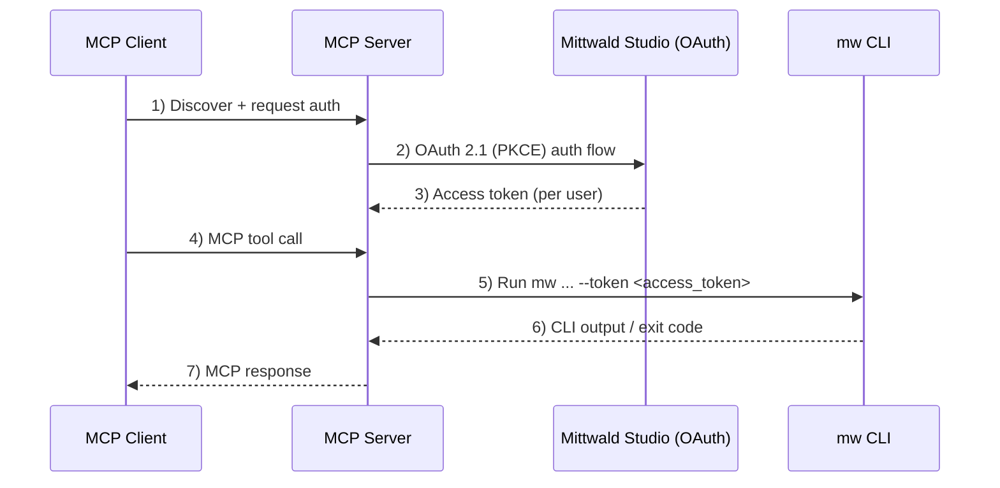
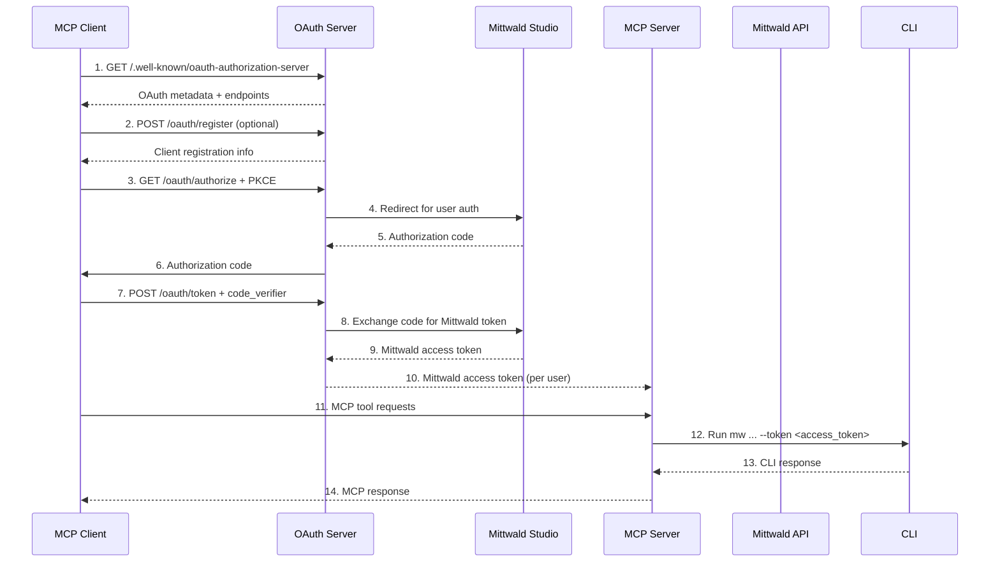

# CLI‑Centric MCP Architecture (OAuth 2.1 + per‑command --token)

> Status: Adopted design (planning → consolidation)  
> Branch: `oauth-server-v2`  
> Principle: Always wrap the official Mittwald CLI (`mw`) and pass `--token <access_token>` on every command

## 📋 Executive Summary

This document describes the CLI‑first architecture for the Mittwald MCP Server. The MCP server continues to invoke the official `mw` CLI for all tool functionality. Authentication is provided by OAuth 2.1 with PKCE against Mittwald Studio. The MCP server obtains a per‑user Mittwald access token and forwards it to the CLI by adding `--token <access_token>` to every command invocation. No privileged server tokens or dev bypass flags are used.

### Design Principles
- CLI is the single integration surface for all Mittwald operations
- Each command is authenticated per‑user via `--token <access_token>`
- No `MITTWALD_API_TOKEN` anywhere; no `DISABLE_OAUTH` bypass
- Keep the working MCP server; minimize churn; improve resilience

### Key Problems Solved
- ❌ **Recursive OAuth flows** causing connection instability
- ❌ **Complex proxy state management** with Redis dependencies
- ❌ **PKCE conflict resolution** across multiple simultaneous users
- ❌ **mcp-remote timeout issues** and connection failures
- ❌ **Session-based authentication complexity**

### Solution Benefits
- ✅ **Standards-compliant OAuth 2.1** with mandatory PKCE
- ✅ **Stateless JWT authentication** eliminating shared state
- ✅ **Microservices architecture** with clean separation of concerns
- ✅ **Multi-tenant user isolation** by design
- ✅ **Scalable deployment** with independent service scaling

---

## 🏗️ Architecture Overview

### High‑Level Architecture



### Service Breakdown

#### MCP Server (this repository)
**Technology Stack:**
- Express.js with TypeScript
- MCP SDK (tools, prompts, resources, sampling)
- OAuth 2.1 client (discovery, PKCE, token exchange)
- Redis (optional) for session/state coordination

**Responsibilities:**
- Expose MCP endpoints over HTTPS/SSE
- Complete OAuth 2.1 flows to obtain per‑user access tokens
- Invoke `mw` CLI for all operations, adding `--token <access_token>`
- Parse CLI output and map to MCP responses

---

## 🔐 Security Architecture

### OAuth 2.1 Flow Implementation



### What we do not use
- No `MITTWALD_API_TOKEN` anywhere in dev or prod
- No `DISABLE_OAUTH` bypass flag
- No production path that invokes APIs without a per‑user token

### JWT Token Structure

```json
{
  "iss": "https://mittwald-oauth-server.fly.dev",
  "sub": "user@example.com",
  "aud": "https://mittwald-mcp-fly2.fly.dev",
  "exp": 1640995200,
  "iat": 1640908800,
  "jti": "unique-jwt-id",
  "mittwald": {
    "access_token": "mittwald_oauth_token",
    "refresh_token": "mittwald_refresh_token",
    "expires_in": 3600,
    "scopes": ["project:read", "project:write", "..."]
  },
  "mcp": {
    "client_id": "mcp-client-123",
    "session_id": "session-456"
  }
}
```

Note: If JWTs are used internally for session continuity, they never replace the requirement to pass `--token` to the CLI. The CLI is the authoritative integration point.

### Mittwald Studio OAuth Client Configuration

**Pre-registered Static Client in Mittwald Studio:**
```yaml
id: "mittwald-mcp-server"
humanReadableName: "mStudio MCP server"
allowedGrantTypes: ["authorization_code"]
allowedScopes:
  # Application Management
  - "app:read"
  - "app:write"
  - "app:delete"
  # Backup Management
  - "backup:read"
  - "backup:write"
  - "backup:delete"
  # Contract & Business
  - "contract:read"
  - "contract:write"
  # Cron Jobs
  - "cronjob:read"
  - "cronjob:write"
  - "cronjob:delete"
  # Customer Management
  - "customer:read"
  - "customer:write"
  # Database Management
  - "database:read"
  - "database:write"
  - "database:delete"
  # Domain & DNS
  - "domain:read"
  - "domain:write"
  - "domain:delete"
  # Extensions
  - "extension:read"
  - "extension:write"
  - "extension:delete"
  # Mail Management
  - "mail:read"
  - "mail:write"
  - "mail:delete"
  # Order Management
  - "order:domain-create"
  - "order:domain-preview"
  # Project Management
  - "project:read"
  - "project:write"
  - "project:delete"
  # Registry Management
  - "registry:read"
  - "registry:write"
  - "registry:delete"
  # SSH User Management
  - "sshuser:read"
  - "sshuser:write"
  - "sshuser:delete"
  # Container Stacks
  - "stack:read"
  - "stack:write"
  - "stack:delete"
  # User Management
  - "user:read"
  - "user:write"

allowedRedirectURIs:
  # Authorization Server callback (current)
  - "https://mittwald-oauth-server.fly.dev/mittwald/callback"
  # Production URLs (future move to .mittwald.de)
  - "https://mcp.mittwald.de/oauth/callback"
  - "https://mcp.mittwald.de/auth/callback"
```

**Key Configuration Details:**
- **Client Type**: Public client (no client secret)
- **Grant Type**: Authorization Code with PKCE (OAuth 2.1 compliant)
- **Scope Coverage**: Comprehensive access to all major Mittwald platform features
- **Redirect URIs**: Support for both development and production deployments
- **User-Facing Name**: "mStudio MCP server" (appears in consent screens)

### Security Features

1. **PKCE (RFC 7636)** - Mandatory for all OAuth flows (no client secret)
2. **JWT Validation** - Stateless authentication with signature verification
3. **Token Expiration** - Short-lived tokens with refresh capability
4. **Scope Enforcement** - Granular permission control (40+ scopes available)
5. **Multi-tenant Isolation** - User data segregation by JWT claims
6. **HTTPS Only** - All communications encrypted in transit
7. **Static Client Registration** - Pre-approved by Mittwald with controlled redirect URIs

---

## MCP Third‑Party Authorization Flow (node-oidc-provider)

The OAuth Authorization Server is implemented using **node-oidc-provider**, a production-ready OpenID Certified™ OAuth 2.0 server. The MCP server acts as a Resource Server validating JWT tokens and as an OAuth Client to Mittwald.

### OAuth AS (node-oidc-provider) to MCP Clients
**Hosted at:** `https://mittwald-oauth-server.fly.dev`

- **Discovery**: `/.well-known/oauth-authorization-server`, `/.well-known/openid-configuration`
- **Dynamic Client Registration (DCR)**: `/reg` (RFC 7591) - built-in support
- **Authorize**: `/auth` (code + PKCE) - OpenID Certified flow
- **Token**: `/token` (code exchange + PKCE) - issues AS JWTs
- **Revocation**: `/token/revocation` (RFC 7009)
- **JWKS**: `/.well-known/jwks` (automatic key rotation)
- **Userinfo**: `/me` (optional, for client metadata)

### MCP Resource Server
**Hosted at:** `https://mittwald-mcp-fly2.fly.dev`

- **WWW‑Authenticate**: `/mcp` returns 401 with challenge pointing to AS discovery
- **JWT Validation**: Verifies tokens against node-oidc-provider JWKS
- **Token Introspection**: Optional fallback via AS introspection endpoint

### OAuth Client to Mittwald
- PKCE code exchange and refresh using `openid-client`
- Secure storage for Mittwald access/refresh tokens (encrypted at rest)
- Minimal scopes documented and requested
- Server-side token binding (JWT `sub` → Mittwald token)

### Token Model
- **Client JWT** (node-oidc-provider → MCP client): Standard OpenID Connect JWT with `sub`, `iss`, `aud`, `exp`, `jti`, and custom claims
- **Mittwald tokens**: Stored server-side in MCP server, encrypted; mapped via JWT `sub`; used for `mw --token <mittwald_access_token>`

### MCP Endpoint Auth
- `/mcp` requires valid AS JWT from node-oidc-provider
- 401 responses include WWW‑Authenticate header with AS discovery URL
- JWT validation via JWKS endpoint with caching and rotation support

### Implementation Approach
1) **Deploy node-oidc-provider**: Configure DCR, PKCE, JWT signing
2) **MCP JWT middleware**: Validate tokens against node-oidc-provider JWKS
3) **Mittwald client**: Server-side OAuth client with token storage
4) **Token binding**: Map JWT claims to Mittwald credentials

### Security & Operations
- **node-oidc-provider**: Handles JWKS rotation, DCR rate limiting, HTTPS enforcement
- **MCP Server**: Validates JWT signatures, manages Mittwald token encryption
- **Service isolation**: Separate containers for AS and Resource Server
- **Monitoring**: Cross-service request tracing and audit logging  

---

## 🚀 Implementation Roadmap (CLI‑centric)

### Phase 1: node-oidc-provider Setup (Week 1)

#### 1.1 OAuth Server Package Setup
- [ ] **Create oauth-server package** with node-oidc-provider dependency
- [ ] **Configure node-oidc-provider** with PKCE, DCR, and JWT settings
- [ ] **Set up Docker container** for oauth-server with persistent JWKS storage
- [ ] **Configure Fly.io deployment** for auth.mittwald-mcp-fly.fly.dev
- [ ] **Test DCR endpoints** and client registration flows

#### 1.2 Mittwald Studio Integration
- [ ] **Configure Mittwald OAuth client** within node-oidc-provider
- [ ] **Implement user interaction flows** for consent/login
- [ ] **Add Mittwald token exchange** logic in interactions
- [ ] **Set up secure token storage** for Mittwald credentials

#### 1.3 Production Deployment
- [ ] **Deploy to Fly.io** with proper environment configuration
- [ ] **Set up JWKS persistence** using Fly.io volumes
- [ ] **Configure Redis** for session storage
- [ ] **Test OAuth flows** end-to-end

#### 1.4 OAuth Server Testing
- [ ] **Write integration tests** for node-oidc-provider configuration
- [ ] **Write tests** for DCR client registration
- [ ] **Write tests** for PKCE authorization flows
- [ ] **Write tests** for Mittwald token exchange
- [ ] **Write tests** for JWKS endpoint and key rotation

**Deliverables:**
- Production-ready node-oidc-provider deployment
- Working DCR and OAuth 2.1 flows with PKCE
- Mittwald Studio integration
- **Comprehensive test suite for OAuth flows**

### Phase 2: MCP Integration (Week 3-4)

#### 2.1 Test Cleanup & MCP Server Setup
- [ ] **Remove obsolete tests** for session management
- [ ] **Remove obsolete tests** for OAuth middleware
- [ ] **Remove obsolete tests** for CLI wrapper patterns
- [ ] Initialize `packages/mcp-server/` project
- [ ] Implement JWT validation middleware
- [ ] Set up MCP protocol handler

#### 2.2 CLI Invocation & Resilience
- [ ] Centralize CLI invocation that appends `--token <access_token>`
- [ ] Add error handling and single retry on auth failures
- [ ] Structured parsing/formatting of CLI output

#### 2.3 Tool Handlers Migration
- [ ] Migrate tool handlers from CLI to API pattern
- [ ] Implement proper TypeScript typing
- [ ] Add comprehensive error handling
- [ ] Create tool registration system

#### 2.4 MCP Server Testing
- [ ] **Write unit tests** for JWT validation middleware
- [ ] **Write unit tests** for Mittwald API client
- [ ] **Write unit tests** for token extraction logic
- [ ] **Write unit tests** for each migrated tool handler
- [ ] **Write integration tests** for MCP protocol handling
- [ ] **Write integration tests** for API client error scenarios
- [ ] **Write tests** for tool registration system
- [ ] **Write tests** for multi-tenant request isolation

**Deliverables:**
- MCP server with OAuth 2.1 + PKCE
- All tool paths invoking `mw` with `--token`
- **Complete test suite for CLI‑centric flows**

### Phase 3: Integration Testing (Week 5)

#### 3.1 System Integration Tests
- [ ] **Write end-to-end tests** for complete OAuth → MCP flow
- [ ] **Write integration tests** for OAuth server ↔ Mittwald Studio
- [ ] **Write integration tests** for MCP server ↔ Mittwald API
- [ ] **Write tests** for cross-service JWT validation
- [ ] Docker Compose setup for both services

#### 3.2 Multi-User & Concurrency Tests
- [ ] **Write tests** for multi-user OAuth flows (concurrent)
- [ ] **Write tests** for JWT token isolation between users
- [ ] **Write tests** for concurrent API requests
- [ ] **Write tests** for user data segregation
- [ ] **Write load tests** for both services

#### 3.3 Error Handling & Edge Case Tests
- [ ] **Write tests** for token expiration scenarios
- [ ] **Write tests** for token refresh flows
- [ ] **Write tests** for API error propagation
- [ ] **Write tests** for network failure resilience
- [ ] **Write tests** for invalid/malformed JWT handling
- [ ] **Write tests** for OAuth flow interruption scenarios
- [ ] **Write tests** for service unavailability handling

#### 3.4 Security Tests
- [ ] **Write tests** for JWT signature tampering attempts
- [ ] **Write tests** for expired token rejection
- [ ] **Write tests** for cross-user data access prevention
- [ ] **Write tests** for PKCE code challenge validation
- [ ] **Write penetration tests** for common OAuth vulnerabilities

**Deliverables:**
- **Comprehensive integration test suite**
- **Security test validation**
- **Performance benchmarks**
- Docker deployment configuration
- Integration validation

### Phase 4: Production Deployment (Week 6)

#### 4.1 Deployment Tests & Setup
- [ ] **Write tests** for Fly.io deployment scripts
- [ ] **Write tests** for environment variable validation
- [ ] **Write tests** for health check endpoints
- [ ] **Write tests** for service discovery between apps
- [ ] Configure separate Fly.io apps
- [ ] Set up custom domain routing
- [ ] Configure environment variables
- [ ] Implement health checks

#### 4.2 Production Validation Tests
- [ ] **Write smoke tests** for production deployment
- [ ] **Write tests** for SSL certificate validation
- [ ] **Write tests** for custom domain routing
- [ ] **Write tests** for production OAuth flows
- [ ] **Write tests** for production API performance
- [ ] **Write monitoring tests** for alerting systems
- [ ] **Write tests** for backup/recovery procedures

#### 4.3 Performance & Monitoring
- [ ] Add application metrics
- [ ] Configure logging and monitoring
- [ ] **Run load tests** against production environment
- [ ] **Validate performance benchmarks** (< 50ms JWT validation, < 500ms API calls)
- [ ] Security audit and hardening

**Deliverables:**
- Production-ready deployment
- **Production validation test suite**
- Monitoring and alerting
- **Performance test results and validation**

---

## 📦 Project Structure

```
mittwald-mcp-v2/
├── packages/
│   ├── oauth-server/                    # node-oidc-provider OAuth AS
│   │   ├── src/
│   │   │   ├── server.ts               # node-oidc-provider setup
│   │   │   ├── config/
│   │   │   │   ├── provider.ts         # node-oidc-provider configuration
│   │   │   │   ├── clients.ts          # DCR and initial access tokens
│   │   │   │   └── adapters.ts         # Storage adapters (Redis/Memory)
│   │   │   ├── handlers/
│   │   │   │   ├── interactions.ts     # User login/consent flows
│   │   │   │   └── mittwald-auth.ts    # Mittwald Studio integration
│   │   │   ├── middleware/
│   │   │   │   ├── cors.ts             # CORS configuration
│   │   │   │   ├── security.ts        # Security headers
│   │   │   │   └── logging.ts          # Request logging
│   │   │   ├── services/
│   │   │   │   └── mittwald-oauth.ts   # Mittwald Studio OAuth client
│   │   │   └── types/
│   │   │       ├── provider.ts         # node-oidc-provider types
│   │   │       └── mittwald.ts         # Mittwald API types
│   │   ├── Dockerfile
│   │   ├── fly.toml                    # Fly.io deployment config
│   │   └── package.json
│   │
│   └── mcp-server/                     # MCP Protocol Server
│       ├── src/
│       │   ├── server.ts               # Main MCP server
│       │   ├── middleware/
│       │   │   ├── jwt-auth.ts         # JWT validation middleware
│       │   │   ├── cors.ts             # CORS configuration
│       │   │   └── error.ts            # Error handling
│       │   ├── handlers/
│       │   │   ├── mcp.ts              # MCP protocol handler
│       │   │   └── tools/              # Tool implementations
│       │   │       ├── projects.ts     # Project management tools
│       │   │       ├── databases.ts    # Database management tools
│       │   │       ├── domains.ts      # Domain management tools
│       │   │       └── ...             # Other tool categories
│       │   ├── services/
│       │   │   ├── mittwald-client.ts  # Direct API client
│       │   │   └── tool-registry.ts    # Tool registration system
│       │   ├── types/
│       │   │   ├── mcp.ts              # MCP type definitions
│       │   │   ├── mittwald.ts         # Mittwald API types
│       │   │   └── jwt.ts              # JWT type definitions
│       │   └── utils/
│       │       ├── format-response.ts  # Response formatting
│       │       └── validate-jwt.ts     # JWT validation utilities
│       ├── Dockerfile
│       ├── fly.toml                    # Fly.io deployment config
│       └── package.json
│
├── shared/                             # Shared utilities
│   ├── types/                          # Common type definitions
│   ├── utils/                          # Common utilities
│   └── package.json
│
├── docs/
│   ├── ARCHITECTURE.md                 # This document
│   ├── DEPLOYMENT.md                   # Deployment instructions
│   ├── MIGRATION.md                    # v1 → v2 migration guide
│   └── API.md                          # API documentation
│
├── MITTWALD_OAUTH_CLIENT.md            # Critical: Mittwald Studio client config
├── CLAUDE.md                           # Project constraints and status
├── README.md                           # Project overview
│
├── docker-compose.yml                  # Local development setup
├── docker-compose.prod.yml             # Production deployment
├── package.json                        # Workspace configuration
├── .env.example                        # Environment template
└── README.md                           # Updated project readme
```

---

## ⚙️ Configuration

### Environment Variables

#### OAuth Server Configuration (node-oidc-provider)
```bash
# OAuth Server (.env.oauth)
ISSUER=https://mittwald-oauth-server.fly.dev
COOKIES_SECURE=true                     # HTTPS-only cookies
INITIAL_ACCESS_TOKEN=generate-secure-token-for-dcr

# node-oidc-provider JWT Configuration
JWKS_KEYSTORE_PATH=/app/jwks.json       # Persistent key storage
TOKEN_TTL_ACCESS_TOKEN=3600             # 1 hour
TOKEN_TTL_ID_TOKEN=3600                 # 1 hour
TOKEN_TTL_REFRESH_TOKEN=86400           # 24 hours

# Mittwald Studio Integration (Static Client)
MITTWALD_OAUTH_BASE=https://api.mittwald.de
MITTWALD_OAUTH_AUTHORIZE_URL=https://api.mittwald.de/v2/oauth2/authorize
MITTWALD_OAUTH_TOKEN_URL=https://api.mittwald.de/v2/oauth2/token
MITTWALD_CLIENT_ID=mittwald-mcp-server
# Note: No client secret - public client with PKCE

# Allowed Redirect URIs for DCR validation
ALLOWED_REDIRECT_URI_PATTERNS=https://localhost:*/*,vscode://*/*,claude://*/*

# Storage (Redis recommended for production)
REDIS_URL=redis://localhost:6379
STORAGE_ADAPTER=redis                   # redis | memory

# Server Configuration
PORT=3000
NODE_ENV=production
LOG_LEVEL=info
```

#### MCP Server Configuration
```bash
# MCP Server (.env.mcp)
JWT_ISSUER=https://mittwald-oauth-server.fly.dev
JWT_AUDIENCE=https://mittwald-mcp-fly2.fly.dev
JWKS_URL=https://mittwald-oauth-server.fly.dev/jwks
JWKS_CACHE_TTL=300                      # 5 minutes

# Mittwald API & Token Storage
MITTWALD_API_BASE=https://api.mittwald.de
TOKEN_ENCRYPTION_KEY=32-byte-encryption-key-for-mittwald-tokens
TOKEN_STORE_TTL=86400                   # 24 hours

# OAuth Discovery for WWW-Authenticate headers
OAUTH_DISCOVERY_URL=https://mittwald-oauth-server.fly.dev/.well-known/oauth-authorization-server

# Storage for Mittwald tokens
REDIS_URL=redis://localhost:6379

# Server Configuration
PORT=3000
NODE_ENV=production
LOG_LEVEL=info
MCP_PROTOCOL_VERSION=2024-11-05
```

---

## 🧪 Testing Strategy

### Test Architecture Overview

#### Unit Tests (per service)
**OAuth Server Unit Tests:**
- PKCE code challenge/verifier validation
- JWT token creation and signing
- OAuth flow state management
- Client registration logic
- Mittwald Studio API client
- Error handling and validation

**MCP Server Unit Tests:**
- JWT signature verification
- Token payload extraction
- Individual tool handler logic
- API client request/response handling
- Error propagation and formatting
- User isolation logic

#### Integration Tests
**Cross-Service Integration:**
- Complete OAuth 2.1 authorization flow
- JWT token validation across services
- MCP protocol compliance testing
- Multi-service error propagation

**External API Integration:**
- Mittwald Studio OAuth integration
- Mittwald API client functionality
- API error handling and retry logic
- Rate limiting and throttling

#### End-to-End Tests
**User Journey Tests:**
- First-time user OAuth setup
- Returning user with valid token
- Token expiration and refresh
- Multi-user concurrent usage
- Tool execution workflows

#### Performance Tests
**Load Testing:**
- JWT validation performance (target: < 50ms)
- API response times (target: < 500ms p95)
- Concurrent user handling (target: 100+ concurrent)
- Memory usage under load
- Service startup time

#### Security Tests
**OAuth Security:**
- JWT signature tampering detection
- PKCE code interception prevention
- Token expiration enforcement
- Cross-user data isolation
- OAuth flow interruption handling

**API Security:**
- Unauthorized access attempts
- Malformed token handling
- Rate limiting effectiveness
- Input validation and sanitization

### Test Organization Structure
```
tests/
├── unit/
│   ├── oauth-server/
│   │   ├── pkce.test.ts
│   │   ├── jwt.test.ts
│   │   ├── authorize.test.ts
│   │   └── token.test.ts
│   └── mcp-server/
│       ├── jwt-middleware.test.ts
│       ├── api-client.test.ts
│       ├── tools/
│       │   ├── projects.test.ts
│       │   └── databases.test.ts
│       └── mcp-handler.test.ts
├── integration/
│   ├── oauth-flow.test.ts
│   ├── mcp-integration.test.ts
│   ├── api-integration.test.ts
│   └── multi-user.test.ts
├── e2e/
│   ├── user-journeys.test.ts
│   ├── error-scenarios.test.ts
│   └── production-smoke.test.ts
├── performance/
│   ├── load-testing.test.ts
│   ├── memory-usage.test.ts
│   └── benchmarks.test.ts
├── security/
│   ├── oauth-security.test.ts
│   ├── jwt-security.test.ts
│   └── penetration.test.ts
└── helpers/
    ├── oauth-mocks.ts
    ├── api-mocks.ts
    └── test-fixtures.ts
```

### Test Coverage Requirements
- **Unit Tests**: > 90% code coverage per service
- **Integration Tests**: All cross-service interactions
- **E2E Tests**: All critical user paths
- **Performance Tests**: All performance requirements validated
- **Security Tests**: All security requirements verified

---

## 🚀 Deployment Architecture

### Production Deployment (Fly.io)

#### OAuth Server (node-oidc-provider)
```yaml
# fly.toml (oauth-server)
app = "mittwald-oauth-server"
kill_signal = "SIGINT"
kill_timeout = 5
primary_region = "iad"

[build]
  dockerfile = "Dockerfile"

[env]
  NODE_ENV = "production"
  PORT = "3000"
  ISSUER = "https://mittwald-oauth-server.fly.dev"
  COOKIES_SECURE = "true"

[mounts]
  source = "jwks_storage"
  destination = "/app/jwks"

[[services]]
  internal_port = 3000
  protocol = "tcp"
  auto_stop_machines = true
  auto_start_machines = true
  min_machines_running = 1
  
  [services.concurrency]
    hard_limit = 100
    soft_limit = 80

  [[services.ports]]
    handlers = ["http"]
    port = 80
    force_https = true

  [[services.ports]]
    handlers = ["tls", "http"]
    port = 443

[http_service]
  internal_port = 3000
  force_https = true
  auto_stop_machines = true
  auto_start_machines = true
  min_machines_running = 1

[[vm]]
  memory = "512mb"
  cpu_kind = "shared"
  cpus = 1
```

#### MCP Server
```yaml
# fly.toml (mcp-server)
app = "mittwald-mcp-server"
kill_signal = "SIGINT"
kill_timeout = 5

[build]
  dockerfile = "Dockerfile"

[env]
  NODE_ENV = "production"
  PORT = "3000"

[[services]]
  internal_port = 3000
  protocol = "tcp"
  
  [services.concurrency]
    hard_limit = 200
    soft_limit = 160

  [[services.ports]]
    handlers = ["http"]
    port = 80
    force_https = true

  [[services.ports]]
    handlers = ["tls", "http"]
    port = 443

[certificate]
  hostname = "mittwald-mcp-fly2.fly.dev"
```

### Docker Container Details

#### OAuth Server Dockerfile
```dockerfile
# packages/oauth-server/Dockerfile
FROM node:20-alpine

WORKDIR /app

# Install dependencies
COPY package*.json ./
RUN npm ci --only=production

# Copy application code
COPY . .

# Create JWKS storage directory
RUN mkdir -p /app/jwks

# Build TypeScript
RUN npm run build

# Expose port
EXPOSE 3000

# Health check
HEALTHCHECK --interval=30s --timeout=3s --start-period=5s --retries=3 \
  CMD curl -f http://localhost:3000/.well-known/openid-configuration || exit 1

# Run application
CMD ["npm", "start"]
```

#### MCP Server Dockerfile Updates
```dockerfile
# Add to existing Dockerfile
# Install curl for health checks
RUN apk add --no-cache curl

# Health check
HEALTHCHECK --interval=30s --timeout=3s --start-period=5s --retries=3 \
  CMD curl -f http://localhost:3000/health || exit 1
```

### Local Development
```yaml
# docker-compose.yml
version: '3.8'

services:
  oauth-server:
    build:
      context: ./packages/oauth-server
      dockerfile: Dockerfile
    ports:
      - "3001:3000"
    environment:
      - ISSUER=http://localhost:3001
      - COOKIES_SECURE=false
      - REDIS_URL=redis://redis:6379
      - STORAGE_ADAPTER=redis
      - NODE_ENV=development
    env_file:
      - packages/oauth-server/.env.local
    depends_on:
      - redis
    volumes:
      - oauth_jwks:/app/jwks

  mcp-server:
    build:
      context: .
      dockerfile: Dockerfile
    ports:
      - "3000:3000"
    environment:
      - JWT_ISSUER=http://localhost:3001
      - JWKS_URL=http://oauth-server:3000/.well-known/jwks
      - REDIS_URL=redis://redis:6379
      - NODE_ENV=development
    env_file:
      - .env.local
    depends_on:
      - oauth-server
      - redis

  redis:
    image: redis:7-alpine
    ports:
      - "6379:6379"
    command: redis-server --appendonly yes
    volumes:
      - redis_data:/data

volumes:
  redis_data:
  oauth_jwks:
```

### Fly.io Deployment Commands
```bash
# Create and deploy OAuth server
cd packages/oauth-server
fly launch --name mittwald-oauth-server --region iad
fly volumes create jwks_storage --size 1 --app mittwald-oauth-server
fly secrets set INITIAL_ACCESS_TOKEN=$(openssl rand -base64 32)
fly secrets set MITTWALD_CLIENT_ID=mittwald-mcp-server
fly secrets set REDIS_URL=redis://your-redis-url
fly deploy

# Create and deploy MCP server
cd ../..
fly launch --name mittwald-mcp-server --region iad
fly secrets set TOKEN_ENCRYPTION_KEY=$(openssl rand -base64 32)
fly secrets set REDIS_URL=redis://your-redis-url
fly deploy
```

---

## 📊 Success Metrics

### Technical Metrics
- **OAuth Flow Success Rate**: > 99%
- **Token Validation Latency**: < 50ms
- **API Response Time**: < 500ms (95th percentile)
- **System Uptime**: > 99.9%
- **Zero Recursive OAuth Flows**: 0 occurrences

### User Experience Metrics
- **Connection Stability**: No unexpected disconnections
- **Multi-user Isolation**: 100% data segregation
- **Error Handling**: Clear, actionable error messages
- **Tool Availability**: 140+ tools operational

### Security Metrics
- **JWT Signature Validation**: 100% success rate
- **PKCE Compliance**: All flows use PKCE
- **Token Expiration**: Proper cleanup of expired tokens
- **Multi-tenant Security**: Zero cross-user data access

---

## 🔄 Migration Notes

- Keep the existing MCP server; no separate OAuth microservice is required.
- Remove all code and docs that reference `MITTWALD_API_TOKEN` or `DISABLE_OAUTH`.
- Ensure every tool path invokes the CLI with `--token <access_token>`.
- Retain mock OAuth server for local testing of flows.
- Archive old documentation
- **Request removal of old redirect URIs** from Mittwald Studio

---

## 📋 Implementation Checklist

### Pre-Development
- [ ] Architecture review and approval
- [ ] **Verify Mittwald Studio OAuth client configuration**
- [ ] **Test static client `mittwald-mcp-server` accessibility**
- [ ] **Validate all 40+ scopes are available in Mittwald Studio**
- [ ] Technology stack finalization
- [ ] Development environment setup
- [ ] Repository structure creation

### Development Phases
- [ ] **Phase 1**: OAuth Server Implementation
- [ ] **Phase 2**: MCP Server Refactoring  
- [ ] **Phase 3**: Integration Testing
- [ ] **Phase 4**: Production Deployment

### Quality Assurance
- [ ] **Unit test coverage > 90%** for both services
- [ ] **All integration tests passing** (OAuth ↔ MCP ↔ API)
- [ ] **All end-to-end tests passing** (complete user workflows)
- [ ] **Performance benchmarks met** (JWT < 50ms, API < 500ms p95)
- [ ] **Security tests passing** (penetration testing, vulnerability scans)
- [ ] **Load tests validated** (100+ concurrent users)
- [ ] Security audit completed
- [ ] Documentation completed
- [ ] **Test automation pipeline** configured

### Production Readiness
- [ ] Deployment automation
- [ ] Monitoring and alerting
- [ ] Backup and recovery procedures
- [ ] Incident response plan
- [ ] User migration strategy

---

## 📞 Support & Maintenance

### Monitoring
- Application performance monitoring (APM)
- Log aggregation and analysis
- Security event monitoring
- User behavior analytics

### Maintenance Windows
- Regular security updates
- OAuth token cleanup
- Performance optimization
- Feature releases

### Incident Response
- 24/7 monitoring setup
- Automated alerting system
- Escalation procedures
- Post-incident reviews

---

**Document Version**: 1.0  
**Last Updated**: 2025-09-05  
**Status**: Implementation Planning  
**Next Review**: After Phase 1 Completion

---

*This architecture represents a comprehensive solution to the OAuth stability issues encountered in v1, providing a robust, scalable, and secure foundation for the Mittwald MCP Server ecosystem.*
