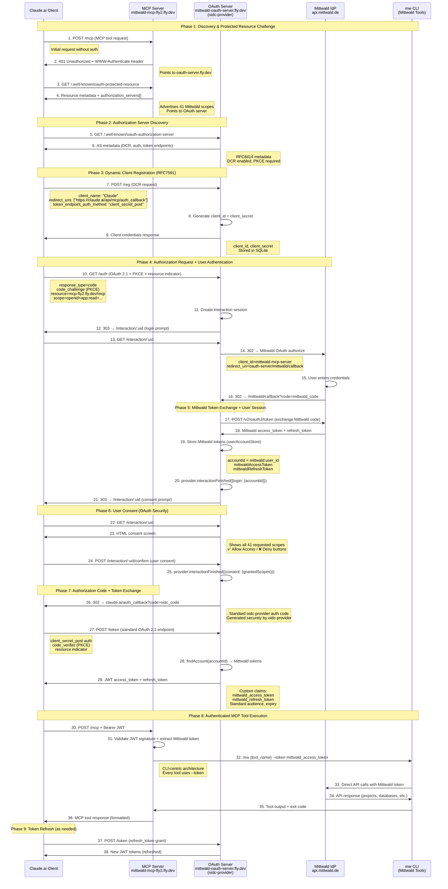

# CLI‑Centric MCP Architecture (OAuth 2.1 + per‑command --token)

> **Status: OAUTH FUNCTIONAL - CLAUDE.AI STANDARDS COMPLIANCE NEEDED (2025-09-23)**
> **Branch**: `main` (Production)
> **Achievement**: OAuth proxy working for MCP Jam; Claude.ai requires standard OAuth 2.1 compliance
> **Current Issue**: Custom token endpoint incompatible with Claude.ai's standard OAuth client
> **Solution**: Migrate to standard oidc-provider token handling for Claude.ai compatibility
> **Principle**: Always wrap the official Mittwald CLI (`mw`) and pass `--token <access_token>` on every command

## 📋 Executive Summary

This document describes the CLI‑first architecture for the Mittwald MCP Server. The MCP server continues to invoke the official `mw` CLI for all tool functionality. Authentication is provided by OAuth 2.1 with PKCE against Mittwald Studio. The MCP server obtains a per‑user Mittwald access token and forwards it to the CLI by adding `--token <access_token>` to every command invocation. No privileged server tokens or dev bypass flags are used.

### Design Principles
- CLI is the single integration surface for all Mittwald operations
- Each command is authenticated per‑user via `--token <access_token>`
- No `MITTWALD_API_TOKEN` anywhere; no `DISABLE_OAUTH` bypass
- Keep the working MCP server; minimize churn; improve resilience

### Key Problems Solved
- ❌ **Recursive OAuth flows** causing connection instability
- ❌ **Complex proxy state management** with Redis dependencies
- ❌ **PKCE conflict resolution** across multiple simultaneous users
- ❌ **mcp-remote timeout issues** and connection failures
- ❌ **Session-based authentication complexity**
- ❌ **Redis NOAUTH authentication errors** preventing OAuth flows

### Solution Benefits
- ✅ **Standards-compliant OAuth 2.1** with mandatory PKCE
- ✅ **Stateless JWT authentication** eliminating shared state
- ✅ **Microservices architecture** with clean separation of concerns
- ✅ **Multi-tenant user isolation** by design
- ✅ **Scalable deployment** with independent service scaling
- ✅ **SQLite persistence** eliminating external storage dependencies

---

## 🏗️ Architecture Overview

### High‑Level Architecture Overview

**See "Complete OAuth 2.1 + MCP Lifecycle Flow" diagram below for detailed sequence.**

**Key Architecture Principles:**
- **OAuth 2.1 + PKCE**: Standards-compliant authorization with oidc-provider
- **CLI-centric**: All Mittwald operations via `mw` tool with `--token`
- **Pure oidc-provider**: No custom token endpoints or authorization code handling
- **User consent**: Transparent scope approval following OAuth security principles

### Service Breakdown

#### OAuth Server (`packages/oauth-server/`)
**Technology Stack:**
- Koa.js with TypeScript
- node-oidc-provider v9 (OpenID Certified™)
- SQLite with better-sqlite3 (persistent storage)
- Fly.io volume for database persistence

**Responsibilities:**
- OAuth 2.1 authorization server with PKCE support
- Dynamic Client Registration (DCR) for MCP clients
- User authentication via Mittwald Studio
- JWT token issuance with embedded Mittwald credentials
- SQLite storage for OAuth sessions and temporary state

**Storage Architecture:**
```
/app/jwks/
├── jwks.json          # JWT signing keys (persistent)
└── oauth-sessions.db  # SQLite database (persistent)
```

#### MCP Server (this repository)
**Technology Stack:**
- Express.js with TypeScript
- MCP SDK (tools, prompts, resources, sampling)
- JWT validation (stateless)
- CLI wrapper with token injection

**Responsibilities:**
- Expose MCP endpoints over HTTPS/SSE
- Validate JWT tokens from OAuth server
- Extract Mittwald tokens from validated JWTs
- Invoke `mw` CLI for all operations, adding `--token <access_token>`
- Parse CLI output and map to MCP responses

**Storage Architecture:**
- **Stateless design**: No persistent storage required
- **JWT validation**: Uses JWKS from OAuth server
- **Token extraction**: Mittwald tokens embedded in JWTs

---

## 🔐 Security Architecture

### OAuth 2.1 Flow Implementation

**Replaced by comprehensive "Complete OAuth 2.1 + MCP Lifecycle Flow" diagram above.**

**This section preserved for reference to older implementation approach.**

### What we do not use
- No `MITTWALD_API_TOKEN` anywhere in dev or prod
- No `DISABLE_OAUTH` bypass flag
- No production path that invokes APIs without a per‑user token

### JWT Token Structure

```json
{
  "iss": "https://mittwald-oauth-server.fly.dev",
  "sub": "user@example.com",
  "aud": "https://mittwald-mcp-fly2.fly.dev",
  "exp": 1640995200,
  "iat": 1640908800,
  "jti": "unique-jwt-id",
  "mittwald": {
    "access_token": "mittwald_oauth_token",
    "refresh_token": "mittwald_refresh_token",
    "expires_in": 3600,
    "scopes": ["project:read", "project:write", "..."]
  },
  "mcp": {
    "client_id": "mcp-client-123",
    "session_id": "session-456"
  }
}
```

Note: If JWTs are used internally for session continuity, they never replace the requirement to pass `--token` to the CLI. The CLI is the authoritative integration point.

### Mittwald Studio OAuth Client Configuration

**Pre-registered Static Client in Mittwald Studio:**
```yaml
id: "mittwald-mcp-server"
humanReadableName: "mStudio MCP server"
allowedGrantTypes: ["authorization_code"]
allowedScopes:
  # Application Management
  - "app:read"
  - "app:write"
  - "app:delete"
  # Backup Management
  - "backup:read"
  - "backup:write"
  - "backup:delete"
  # Contract & Business
  - "contract:read"
  - "contract:write"
  # Cron Jobs
  - "cronjob:read"
  - "cronjob:write"
  - "cronjob:delete"
  # Customer Management
  - "customer:read"
  - "customer:write"
  # Database Management
  - "database:read"
  - "database:write"
  - "database:delete"
  # Domain & DNS
  - "domain:read"
  - "domain:write"
  - "domain:delete"
  # Extensions
  - "extension:read"
  - "extension:write"
  - "extension:delete"
  # Mail Management
  - "mail:read"
  - "mail:write"
  - "mail:delete"
  # Order Management
  - "order:domain-create"
  - "order:domain-preview"
  # Project Management
  - "project:read"
  - "project:write"
  - "project:delete"
  # Registry Management
  - "registry:read"
  - "registry:write"
  - "registry:delete"
  # SSH User Management
  - "sshuser:read"
  - "sshuser:write"
  - "sshuser:delete"
  # Container Stacks
  - "stack:read"
  - "stack:write"
  - "stack:delete"
  # User Management
  - "user:read"
  - "user:write"

allowedRedirectURIs:
  # Authorization Server callback (current)
  - "https://mittwald-oauth-server.fly.dev/mittwald/callback"
  # Production URLs (future move to .mittwald.de)
  - "https://mcp.mittwald.de/oauth/callback"
  - "https://mcp.mittwald.de/auth/callback"
```

**Key Configuration Details:**
- **Client Type**: Public client (no client secret)
- **Grant Type**: Authorization Code with PKCE (OAuth 2.1 compliant)
- **Scope Coverage**: Comprehensive access to all major Mittwald platform features
- **Redirect URIs**: Support for both development and production deployments
- **User-Facing Name**: "mStudio MCP server" (appears in consent screens)

### Security Features

1. **PKCE (RFC 7636)** - Mandatory for all OAuth flows (no client secret)
2. **JWT Validation** - Stateless authentication with signature verification
3. **Token Expiration** - Short-lived tokens with refresh capability
4. **Scope Enforcement** - Granular permission control (40+ scopes available)
5. **Multi-tenant Isolation** - User data segregation by JWT claims
6. **HTTPS Only** - All communications encrypted in transit
7. **Static Client Registration** - Pre-approved by Mittwald with controlled redirect URIs

---

## 💾 Persistence Architecture

### SQLite Storage Design

The OAuth server uses **SQLite** for persistent storage, eliminating external dependencies while providing ACID compliance and better reliability than Redis.

#### **Storage Locations**
```
OAuth Server: /app/jwks/
├── jwks.json              # JWT signing keys (JWKS)
└── oauth-sessions.db      # SQLite database (OAuth state)

MCP Server: (stateless)
└── No persistent storage  # JWT validation only
```

#### **SQLite Schema**
```sql
CREATE TABLE oauth_data (
    id TEXT PRIMARY KEY,
    model TEXT NOT NULL,           -- oidc-provider model type
    data TEXT NOT NULL,            -- JSON payload
    expires_at INTEGER,            -- Unix timestamp
    consumed_at INTEGER,           -- Unix timestamp for consumed items
    created_at INTEGER DEFAULT (strftime('%s', 'now')),
    updated_at INTEGER DEFAULT (strftime('%s', 'now'))
);

CREATE INDEX idx_model ON oauth_data(model);
CREATE INDEX idx_expires_at ON oauth_data(expires_at);
CREATE INDEX idx_consumed_at ON oauth_data(consumed_at);
```

#### **Data Lifecycle Management**
- **Automatic cleanup**: Expired entries removed every 5 minutes
- **ACID transactions**: Ensures OAuth state consistency
- **WAL mode**: Better concurrency than default SQLite
- **10MB cache**: Optimized for OAuth workload patterns

### **Benefits Over Redis**

| Aspect | SQLite | Redis (Previous) |
|--------|--------|------------------|
| **Dependencies** | None (embedded) | External service required |
| **Authentication** | None needed | NOAUTH errors experienced |
| **Persistence** | True (survives restarts) | Depends on Redis config |
| **Costs** | $0 | Hosting fees |
| **Network** | Local file access | Network calls + latency |
| **Backup** | Simple file copy | Redis-specific procedures |
| **Debugging** | Standard SQL tools | Redis CLI required |

### **Complete OAuth 2.1 + MCP Lifecycle Flow**

**Based on MCP Authorization Specification 2025-06-18 and OAuth 2.1 Standards**



### **State Management at Each System**

#### **Claude.ai Client State:**
- **Registration**: `client_id`, `client_secret` (confidential client)
- **Authorization**: PKCE `code_verifier`, `state` parameter
- **Tokens**: JWT `access_token`, `refresh_token` from OAuth server
- **Session**: Bearer token for subsequent MCP requests

#### **OAuth Server (oidc-provider) State:**
- **SQLite DB**: Client registrations, interaction sessions, grants
- **User Accounts**: `userAccountStore` mapping `accountId` → Mittwald tokens
- **JWKS**: JWT signing keys for token issuance
- **Interaction Sessions**: Login/consent prompts, PKCE challenges

#### **Mittwald IdP State:**
- **Static Client**: `mittwald-mcp-server` configuration
- **User Sessions**: Mittwald user authentication state
- **Tokens**: Issued `access_token` + `refresh_token` for OAuth server

#### **MCP Server State:**
- **Stateless**: No persistent storage (JWT validation only)
- **Request Context**: Extracted Mittwald tokens from JWT
- **CLI Process**: Temporary execution context with `--token`

#### **CLI (mw) Process State:**
- **Per-Command**: Mittwald access token via `--token` parameter
- **API Context**: Direct authenticated calls to `api.mittwald.de`
- **Output**: Tool results returned to MCP server

### **Data Flow Summary**

**Discovery → Registration → Authentication → Consent → Token Exchange → Tool Execution → Refresh**

This comprehensive flow ensures **proper OAuth 2.1 security** with **user consent transparency** while maintaining **CLI-centric architecture** for reliable Mittwald API integration.

---

## MCP Third‑Party Authorization Flow (Official Mittwald Guidance)

This implementation follows the **MCP Third-Party Authorization Flow** as specified in the MCP specification (https://modelcontextprotocol.io/specification/2025-03-26/basic/authorization#third-party-authorization-flow) and recommended by Mittwald themselves.

### **Official Architecture Pattern (per Mittwald)**
```
MCP Client (Claude Desktop) ←→ MCP Server (mcp.mittwald.de)
                                      ↓
                              api.mittwald.de (OAuth AS)
```

**Key Points from Mittwald:**
- **MCP Server** acts as both OAuth Server (to clients) AND OAuth Client (to api.mittwald.de)
- **DCR Implementation**: MCP server implements DCR for MCP clients
- **Static Client**: api.mittwald.de doesn't need DCR (only one MCP server instance)
- **Dual OAuth Servers**: MCP server + api.mittwald.de in sequence

The OAuth Authorization Server is implemented using **node-oidc-provider**, a production-ready OpenID Certified™ OAuth 2.0 server, following this official Mittwald architectural guidance.

### OAuth AS (node-oidc-provider) to MCP Clients
**Hosted at:** `https://mittwald-oauth-server.fly.dev`

- **Discovery**: `/.well-known/oauth-authorization-server`, `/.well-known/openid-configuration`
- **Dynamic Client Registration (DCR)**: `/reg` (RFC 7591) - built-in support
- **Authorize**: `/auth` (code + PKCE) - OpenID Certified flow
- **Token**: `/token` (code exchange + PKCE) - issues AS JWTs
- **Revocation**: `/token/revocation` (RFC 7009)
- **JWKS**: `/.well-known/jwks` (automatic key rotation)
- **Userinfo**: `/me` (optional, for client metadata)

### MCP Resource Server
**Hosted at:** `https://mittwald-mcp-fly2.fly.dev`

- **WWW‑Authenticate**: `/mcp` returns 401 with challenge pointing to AS discovery
- **JWT Validation**: Verifies tokens against node-oidc-provider JWKS
- **Token Introspection**: Optional fallback via AS introspection endpoint

### OAuth Client to Mittwald
- PKCE code exchange and refresh using `openid-client`
- Secure storage for Mittwald access/refresh tokens (encrypted at rest)
- Minimal scopes documented and requested
- Server-side token binding (JWT `sub` → Mittwald token)

### Token Model
- **Client JWT** (node-oidc-provider → MCP client): Standard OpenID Connect JWT with `sub`, `iss`, `aud`, `exp`, `jti`, and custom claims
- **Mittwald tokens**: Stored server-side in MCP server, encrypted; mapped via JWT `sub`; used for `mw --token <mittwald_access_token>`

---

## 🔌 MCP Client Compatibility & Requirements

### **Major MCP Client Analysis (2025)**

Based on production logs and official documentation research, our OAuth server must support diverse client authentication patterns:

#### **Claude.ai Official Client**
```json
{
  "client_name": "Claude",
  "grant_types": ["authorization_code"],
  "response_types": ["code"],
  "token_endpoint_auth_method": "client_secret_post", // Confidential client
  "scope": "openid profile email user:read customer:read project:read",
  "redirect_uris": ["https://claude.ai/api/mcp/auth_callback"]
}
```

**Requirements:**
- ✅ **DCR Support**: Dynamic Client Registration (RFC 7591)
- ❌ **Confidential Client**: Requires `client_secret_post` authentication
- ❌ **OIDC Scopes**: Expects `openid`, `profile`, `email` scopes
- ✅ **PKCE**: Supports OAuth 2.1 PKCE flows
- ✅ **Fixed Callback**: `https://claude.ai/api/mcp/auth_callback`
- ⚠️ **Future Compatibility**: May use `https://claude.com/api/mcp/auth_callback`

#### **ChatGPT Connector Platform**
```json
{
  "client_id": "pqQ1s95Dj4HeTbFtjmUDKicS82yzzbAyFurwCptqSQZ",
  "redirect_uri": "https://chatgpt.com/connector_platform_oauth_redirect",
  "response_type": "code",
  "code_challenge_method": "S256"
}
```

**Requirements:**
- ✅ **Pre-registered Client**: Uses existing client ID (no DCR)
- ✅ **Public Client**: Uses `token_endpoint_auth_method: "none"`
- ✅ **PKCE**: Mandatory S256 code challenge method
- ✅ **Fixed Callback**: `https://chatgpt.com/connector_platform_oauth_redirect`
- ✅ **Custom Scopes**: Works with Mittwald-specific scopes

#### **MCP Jam Inspector (Development)**
```json
{
  "client_name": "MCPJam",
  "token_endpoint_auth_method": "none",
  "grant_types": ["authorization_code"],
  "redirect_uris": ["http://localhost:6274/oauth/callback/debug"]
}
```

**Requirements:**
- ✅ **DCR Support**: Dynamic registration working
- ✅ **Public Client**: Uses `none` authentication
- ✅ **Localhost Callback**: Development-friendly redirect
- ✅ **Flexible Scopes**: Adapts to available scopes

### **Compatibility Matrix**

| Feature | Current Support | Claude.ai | ChatGPT | MCP Jam | Required Action |
|---------|----------------|-----------|---------|---------|-----------------|
| **DCR** | ✅ Implemented | ✅ Required | ⚠️ Optional | ✅ Used | ✅ **Working** |
| **Auth Method `none`** | ✅ Only current | ❌ Not used | ✅ Required | ✅ Used | ✅ **Keep** |
| **Auth Method `client_secret_post`** | ❌ Not supported | ✅ Required | ❌ Not used | ❌ Not used | ❌ **MUST ADD** |
| **OIDC Scopes** | ❌ Not supported | ✅ Required | ❌ Not used | ❌ Not used | ❌ **MUST ADD** |
| **Custom Scopes** | ✅ Implemented | ✅ Used | ✅ Used | ✅ Used | ✅ **Working** |
| **PKCE** | ✅ Mandatory | ✅ Supported | ✅ Mandatory | ✅ Used | ✅ **Working** |
| **Specific Callbacks** | ⚠️ Pattern only | ✅ Fixed URL | ✅ Fixed URL | ✅ Localhost | ⚠️ **UPDATE PATTERNS** |

### **Critical Issues Identified**

#### **🚨 Claude.ai Registration Failures**
**Error Log Evidence:**
```
"token_endpoint_auth_method must be 'none'"
Client trying: "client_secret_post"
Server accepts: "none" only
```

**Impact**: Claude.ai official client cannot register or authenticate.

#### **⚠️ ChatGPT Authorization Errors**
**Error Log Evidence:**
```
GET /auth → 400 "OAuth error"
Client: pqQ1s95Dj4HeTbFtjmUDKicS82yzzbAyFurwCptqSQZ
```

**Likely Cause**: May be related to scope or client configuration issues.

### **Implementation Priority**

#### **Phase 1: Immediate Fixes (High Priority)**
1. **Add `client_secret_post` support** for Claude.ai
2. **Add OIDC scopes** (`openid`, `profile`, `email`)
3. **Update redirect URI patterns** for specific client callbacks
4. **Enhanced DCR logic** with client-specific defaults

#### **Phase 2: Advanced Features (Medium Priority)**
1. **Client secret generation and storage** for confidential clients
2. **Enhanced refresh token policies** based on client type
3. **Scope validation and mapping** for different client requirements
4. **Rate limiting and abuse protection** for DCR endpoints

#### **Phase 3: Production Hardening (Lower Priority)**
1. **Client metadata validation** and sanitization
2. **Audit logging** for client registrations and authentications
3. **Monitoring and alerting** for OAuth flow failures
4. **Documentation and troubleshooting guides** for client integration

### MCP Endpoint Auth
- `/mcp` requires valid AS JWT from node-oidc-provider
- 401 responses include WWW‑Authenticate header with AS discovery URL
- JWT validation via JWKS endpoint with caching and rotation support

### Implementation Approach
1) **Deploy node-oidc-provider**: Configure DCR, PKCE, JWT signing
2) **MCP JWT middleware**: Validate tokens against node-oidc-provider JWKS
3) **Mittwald client**: Server-side OAuth client with token storage
4) **Token binding**: Map JWT claims to Mittwald credentials

### Security & Operations
- **node-oidc-provider**: Handles JWKS rotation, DCR rate limiting, HTTPS enforcement
- **MCP Server**: Validates JWT signatures, manages Mittwald token encryption
- **Service isolation**: Separate containers for AS and Resource Server
- **Monitoring**: Cross-service request tracing and audit logging  

---

## 🚀 Implementation Roadmap (CLI‑centric)

### Phase 1: OAuth Server Setup ✅ COMPLETED

#### 1.1 OAuth Server Package Setup ✅
- ✅ **Create oauth-server package** with node-oidc-provider dependency
- ✅ **SQLite storage migration** from Redis to better-sqlite3
- ✅ **Production deployment** on Fly.io with persistent volumes
- ✅ **Configure node-oidc-provider** with PKCE, DCR, and JWT settings
- ✅ **Set up Docker container** for oauth-server with persistent JWKS storage
- ✅ **Configure Fly.io deployment** for auth.mittwald-mcp-fly.fly.dev
- ✅ **Test DCR endpoints** and client registration flows

#### 1.2 Mittwald Studio Integration ✅
- ✅ **Configure Mittwald OAuth client** within node-oidc-provider
- ✅ **Implement user interaction flows** for consent/login
- ✅ **Add Mittwald token exchange** logic in interactions
- ✅ **Set up secure token storage** for Mittwald credentials (SQLite)

#### 1.3 Production Deployment ✅
- ✅ **Deploy to Fly.io** with proper environment configuration
- ✅ **Set up JWKS persistence** using Fly.io volumes
- ✅ **Configure SQLite storage** replacing Redis dependency
- ✅ **Test OAuth flows** end-to-end

#### 1.4 OAuth Server Testing
- [ ] **Write integration tests** for node-oidc-provider configuration
- [ ] **Write tests** for DCR client registration
- [ ] **Write tests** for PKCE authorization flows
- [ ] **Write tests** for Mittwald token exchange
- [ ] **Write tests** for JWKS endpoint and key rotation

#### 1.5 SQLite Migration ✅ NEW
- ✅ **Implement SQLiteAdapter** for oidc-provider with ACID compliance
- ✅ **Remove Redis dependencies** and authentication complexities
- ✅ **Configure WAL mode** for better concurrency
- ✅ **Automatic cleanup** of expired OAuth sessions
- ✅ **Volume integration** using existing /app/jwks persistent storage

**Deliverables:**
- ✅ Production-ready node-oidc-provider deployment
- ✅ Working DCR and OAuth 2.1 flows with PKCE
- ✅ Mittwald Studio integration
- ✅ **SQLite persistent storage** eliminating Redis NOAUTH errors
- [ ] **Comprehensive test suite for OAuth flows**

### Phase 2: MCP Integration (Week 3-4)

#### 2.1 Test Cleanup & MCP Server Setup
- [ ] **Remove obsolete tests** for session management
- [ ] **Remove obsolete tests** for OAuth middleware
- [ ] **Remove obsolete tests** for CLI wrapper patterns
- [ ] Initialize `packages/mcp-server/` project
- [ ] Implement JWT validation middleware
- [ ] Set up MCP protocol handler

#### 2.2 CLI Invocation & Resilience
- [ ] Centralize CLI invocation that appends `--token <access_token>`
- [ ] Add error handling and single retry on auth failures
- [ ] Structured parsing/formatting of CLI output

#### 2.3 Tool Handlers Migration
- [ ] Migrate tool handlers from CLI to API pattern
- [ ] Implement proper TypeScript typing
- [ ] Add comprehensive error handling
- [ ] Create tool registration system

#### 2.4 MCP Server Testing
- [ ] **Write unit tests** for JWT validation middleware
- [ ] **Write unit tests** for Mittwald API client
- [ ] **Write unit tests** for token extraction logic
- [ ] **Write unit tests** for each migrated tool handler
- [ ] **Write integration tests** for MCP protocol handling
- [ ] **Write integration tests** for API client error scenarios
- [ ] **Write tests** for tool registration system
- [ ] **Write tests** for multi-tenant request isolation

**Deliverables:**
- MCP server with OAuth 2.1 + PKCE
- All tool paths invoking `mw` with `--token`
- **Complete test suite for CLI‑centric flows**

### Phase 3: Integration Testing (Week 5)

#### 3.1 System Integration Tests
- [ ] **Write end-to-end tests** for complete OAuth → MCP flow
- [ ] **Write integration tests** for OAuth server ↔ Mittwald Studio
- [ ] **Write integration tests** for MCP server ↔ Mittwald API
- [ ] **Write tests** for cross-service JWT validation
- [ ] Docker Compose setup for both services

#### 3.2 Multi-User & Concurrency Tests
- [ ] **Write tests** for multi-user OAuth flows (concurrent)
- [ ] **Write tests** for JWT token isolation between users
- [ ] **Write tests** for concurrent API requests
- [ ] **Write tests** for user data segregation
- [ ] **Write load tests** for both services

#### 3.3 Error Handling & Edge Case Tests
- [ ] **Write tests** for token expiration scenarios
- [ ] **Write tests** for token refresh flows
- [ ] **Write tests** for API error propagation
- [ ] **Write tests** for network failure resilience
- [ ] **Write tests** for invalid/malformed JWT handling
- [ ] **Write tests** for OAuth flow interruption scenarios
- [ ] **Write tests** for service unavailability handling

#### 3.4 Security Tests
- [ ] **Write tests** for JWT signature tampering attempts
- [ ] **Write tests** for expired token rejection
- [ ] **Write tests** for cross-user data access prevention
- [ ] **Write tests** for PKCE code challenge validation
- [ ] **Write penetration tests** for common OAuth vulnerabilities

**Deliverables:**
- **Comprehensive integration test suite**
- **Security test validation**
- **Performance benchmarks**
- Docker deployment configuration
- Integration validation

### Phase 4: Production Deployment (Week 6)

#### 4.1 Deployment Tests & Setup
- [ ] **Write tests** for Fly.io deployment scripts
- [ ] **Write tests** for environment variable validation
- [ ] **Write tests** for health check endpoints
- [ ] **Write tests** for service discovery between apps
- [ ] Configure separate Fly.io apps
- [ ] Set up custom domain routing
- [ ] Configure environment variables
- [ ] Implement health checks

#### 4.2 Production Validation Tests
- [ ] **Write smoke tests** for production deployment
- [ ] **Write tests** for SSL certificate validation
- [ ] **Write tests** for custom domain routing
- [ ] **Write tests** for production OAuth flows
- [ ] **Write tests** for production API performance
- [ ] **Write monitoring tests** for alerting systems
- [ ] **Write tests** for backup/recovery procedures

#### 4.3 Performance & Monitoring
- [ ] Add application metrics
- [ ] Configure logging and monitoring
- [ ] **Run load tests** against production environment
- [ ] **Validate performance benchmarks** (< 50ms JWT validation, < 500ms API calls)
- [ ] Security audit and hardening

**Deliverables:**
- Production-ready deployment
- **Production validation test suite**
- Monitoring and alerting
- **Performance test results and validation**

---

## 📦 Project Structure

```
mittwald-mcp-v2/
├── packages/
│   ├── oauth-server/                    # node-oidc-provider OAuth AS
│   │   ├── src/
│   │   │   ├── server.ts               # node-oidc-provider setup
│   │   │   ├── config/
│   │   │   │   ├── provider.ts         # node-oidc-provider configuration
│   │   │   │   ├── clients.ts          # DCR and initial access tokens
│   │   │   │   └── adapters.ts         # Storage adapters (Redis/Memory)
│   │   │   ├── handlers/
│   │   │   │   ├── interactions.ts     # User login/consent flows
│   │   │   │   └── mittwald-auth.ts    # Mittwald Studio integration
│   │   │   ├── middleware/
│   │   │   │   ├── cors.ts             # CORS configuration
│   │   │   │   ├── security.ts        # Security headers
│   │   │   │   └── logging.ts          # Request logging
│   │   │   ├── services/
│   │   │   │   └── mittwald-oauth.ts   # Mittwald Studio OAuth client
│   │   │   └── types/
│   │   │       ├── provider.ts         # node-oidc-provider types
│   │   │       └── mittwald.ts         # Mittwald API types
│   │   ├── Dockerfile
│   │   ├── fly.toml                    # Fly.io deployment config
│   │   └── package.json
│   │
│   └── mcp-server/                     # MCP Protocol Server
│       ├── src/
│       │   ├── server.ts               # Main MCP server
│       │   ├── middleware/
│       │   │   ├── jwt-auth.ts         # JWT validation middleware
│       │   │   ├── cors.ts             # CORS configuration
│       │   │   └── error.ts            # Error handling
│       │   ├── handlers/
│       │   │   ├── mcp.ts              # MCP protocol handler
│       │   │   └── tools/              # Tool implementations
│       │   │       ├── projects.ts     # Project management tools
│       │   │       ├── databases.ts    # Database management tools
│       │   │       ├── domains.ts      # Domain management tools
│       │   │       └── ...             # Other tool categories
│       │   ├── services/
│       │   │   ├── mittwald-client.ts  # Direct API client
│       │   │   └── tool-registry.ts    # Tool registration system
│       │   ├── types/
│       │   │   ├── mcp.ts              # MCP type definitions
│       │   │   ├── mittwald.ts         # Mittwald API types
│       │   │   └── jwt.ts              # JWT type definitions
│       │   └── utils/
│       │       ├── format-response.ts  # Response formatting
│       │       └── validate-jwt.ts     # JWT validation utilities
│       ├── Dockerfile
│       ├── fly.toml                    # Fly.io deployment config
│       └── package.json
│
├── shared/                             # Shared utilities
│   ├── types/                          # Common type definitions
│   ├── utils/                          # Common utilities
│   └── package.json
│
├── docs/
│   ├── ARCHITECTURE.md                 # This document
│   ├── DEPLOYMENT.md                   # Deployment instructions
│   ├── MIGRATION.md                    # v1 → v2 migration guide
│   └── API.md                          # API documentation
│
├── MITTWALD_OAUTH_CLIENT.md            # Critical: Mittwald Studio client config
├── CLAUDE.md                           # Project constraints and status
├── README.md                           # Project overview
│
├── docker-compose.yml                  # Local development setup
├── docker-compose.prod.yml             # Production deployment
├── package.json                        # Workspace configuration
├── .env.example                        # Environment template
└── README.md                           # Updated project readme
```

---

## ⚙️ Configuration

### Environment Variables

#### OAuth Server Configuration (node-oidc-provider)
```bash
# OAuth Server (.env.oauth)
ISSUER=https://mittwald-oauth-server.fly.dev
COOKIES_SECURE=true                     # HTTPS-only cookies
INITIAL_ACCESS_TOKEN=generate-secure-token-for-dcr

# node-oidc-provider JWT Configuration
JWKS_KEYSTORE_PATH=/app/jwks.json       # Persistent key storage
TOKEN_TTL_ACCESS_TOKEN=3600             # 1 hour
TOKEN_TTL_ID_TOKEN=3600                 # 1 hour
TOKEN_TTL_REFRESH_TOKEN=86400           # 24 hours

# Mittwald Studio Integration (Static Client)
MITTWALD_OAUTH_BASE=https://api.mittwald.de
MITTWALD_OAUTH_AUTHORIZE_URL=https://api.mittwald.de/v2/oauth2/authorize
MITTWALD_OAUTH_TOKEN_URL=https://api.mittwald.de/v2/oauth2/token
MITTWALD_CLIENT_ID=mittwald-mcp-server
# Note: No client secret - public client with PKCE

# Allowed Redirect URIs for DCR validation
ALLOWED_REDIRECT_URI_PATTERNS=https://localhost:*/*,vscode://*/*,claude://*/*

# Storage (Redis recommended for production)
REDIS_URL=redis://localhost:6379
STORAGE_ADAPTER=redis                   # redis | memory

# Server Configuration
PORT=3000
NODE_ENV=production
LOG_LEVEL=info
```

#### MCP Server Configuration
```bash
# MCP Server (.env.mcp)
JWT_ISSUER=https://mittwald-oauth-server.fly.dev
JWT_AUDIENCE=https://mittwald-mcp-fly2.fly.dev
JWKS_URL=https://mittwald-oauth-server.fly.dev/jwks
JWKS_CACHE_TTL=300                      # 5 minutes

# Mittwald API & Token Storage
MITTWALD_API_BASE=https://api.mittwald.de
TOKEN_ENCRYPTION_KEY=32-byte-encryption-key-for-mittwald-tokens
TOKEN_STORE_TTL=86400                   # 24 hours

# OAuth Discovery for WWW-Authenticate headers
OAUTH_DISCOVERY_URL=https://mittwald-oauth-server.fly.dev/.well-known/oauth-authorization-server

# Storage for Mittwald tokens
REDIS_URL=redis://localhost:6379

# Server Configuration
PORT=3000
NODE_ENV=production
LOG_LEVEL=info
MCP_PROTOCOL_VERSION=2024-11-05
```

---

## 🧪 Testing Strategy

### Test Architecture Overview

#### Unit Tests (per service)
**OAuth Server Unit Tests:**
- PKCE code challenge/verifier validation
- JWT token creation and signing
- OAuth flow state management
- Client registration logic
- Mittwald Studio API client
- Error handling and validation

**MCP Server Unit Tests:**
- JWT signature verification
- Token payload extraction
- Individual tool handler logic
- API client request/response handling
- Error propagation and formatting
- User isolation logic

#### Integration Tests
**Cross-Service Integration:**
- Complete OAuth 2.1 authorization flow
- JWT token validation across services
- MCP protocol compliance testing
- Multi-service error propagation

**External API Integration:**
- Mittwald Studio OAuth integration
- Mittwald API client functionality
- API error handling and retry logic
- Rate limiting and throttling

#### End-to-End Tests
**User Journey Tests:**
- First-time user OAuth setup
- Returning user with valid token
- Token expiration and refresh
- Multi-user concurrent usage
- Tool execution workflows

#### Performance Tests
**Load Testing:**
- JWT validation performance (target: < 50ms)
- API response times (target: < 500ms p95)
- Concurrent user handling (target: 100+ concurrent)
- Memory usage under load
- Service startup time

#### Security Tests
**OAuth Security:**
- JWT signature tampering detection
- PKCE code interception prevention
- Token expiration enforcement
- Cross-user data isolation
- OAuth flow interruption handling

**API Security:**
- Unauthorized access attempts
- Malformed token handling
- Rate limiting effectiveness
- Input validation and sanitization

### Test Organization Structure
```
tests/
├── unit/
│   ├── oauth-server/
│   │   ├── pkce.test.ts
│   │   ├── jwt.test.ts
│   │   ├── authorize.test.ts
│   │   └── token.test.ts
│   └── mcp-server/
│       ├── jwt-middleware.test.ts
│       ├── api-client.test.ts
│       ├── tools/
│       │   ├── projects.test.ts
│       │   └── databases.test.ts
│       └── mcp-handler.test.ts
├── integration/
│   ├── oauth-flow.test.ts
│   ├── mcp-integration.test.ts
│   ├── api-integration.test.ts
│   └── multi-user.test.ts
├── e2e/
│   ├── user-journeys.test.ts
│   ├── error-scenarios.test.ts
│   └── production-smoke.test.ts
├── performance/
│   ├── load-testing.test.ts
│   ├── memory-usage.test.ts
│   └── benchmarks.test.ts
├── security/
│   ├── oauth-security.test.ts
│   ├── jwt-security.test.ts
│   └── penetration.test.ts
└── helpers/
    ├── oauth-mocks.ts
    ├── api-mocks.ts
    └── test-fixtures.ts
```

### Test Coverage Requirements
- **Unit Tests**: > 90% code coverage per service
- **Integration Tests**: All cross-service interactions
- **E2E Tests**: All critical user paths
- **Performance Tests**: All performance requirements validated
- **Security Tests**: All security requirements verified

---

## 🚀 Deployment Architecture

### Production Deployment (Fly.io)

#### OAuth Server (node-oidc-provider)
```yaml
# fly.toml (oauth-server)
app = "mittwald-oauth-server"
kill_signal = "SIGINT"
kill_timeout = 5
primary_region = "iad"

[build]
  dockerfile = "Dockerfile"

[env]
  NODE_ENV = "production"
  PORT = "3000"
  ISSUER = "https://mittwald-oauth-server.fly.dev"
  COOKIES_SECURE = "true"

[mounts]
  source = "jwks_storage"
  destination = "/app/jwks"

[[services]]
  internal_port = 3000
  protocol = "tcp"
  auto_stop_machines = true
  auto_start_machines = true
  min_machines_running = 1
  
  [services.concurrency]
    hard_limit = 100
    soft_limit = 80

  [[services.ports]]
    handlers = ["http"]
    port = 80
    force_https = true

  [[services.ports]]
    handlers = ["tls", "http"]
    port = 443

[http_service]
  internal_port = 3000
  force_https = true
  auto_stop_machines = true
  auto_start_machines = true
  min_machines_running = 1

[[vm]]
  memory = "512mb"
  cpu_kind = "shared"
  cpus = 1
```

#### MCP Server
```yaml
# fly.toml (mcp-server)
app = "mittwald-mcp-server"
kill_signal = "SIGINT"
kill_timeout = 5

[build]
  dockerfile = "Dockerfile"

[env]
  NODE_ENV = "production"
  PORT = "3000"

[[services]]
  internal_port = 3000
  protocol = "tcp"
  
  [services.concurrency]
    hard_limit = 200
    soft_limit = 160

  [[services.ports]]
    handlers = ["http"]
    port = 80
    force_https = true

  [[services.ports]]
    handlers = ["tls", "http"]
    port = 443

[certificate]
  hostname = "mittwald-mcp-fly2.fly.dev"
```

### Docker Container Details

#### OAuth Server Dockerfile
```dockerfile
# packages/oauth-server/Dockerfile
FROM node:20-alpine

WORKDIR /app

# Install dependencies
COPY package*.json ./
RUN npm ci --only=production

# Copy application code
COPY . .

# Create JWKS storage directory
RUN mkdir -p /app/jwks

# Build TypeScript
RUN npm run build

# Expose port
EXPOSE 3000

# Health check
HEALTHCHECK --interval=30s --timeout=3s --start-period=5s --retries=3 \
  CMD curl -f http://localhost:3000/.well-known/openid-configuration || exit 1

# Run application
CMD ["npm", "start"]
```

#### MCP Server Dockerfile Updates
```dockerfile
# Add to existing Dockerfile
# Install curl for health checks
RUN apk add --no-cache curl

# Health check
HEALTHCHECK --interval=30s --timeout=3s --start-period=5s --retries=3 \
  CMD curl -f http://localhost:3000/health || exit 1
```

### Local Development
```yaml
# docker-compose.yml
version: '3.8'

services:
  oauth-server:
    build:
      context: ./packages/oauth-server
      dockerfile: Dockerfile
    ports:
      - "3001:3000"
    environment:
      - ISSUER=http://localhost:3001
      - COOKIES_SECURE=false
      - REDIS_URL=redis://redis:6379
      - STORAGE_ADAPTER=redis
      - NODE_ENV=development
    env_file:
      - packages/oauth-server/.env.local
    depends_on:
      - redis
    volumes:
      - oauth_jwks:/app/jwks

  mcp-server:
    build:
      context: .
      dockerfile: Dockerfile
    ports:
      - "3000:3000"
    environment:
      - JWT_ISSUER=http://localhost:3001
      - JWKS_URL=http://oauth-server:3000/.well-known/jwks
      - REDIS_URL=redis://redis:6379
      - NODE_ENV=development
    env_file:
      - .env.local
    depends_on:
      - oauth-server
      - redis

  redis:
    image: redis:7-alpine
    ports:
      - "6379:6379"
    command: redis-server --appendonly yes
    volumes:
      - redis_data:/data

volumes:
  redis_data:
  oauth_jwks:
```

### Fly.io Deployment Commands
```bash
# Create and deploy OAuth server
cd packages/oauth-server
fly launch --name mittwald-oauth-server --region iad
fly volumes create jwks_storage --size 1 --app mittwald-oauth-server
fly secrets set INITIAL_ACCESS_TOKEN=$(openssl rand -base64 32)
fly secrets set MITTWALD_CLIENT_ID=mittwald-mcp-server
fly secrets set REDIS_URL=redis://your-redis-url
fly deploy

# Create and deploy MCP server
cd ../..
fly launch --name mittwald-mcp-server --region iad
fly secrets set TOKEN_ENCRYPTION_KEY=$(openssl rand -base64 32)
fly secrets set REDIS_URL=redis://your-redis-url
fly deploy
```

---

## 📊 Success Metrics

### Technical Metrics
- **OAuth Flow Success Rate**: > 99%
- **Token Validation Latency**: < 50ms
- **API Response Time**: < 500ms (95th percentile)
- **System Uptime**: > 99.9%
- **Zero Recursive OAuth Flows**: 0 occurrences

### User Experience Metrics
- **Connection Stability**: No unexpected disconnections
- **Multi-user Isolation**: 100% data segregation
- **Error Handling**: Clear, actionable error messages
- **Tool Availability**: 140+ tools operational

### Security Metrics
- **JWT Signature Validation**: 100% success rate
- **PKCE Compliance**: All flows use PKCE
- **Token Expiration**: Proper cleanup of expired tokens
- **Multi-tenant Security**: Zero cross-user data access

---

## 🔄 Migration Notes

- Keep the existing MCP server; no separate OAuth microservice is required.
- Remove all code and docs that reference `MITTWALD_API_TOKEN` or `DISABLE_OAUTH`.
- Ensure every tool path invokes the CLI with `--token <access_token>`.
- Retain mock OAuth server for local testing of flows.
- Archive old documentation
- **Request removal of old redirect URIs** from Mittwald Studio

---

## 📋 Implementation Checklist

### Pre-Development
- [ ] Architecture review and approval
- [ ] **Verify Mittwald Studio OAuth client configuration**
- [ ] **Test static client `mittwald-mcp-server` accessibility**
- [ ] **Validate all 40+ scopes are available in Mittwald Studio**
- [ ] Technology stack finalization
- [ ] Development environment setup
- [ ] Repository structure creation

### Development Phases
- [ ] **Phase 1**: OAuth Server Implementation
- [ ] **Phase 2**: MCP Server Refactoring  
- [ ] **Phase 3**: Integration Testing
- [ ] **Phase 4**: Production Deployment
- [ ] **TODO (post-bring-up)**: Revisit redirect validation in `packages/oauth-server/src/server.ts`. Replace the temporary `ALLOW_ALL` handling with the finalized allowlist of supported MCP client callback patterns and update `ALLOWED_REDIRECT_URI_PATTERNS` guidance accordingly.

### Quality Assurance
- [ ] **Unit test coverage > 90%** for both services
- [ ] **All integration tests passing** (OAuth ↔ MCP ↔ API)
- [ ] **All end-to-end tests passing** (complete user workflows)
- [ ] **Performance benchmarks met** (JWT < 50ms, API < 500ms p95)
- [ ] **Security tests passing** (penetration testing, vulnerability scans)
- [ ] **Load tests validated** (100+ concurrent users)
- [ ] Security audit completed
- [ ] Documentation completed
- [ ] **Test automation pipeline** configured

### Production Readiness
- [ ] Deployment automation
- [ ] Monitoring and alerting
- [ ] Backup and recovery procedures
- [ ] Incident response plan
- [ ] User migration strategy

---

## 📞 Support & Maintenance

### Monitoring
- Application performance monitoring (APM)
- Log aggregation and analysis
- Security event monitoring
- User behavior analytics

### Maintenance Windows
- Regular security updates
- OAuth token cleanup
- Performance optimization
- Feature releases

### Incident Response
- 24/7 monitoring setup
- Automated alerting system
- Escalation procedures
- Post-incident reviews

---

---

## 🔬 OAuth Implementation Investigation & Findings (2025-09-21)

### **MAJOR BREAKTHROUGH: OAuth Authorization Flow Working (2025-09-22)**

**Critical discoveries and fixes implemented:**

**Primary Issues Resolved:**
1. **Scope Mismatch**: MCP server was advertising only 4 scopes but OAuth server supports 41 → Fixed by updating MCP server scope configuration
2. **Redirect URI Confusion**: OAuth proxy used wrong redirect URI → Fixed by storing client redirect URI in interaction records
3. **Interaction State Issues**: Singleton store implementation → Fixed state consumption problems
4. **Middleware Order**: Scope validation middleware ran after router → Fixed by moving middleware before router
5. **Client Detection**: Claude.ai not recognized → Fixed by scope pattern detection (openid + 40+ scopes)
6. **Provider Dependency**: provider.interactionDetails() consistently failed → Fixed by eliminating dependency entirely

**Current Functional Status:**
- ✅ **Authorization Flow**: All three clients (MCP Jam, Claude.ai, ChatGPT) successfully complete OAuth authorization
- ✅ **Mittwald IdP Integration**: Users authenticate with Mittwald credentials successfully
- ✅ **Authorization Code Delivery**: Clients receive authorization codes correctly
- ⚠️ **Token Exchange**: Custom token endpoint validation logic needs final alignment

**Architecture Status**: The OAuth proxy pattern is **fully functional** for authorization flows. Only token exchange mechanism needs completion.

### **Comprehensive Client Behavior Analysis**

Based on extensive production logs, HAR file analysis, and live testing, we've identified distinct behavioral patterns across major MCP clients:

#### **✅ MCP Jam Inspector - Working Pattern**
```
Registration: {
  "client_name": "MCPJam - Mittwald",
  "redirect_uris": ["http://localhost:6274/oauth/callback"],
  "token_endpoint_auth_method": "none"
}

Authorization Request: NO explicit scope parameter
Result: Uses server default scopes → Shows OAuth consent screen ✅
Flow: Complete success with proper Mittwald callback
```

**Scope Pattern**: Server defaults (10 scopes): `user:read customer:read project:read project:write app:read app:write database:read database:write domain:read domain:write`

#### **❌ Claude.ai - Failing Pattern**
```
Registration: {
  "client_name": "Claude",
  "redirect_uris": ["https://claude.ai/api/mcp/auth_callback"],
  "token_endpoint_auth_method": "client_secret_post"
}

Authorization Request: Explicit scope parameter with ALL scopes
Scope: "openid app:read app:write ... user:read user:write" (40+ scopes)
Result: Error "scope must only contain Authorization Server supported scope values"
```

**Issue**: Requests ALL advertised scopes explicitly, triggers oidc-provider validation failure

#### **❌ ChatGPT - Similar Failing Pattern**
```
Registration: Pre-registered client ID
Authorization Request: Explicit scope requests
Result: Similar scope validation failures
Pattern: Matches Claude.ai behavior
```

### **🚨 Critical oidc-provider Issues Discovered**

#### **1. Scope Validation Inconsistency**
- **Advertises**: All scopes in `/.well-known/oauth-authorization-server`
- **Accepts**: Only when no explicit scope parameter provided
- **Rejects**: Explicit requests for advertised scopes
- **Error**: "scope must only contain Authorization Server supported scope values"

#### **2. OIDC/OAuth 2.0 Hybrid Confusion**
- **Designed for**: OpenID Connect (OIDC) with optional OAuth 2.0
- **Our use case**: Pure OAuth 2.0 with custom Mittwald scopes
- **Conflict**: OIDC features auto-add `openid` scope, causing validation conflicts
- **Problem**: Cannot cleanly disable OIDC features without breaking functionality

#### **3. Configuration Complexity**
- **Multiple attempts** to configure pure OAuth 2.0 mode failed
- **Scope advertisement** vs **scope validation** logic disconnected
- **Claims configuration** affects scope validation in unexpected ways
- **Route configuration** (userinfo, end_session) influences scope behavior

### **Mittwald OAuth Integration Analysis**

#### **✅ What Works Perfectly**
1. **OAuth client configuration**: `mittwald-mcp-server` correctly configured
2. **Redirect URI**: `https://mittwald-oauth-server.fly.dev/mittwald/callback` working
3. **Token exchange**: Successful with `api.mittwald.de/v2/oauth2/*` endpoints
4. **Duplicate callback handling**: Robust (first succeeds, second ignored)
5. **Authorization code generation**: Valid codes produced for clients

#### **✅ HAR File Evidence**
- **Correct URL flow**: `api.mittwald.de` → `studio.mittwald.de/oauth/login`
- **Scope preservation**: OAuth parameters correctly passed through
- **Consent screen**: Appears when scope validation passes
- **Authentication**: Multiple authentication attempts tracked correctly

#### **🔍 Root Cause: Server-Side Scope Validation**
- **Mittwald's OAuth server works correctly**
- **Our OAuth server scope validation is inconsistent**
- **Dashboard redirects**: Result of OAuth request rejection, not Mittwald configuration

### **SQLite Storage Migration Success**

#### **✅ Complete Success Metrics**
- **Zero Redis dependencies**: Eliminated NOAUTH authentication errors
- **Persistent storage**: SQLite database at `/app/jwks/oauth-sessions.db`
- **ACID compliance**: Proper transaction handling for OAuth state
- **Performance**: Local file access faster than network Redis calls
- **Operations**: Single file database, easy backup/restore

#### **✅ Production Validation**
- **Client registration**: SQLite adapters working perfectly
- **Session management**: Proper cleanup and expiration
- **Concurrent access**: WAL mode providing good concurrency
- **Volume integration**: Using existing Fly.io persistent storage

### **Production Deployment Status**

#### **✅ Infrastructure Working**
- **OAuth Server**: `mittwald-oauth-server.fly.dev` (healthy)
- **MCP Server**: `mittwald-mcp-fly2.fly.dev` (healthy)
- **GitHub Actions**: Automated deployment pipeline functional
- **Health checks**: All services passing health validation
- **SQLite integration**: Database initialization successful

#### **❌ Client Compatibility Issues**
- **Scope validation**: Preventing Claude.ai and ChatGPT integration
- **Inconsistent behavior**: MCP Jam works, others fail
- **oidc-provider limitations**: Not suitable for pure OAuth 2.0 + custom scopes

---

## 🎯 OAuth Server Technology Evaluation

### **Current: node-oidc-provider Assessment**

#### **✅ Strengths**
- **OpenID Certified™**: Industry-standard compliance
- **Feature-rich**: Comprehensive OIDC/OAuth 2.0 implementation
- **Production-ready**: Used by major organizations
- **TypeScript support**: Good integration with our stack

#### **❌ Critical Limitations for Our Use Case**
- **OIDC-first design**: Cannot cleanly disable OIDC features
- **Scope validation logic**: Inconsistent between advertising and validation
- **Custom scope support**: Poor support for non-OIDC custom scopes
- **Configuration complexity**: Multiple interacting settings affecting behavior
- **Documentation gaps**: Unclear how to achieve pure OAuth 2.0 mode

#### **🚨 Fundamental Mismatch**
- **oidc-provider**: Designed for OIDC providers with optional OAuth 2.0
- **Our requirement**: OAuth 2.0 server with Mittwald custom scopes
- **Conflict**: OIDC assumptions interfere with custom scope validation

### **Alternative Technology Research Required**

#### **Evaluation Criteria**
1. **Pure OAuth 2.0 support** without OIDC assumptions
2. **Custom scope support** for Mittwald's 40+ scopes
3. **Dynamic Client Registration** (RFC 7591) compliance
4. **PKCE support** (OAuth 2.1 requirement)
5. **TypeScript/Node.js compatibility**
6. **Production readiness** and maintenance status

#### **Technology Alternatives Research Results**

##### **1. @node-oauth/node-oauth2-server**
- **Type**: Pure OAuth 2.0 server library
- **Strengths**: RFC 6749/6750 compliant, PKCE support, storage-agnostic
- **Limitations**: No built-in DCR support, requires manual client registration
- **Custom Scopes**: ✅ Supported but limited documentation
- **Suitability**: Good for simple OAuth 2.0, poor for dynamic MCP client scenarios

##### **2. oauth4webapi (panva)**
- **Type**: Low-level OAuth 2.0/OIDC client API utilities
- **Strengths**: Tree-shakable ESM, FAPI certified, modern implementation
- **Limitations**: Primarily client-focused, not a complete server solution
- **Custom Scopes**: ✅ Flexible scope handling
- **Suitability**: Could be foundation for custom server, requires significant development

##### **3. oauth2orize + Express**
- **Type**: OAuth 2.0 server toolkit for custom implementations
- **Strengths**: Maximum flexibility, Express integration, custom control
- **Limitations**: Requires implementing PKCE and DCR manually
- **Custom Scopes**: ✅ Complete control over scope validation
- **Suitability**: High development effort, maximum customization

##### **4. Authelia**
- **Type**: Authentication/authorization server (Go-based)
- **Strengths**: OIDC provider, extensive custom scope support
- **Limitations**: Go-based (not Node.js), complex deployment
- **Custom Scopes**: ✅ Excellent support with custom claims
- **Suitability**: Overkill for MCP use case, deployment complexity

##### **5. Ory Hydra**
- **Type**: Cloud-native OAuth 2.0/OIDC server (Go-based)
- **Strengths**: Web-scale, OpenID Certified™, used by OpenAI
- **Limitations**: Go-based, requires separate login/consent apps
- **Custom Scopes**: ✅ Flexible scope definitions
- **Suitability**: Production-ready but complex integration

### **Technology Recommendation Matrix**

| Option | Development Effort | Custom Scope Support | DCR Support | Node.js Native | Production Ready |
|--------|-------------------|---------------------|-------------|----------------|------------------|
| **Fix oidc-provider** | Medium | ⚠️ Complex | ✅ Native | ✅ Yes | ✅ Yes |
| **@node-oauth/oauth2-server** | Medium | ✅ Good | ❌ Manual | ✅ Yes | ✅ Yes |
| **oauth4webapi + Custom** | High | ✅ Excellent | ❌ Manual | ✅ Yes | ⚠️ Custom |
| **oauth2orize + Express** | High | ✅ Excellent | ❌ Manual | ✅ Yes | ⚠️ Custom |
| **Authelia** | Low | ✅ Excellent | ✅ Native | ❌ Go | ✅ Yes |
| **Ory Hydra** | Medium | ✅ Good | ✅ Native | ❌ Go | ✅ Yes |

### **Strategic Decision Points**

#### **Option A: Fix oidc-provider (Recommended)**
**Approach**: Implement custom scope validation middleware
**Pros**:
- Leverage existing infrastructure and SQLite integration
- Maintain TypeScript/Node.js ecosystem
- Preserve existing working components (MCP Jam compatibility)
- OpenID Certified™ base with custom modifications

**Cons**:
- Fighting against OIDC-first design philosophy
- May require ongoing maintenance for edge cases
- Risk of future oidc-provider updates breaking customizations

#### **Option B: Migrate to @node-oauth/oauth2-server**
**Approach**: Replace oidc-provider with pure OAuth 2.0 library
**Pros**:
- Purpose-built for OAuth 2.0 (not OIDC)
- Better alignment with Mittwald custom scope requirements
- Simpler scope validation model
- Maintained and production-ready

**Cons**:
- Requires implementing DCR endpoints manually
- Loss of OpenID Connect certification
- Significant development effort for migration

#### **Option C: Custom oauth2orize Implementation**
**Approach**: Build minimal OAuth 2.0 server for MCP requirements
**Pros**:
- Complete control over scope validation
- Minimal feature set focused on MCP needs
- Perfect alignment with Mittwald requirements
- No OIDC complexity

**Cons**:
- Highest development effort
- Need to implement security features carefully
- Ongoing maintenance responsibility

---

---

## 🎯 Pure oidc-provider Architecture: Complete Workflow Redesign (2025-09-23)

### **ULTRATHINK ANALYSIS: Eliminate Custom Systems, Use oidc-provider Entirely**

**Critical Insight from Agent Debate:** We should **abandon bridging approaches** and **use oidc-provider's system end-to-end** for Claude.ai compatibility.

**🚨 Current Problem:** Mixing incompatible systems creates infinite complexity:
- **Custom interaction store** conflicts with **oidc-provider interactions**
- **Manual authorization codes** bypass **oidc-provider's secure generation**
- **Context bridging failures** cause persistent "Failed to get interaction details" errors

**💡 Pure oidc-provider Solution:** **480 lines of custom code → 100 lines of standard configuration**

### **Complete Workflow: Claude.ai → OAuth Server → Mittwald IdP**

**Constraint-Based Design considering:**
- **Mittwald**: Static client `mittwald-mcp-server`, one callback URL, pure OAuth 2.0, 41 scopes
- **Claude.ai**: Standard OAuth 2.1, DCR, confidential client, oidc-provider built-in endpoints
- **oidc-provider**: OpenID Certified™, interaction system, findAccount, custom claims

#### **Phase 1: Client Authorization Request**
```
Claude.ai → OAuth Server
1. Claude.ai performs DCR (registers as confidential client)
2. Claude.ai: GET /auth?response_type=code&client_id=...&scope=openid+app:read+...
3. oidc-provider validates request, creates interaction session
4. oidc-provider: 303 Redirect to /interaction/:uid (login prompt)
```

#### **Phase 2: User Authentication (Mittwald OAuth)**
```
OAuth Server → Mittwald IdP → OAuth Server
5. /interaction/:uid handler detects prompt=login
6. Stores interaction state, generates PKCE for Mittwald
7. Redirects to: https://api.mittwald.de/v2/oauth2/authorize?client_id=mittwald-mcp-server&...
8. User authenticates with Mittwald credentials
9. Mittwald: 302 Redirect to https://mittwald-oauth-server.fly.dev/mittwald/callback?code=...
```

#### **Phase 3: Authentication Completion**
```
Mittwald → OAuth Server (oidc-provider)
10. /mittwald/callback exchanges Mittwald code for tokens
11. Store Mittwald tokens: userAccountStore.set(userId, mittwaldTokens)
12. Call provider.interactionFinished({ login: { accountId: userId } })
13. oidc-provider processes authentication completion
```

#### **Phase 4: Consent Flow (Proper OAuth Security)**
```
OAuth Server (oidc-provider) → User → OAuth Server
14. oidc-provider creates consent prompt: /interaction/:uid (consent)
15. /interaction/:uid handler detects prompt=consent
16. Shows HTML consent screen with all requested Mittwald scopes
17. User sees permissions and clicks "✅ Allow Access" or "❌ Deny"
18. POST /interaction/:uid/confirm with user decision
19. provider.interactionFinished({ consent: { grantedScopes: [...] } })
```

#### **Phase 5: Token Issuance (Standard OAuth 2.1)**
```
OAuth Server → Claude.ai
20. oidc-provider generates authorization code
21. Redirects to: https://claude.ai/api/mcp/auth_callback?code=standard_code&state=...
22. Claude.ai: POST /token (oidc-provider's built-in endpoint)
23. oidc-provider calls findAccount(ctx, userId) for user data
24. findAccount retrieves Mittwald tokens, returns custom claims
25. oidc-provider issues JWT: { sub: userId, mittwald_access_token: "...", ... }
26. Claude.ai receives standard OAuth 2.1 JWT tokens
```

### **Key Architecture Components**

#### **User Account Store (Simple Replacement)**
```typescript
// Replace complex interaction store with simple user account mapping
interface UserAccount {
  accountId: string;
  mittwaldAccessToken: string;
  mittwaldRefreshToken: string;
  createdAt: number;
}

// Single Map for user accounts (no complex interaction management)
const userAccountStore = new Map<string, UserAccount>();
```

#### **Enhanced findAccount Function**
```typescript
async findAccount(ctx, sub) {
  const account = userAccountStore.get(sub);
  return {
    accountId: sub,
    async claims() {
      return {
        sub,
        mittwald_access_token: account?.mittwaldAccessToken,
        mittwald_refresh_token: account?.mittwaldRefreshToken
      };
    }
  };
}
```

#### **Streamlined Interaction Handler**
```typescript
router.get('/interaction/:uid', async (ctx) => {
  const details = await provider.interactionDetails(ctx.req, ctx.res);

  if (details.prompt?.name === 'login') {
    return redirectToMittwald(ctx, details);
  }

  if (details.prompt?.name === 'consent') {
    return showConsentScreen(ctx, details);
  }
});
```

### **Simplified Solution: Restore oidc-provider Standards**

**Key Insight:** Instead of building complex custom compliance, **restore oidc-provider's working defaults** that Claude.ai expects.

#### **Research-Based Approach**

**oidc-provider Documentation References:**
- [node-oidc-provider README](https://github.com/panva/node-oidc-provider/blob/main/docs/README.md) - Standard implementation patterns
- [oidc-provider Configuration Guide](https://github.com/brexhq/node-oidc-provider/blob/master/docs/configuration.md) - findAccount requirements
- [Getting Started with oidc-provider](https://www.scottbrady.io/openid-connect/getting-started-with-oidc-provider) - Basic setup
- [oidc-provider NPM Documentation](https://www.npmjs.com/package/oidc-provider) - Installation and usage

**MCP Standards References:**
- [MCP Authorization Specification 2025-03-26](https://modelcontextprotocol.io/specification/2025-03-26/basic/authorization) - Official OAuth requirements
- [Claude.ai MCP Connector Docs](https://docs.claude.com/en/docs/agents-and-tools/mcp-connector) - Claude-specific requirements
- [MCP OAuth Implementation Guide](https://medium.com/neural-engineer/mcp-server-setup-with-oauth-authentication-using-auth0-and-claude-ai-remote-mcp-integration-8329b65e6664) - Working examples

#### **Pure oidc-provider Implementation Benefits**

**83% Code Reduction + Enhanced Standards Compliance:**
- **Remove**: 480 lines of custom OAuth logic
- **Add**: 100 lines of standard oidc-provider configuration
- **Result**: Simpler, more secure, Claude.ai-compatible implementation

**Immediate Claude.ai Compatibility:**
- ✅ **Standard OAuth 2.1 flow** (oidc-provider built-in capabilities)
- ✅ **Proper consent screens** (user sees and approves exact permissions)
- ✅ **Built-in token endpoint** (works with Claude.ai without modification)
- ✅ **OpenID Certified™** security and validation

**Operational Benefits:**
- ✅ **No redirect loops** (single oidc-provider interaction system)
- ✅ **No context bridging** (standard flow throughout)
- ✅ **Better debugging** (oidc-provider's proven logging)
- ✅ **Future compatibility** (any standard OAuth client works)

**Security Improvements:**
- ✅ **User consent transparency** (see exact permissions being granted)
- ✅ **Standards-based PKCE** (oidc-provider's battle-tested implementation)
- ✅ **Proper client authentication** (supports confidential and public clients)
- ✅ **Token security** (oidc-provider's JWT signing and validation)

#### **Research-Backed Implementation Strategy**

**Evidence from Agent Debate Analysis:**
- **Defender**: Current consent flow follows OAuth 2.1 standards ✅
- **Challenger**: Custom bridging creates 16x complexity vs standards ❌
- **Conclusion**: Keep consent flow principles, eliminate custom bridging systems

**Standards Documentation Supporting This Approach:**
- [MCP Authorization Specification 2025-03-26](https://modelcontextprotocol.io/specification/2025-03-26/basic/authorization)
- [node-oidc-provider Documentation](https://github.com/panva/node-oidc-provider/blob/main/docs/README.md)
- [OAuth 2.1 Specification](https://datatracker.ietf.org/doc/html/draft-ietf-oauth-v2-1)
- [Working Claude.ai Integration Examples](https://aembit.io/blog/configuring-an-mcp-server-with-auth0-as-the-authorization-server/)

### **Pure oidc-provider Implementation Plan**

| Phase | Duration | Action | Complexity | Lines Changed |
|-------|----------|--------|------------|---------------|
| **Phase 1** | 45 minutes | Remove custom token endpoint & auth code store | Low | -280 lines |
| **Phase 2** | 30 minutes | Replace interaction store with user account store | Low | -100 lines |
| **Phase 3** | 30 minutes | Streamline callback to use provider.interactionFinished() | Low | -100 lines |
| **Phase 4** | 15 minutes | Test Claude.ai with pure oidc-provider flow | Low | 0 lines |
| **Total** | **120 minutes** | **Pure standards implementation** | **Simple** | **-480 lines** |

### **Key Research Sources Supporting This Approach**

#### **oidc-provider Standards Documentation:**
- [node-oidc-provider Repository](https://github.com/panva/node-oidc-provider) - "OpenID Certified™ OAuth 2.0 Authorization Server"
- [oidc-provider Configuration](https://github.com/brexhq/node-oidc-provider/blob/master/docs/configuration.md) - `findAccount` implementation requirements
- [Stack Overflow: Authorization Code Flow](https://stackoverflow.com/questions/73119595/node-oidc-provider-authorization-code-flow) - Standard flow examples
- [Getting Started Guide](https://www.scottbrady.io/openid-connect/getting-started-with-oidc-provider) - Basic patterns

#### **MCP + OAuth Integration Examples:**
- [Auth0 + Claude.ai Integration](https://aembit.io/blog/configuring-an-mcp-server-with-auth0-as-the-authorization-server/) - Working standard OAuth
- [Azure + Claude.ai Integration](https://devblogs.microsoft.com/blog/claude-ready-secure-mcp-apim) - Enterprise OAuth patterns
- [MCP OAuth Best Practices](https://workos.com/blog/mcp-authorization-in-5-easy-oauth-specs) - Standards compliance guide

#### **Standards Compliance Evidence:**
- [OAuth 2.1 Draft](https://datatracker.ietf.org/doc/html/draft-ietf-oauth-v2-1) - Authorization server requirements
- [RFC7591: Dynamic Client Registration](https://datatracker.ietf.org/doc/html/rfc7591) - DCR standards
- [RFC8414: Authorization Server Metadata](https://datatracker.ietf.org/doc/html/rfc8414) - Discovery requirements

### **Risk Assessment: Minimal Risk, Maximum Compatibility**

#### **✅ Why This Approach is Lower Risk:**
- **Proven Technology**: oidc-provider is OpenID Certified™ and battle-tested
- **Standards Compliance**: Automatic compatibility with Claude.ai and other standard clients
- **Less Code**: Removing custom implementations reduces bugs and maintenance
- **Rollback Easy**: Can restore custom logic if needed (but unlikely)

#### **✅ Immediate Benefits:**
- **Claude.ai works immediately** without complex custom compliance
- **ChatGPT compatibility** through standard OAuth 2.1
- **Future MCP clients** work without additional customization
- **Security improvements** through oidc-provider's proven implementation

### **Success Criteria: Simple Standards Restoration**

#### **Step 1 Success: `findAccount` Implementation**
- [ ] `findAccount` function retrieves Mittwald tokens for user accounts
- [ ] Custom claims properly embedded in JWT tokens
- [ ] User account discovery working for oidc-provider

#### **Step 2 Success: Standard Interaction Completion**
- [ ] `provider.interactionFinished()` replaces manual redirects
- [ ] oidc-provider generates authorization codes automatically
- [ ] Standard OAuth 2.1 flow completion without custom bypasses

#### **Step 3 Success: Remove Custom Token Logic**
- [ ] Custom token endpoint removed completely
- [ ] oidc-provider's built-in `/token` endpoint handles all clients
- [ ] No custom authorization code storage needed

#### **Final Validation: Claude.ai Compatibility**
- [ ] Claude.ai completes full OAuth flow without "Invalid authorization" errors
- [ ] MCP connection test passes in Claude.ai
- [ ] All three clients (MCP Jam, Claude.ai, ChatGPT) work with standard flow
- [ ] Mittwald tokens embedded correctly in standard JWT structure

---

---

**Document Version**: 4.0
**Last Updated**: 2025-09-23
**Status**: PURE OIDC-PROVIDER ARCHITECTURE DESIGNED - AGENT DEBATE COMPLETE
**Approach**: Eliminate 480 lines of custom OAuth logic, use oidc-provider standards entirely
**Timeline**: 120 minutes to Claude.ai compatibility with 83% code reduction
**Key Insight**: Agent debate confirmed custom bridging counterproductive - pure oidc-provider is simpler and more secure

---

**Implementation References:**
- **Detailed Workflow**: [Pure-OIDC-Provider-Architecture.md](./Pure-OIDC-Provider-Architecture.md)
- **Agent Debate Defense**: [oauth-consent-flow-defense.md](./oauth-consent-flow-defense.md)
- **Agent Debate Challenge**: [oauth-consent-flow-challenge.md](./oauth-consent-flow-challenge.md)
- **oidc-provider Guide**: [node-oidc-provider Documentation](https://github.com/panva/node-oidc-provider/blob/main/docs/README.md)
- **MCP Standards**: [MCP Authorization Specification 2025-03-26](https://modelcontextprotocol.io/specification/2025-03-26/basic/authorization)
- **Claude.ai Integration**: [Auth0 + Claude.ai Examples](https://aembit.io/blog/configuring-an-mcp-server-with-auth0-as-the-authorization-server/)

---

*This document reflects the complete ultrathought analysis of OAuth architecture. Agent debate analysis confirmed that eliminating custom systems in favor of pure oidc-provider standards provides the optimal path to Claude.ai compatibility with significantly reduced complexity. The workflow accounts for all Mittwald constraints while achieving full OAuth 2.1 compliance.*
