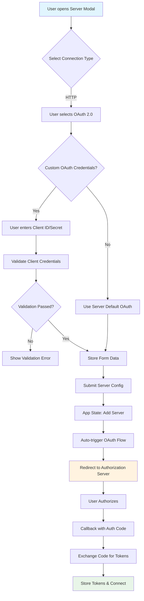

# MCP JAM Inspector OAuth Flow Analysis

## Executive Summary

The MCP JAM Inspector implements a comprehensive OAuth 2.0 authentication system for connecting to MCP (Model Context Protocol) servers that require authentication. This document provides a detailed analysis of the three primary OAuth flows implemented in the application, their branching logic, and the roles of various components.

## Architecture Overview

### Core Components

```
┌─────────────────┐    ┌─────────────────┐    ┌─────────────────┐
│   MCP Client    │    │  OAuth Provider │    │   MCP Server    │
│ (JAM Inspector) │    │  (e.g., GitHub, │    │ (Protected by   │
│                 │◄──►│   Google, etc.) │    │    OAuth)       │
└─────────────────┘    └─────────────────┘    └─────────────────┘
        │                        │                        │
        │                        │                        │
        └────────── OAuth Flow ──────────────────────────┘
```

### Key Libraries and Technologies

- **@modelcontextprotocol/sdk**: Official MCP SDK providing OAuth utilities
- **Local Storage**: Persistent token storage for production flows
- **Session Storage**: Temporary storage for guided/debug flows
- **CORS Proxy**: Server-side proxy to handle OAuth metadata requests
- **PKCE**: Proof Key for Code Exchange for enhanced security

## OAuth Flow 1: Server Addition with OAuth

**Trigger**: User adds a new HTTP server with OAuth authentication selected in ServerModal.tsx

### Flow Diagram



### Key Decision Points

1. **Connection Type Selection** (`ServerModal.tsx:431-491`)
   - STDIO vs HTTP server selection
   - Only HTTP servers support OAuth

2. **Authentication Method** (`ServerModal.tsx:553-578`)
   - None, Bearer Token, or OAuth 2.0
   - OAuth enables `useOAuth: true` in form data

3. **Client Credential Configuration** (`ServerModal.tsx:614-697`)
   - Checkbox: "Use custom OAuth credentials"
   - If checked: Manual Client ID/Secret entry
   - If unchecked: Use server's default OAuth flow

4. **Validation Logic** (`ServerModal.tsx:186-226`)
   - Client ID: 3-100 chars, alphanumeric + dots/hyphens/underscores
   - Client Secret: Optional, 8+ chars for security

### Storage Patterns

```javascript
// Form data structure passed to onSubmit
{
  name: "server-name",
  type: "http",
  url: "https://api.example.com/mcp",
  useOAuth: true,
  oauthScopes: ["mcp:*"],
  clientId: "optional-client-id",
  clientSecret: "optional-client-secret",
  headers: {} // custom headers
}
```

## OAuth Flow 2: Quick Auth (Production Flow)

**Trigger**: User clicks "Quick OAuth" or "Quick Refresh" button in AuthTab.tsx

### Flow Diagram

```mermaid
flowchart TD
    A[User clicks Quick OAuth/Refresh] --> B{Existing Tokens?}
    B -->|Yes| C[Call refreshOAuthTokens]
    B -->|No| D[Call initiateOAuth]

    C --> E{Refresh Success?}
    E -->|Yes| F[Update Tokens in State]
    E -->|No| G[Fall back to Fresh OAuth]
    G --> D

    D --> H[Create MCPOAuthProvider]
    H --> I[Install CORS Proxy Interceptor]
    I --> J[Call MCP SDK auth()]
    J --> K{Auth Result}
    K -->|REDIRECT| L[Store State in localStorage]
    L --> M[Browser redirects to Auth Server]
    M --> N[User authorizes on external site]
    N --> O[Callback to /oauth/callback]
    O --> P[handleOAuthCallback function]
    P --> Q[Extract authorization code]
    Q --> R[Create new MCPOAuthProvider]
    R --> S[Call MCP SDK auth() with code]
    S --> T{Token Exchange Success?}
    T -->|Yes| U[Store tokens in localStorage]
    T -->|No| V[Show error message]
    U --> W[Create server config with Bearer token]
    W --> X[Return to app with tokens]

    F --> Y[Show success message]
    V --> Z[Show error message]
    X --> Y

    style A fill:#e1f5fe
    style M fill:#fff3e0
    style N fill:#ffebee
    style U fill:#e8f5e8
    style V fill:#ffcdd2
```

### Implementation Details

#### MCPOAuthProvider Class (`mcp-oauth.ts:72-191`)

```javascript
class MCPOAuthProvider implements OAuthClientProvider {
  constructor(serverName, customClientId?, customClientSecret?) {
    this.serverName = serverName;
    this.redirectUri = `${window.location.origin}/oauth/callback`;
    this.customClientId = customClientId;
    this.customClientSecret = customClientSecret;
  }

  // Key methods:
  clientInformation() // Retrieves stored/custom client info
  saveClientInformation() // Stores client registration data
  tokens() // Gets tokens from localStorage
  saveTokens() // Persists tokens to localStorage
  redirectToAuthorization() // Redirects browser to auth server
}
```

#### CORS Proxy Mechanism (`mcp-oauth.ts:17-53`)

```javascript
function createOAuthFetchInterceptor() {
  return async function interceptedFetch(input, init) {
    const url = typeof input === "string" ? input : input.toString();

    // Intercept OAuth metadata requests
    if (url.includes("/.well-known/oauth-authorization-server")) {
      // Proxy through server to avoid CORS
      const proxyUrl = `/api/mcp/oauth/metadata?url=${encodeURIComponent(url)}`;
      return await originalFetch(proxyUrl, { ...init, method: "GET" });
    }

    return await originalFetch(input, init);
  };
}
```

### Branch Decision Points

1. **Token Existence Check** (`AuthTab.tsx:564`)
   - If tokens exist: Show "Quick Refresh" button
   - If no tokens: Show "Quick OAuth" button

2. **Refresh vs New OAuth** (`AuthTab.tsx:161-171`)
   - Existing tokens → Try `refreshOAuthTokens()` first
   - No tokens → Go straight to `initiateOAuth()`

3. **OAuth Result Handling** (`mcp-oauth.ts:246-266`)
   - "REDIRECT" → Browser will redirect automatically
   - "AUTHORIZED" → Tokens received, create server config
   - Error → Display error message

### Storage Keys

```javascript
// localStorage keys used in production flow
`mcp-tokens-${serverName}`     // OAuth tokens
`mcp-client-${serverName}`     // Client registration info
`mcp-verifier-${serverName}`   // PKCE code verifier
`mcp-serverUrl-${serverName}`  // Server URL
`mcp-oauth-pending`            // Pending server name during flow
```

## OAuth Flow 3: Guided OAuth Flow (Debug/Educational)

**Trigger**: User clicks "Guided OAuth Flow" button in AuthTab.tsx

### Flow Diagram

```mermaid
flowchart TD
    A[User clicks Guided OAuth Flow] --> B[Reset any existing flow state]
    B --> C[Initialize DebugMCPOAuthClientProvider]
    C --> D[Create OAuthStateMachine]
    D --> E[Set step: metadata_discovery]

    E --> F[Step 1: Metadata Discovery]
    F --> G[Fetch /.well-known/oauth-protected-resource]
    G --> H{Resource Metadata Found?}
    H -->|Yes| I[Extract authorization_servers[0]]
    H -->|No| J[Use server base URL]
    I --> K[Fetch /.well-known/oauth-authorization-server]
    J --> K
    K --> L{OAuth Metadata Success?}
    L -->|Yes| M[Store metadata, advance to client_registration]
    L -->|No| N[Show error, stay on step]

    M --> O[Step 2: Client Registration]
    O --> P[Try Dynamic Client Registration]
    P --> Q{DCR Success?}
    Q -->|Yes| R[Save client info]
    Q -->|No| S[Fallback to static client metadata]
    S --> R
    R --> T[Advance to authorization_redirect]

    T --> U[Step 3: Authorization Preparation]
    U --> V[Generate PKCE code_challenge]
    V --> W[Build authorization URL with state]
    W --> X[Display authorization URL to user]
    X --> Y[User clicks link to open in browser]
    Y --> Z[User authorizes on external site]
    Z --> AA[User manually copies auth code]
    AA --> BB[Step 4: Authorization Code Entry]

    BB --> CC[User pastes code in text field]
    CC --> DD{Code Validation}
    DD -->|Valid| EE[Advance to token_request]
    DD -->|Invalid| FF[Show validation error]

    EE --> GG[Step 5: Token Request]
    GG --> HH[Exchange auth code for tokens]
    HH --> II{Token Exchange Success?}
    II -->|Yes| JJ[Store tokens in sessionStorage]
    II -->|No| KK[Show error message]
    JJ --> LL[Step 6: Complete]
    LL --> MM[Display final tokens]
    MM --> NN[User exits guided flow]
    NN --> OO[Copy tokens to production storage]

    style A fill:#e1f5fe
    style Y fill:#fff3e0
    style Z fill:#ffebee
    style AA fill:#fff59d
    style JJ fill:#e8f5e8
    style KK fill:#ffcdd2
```

### State Machine Implementation

#### OAuthStateMachine (`oauth-state-machine.ts:353-411`)

```javascript
class OAuthStateMachine {
  constructor(context) {
    this.context = context; // Contains state, serverUrl, serverName, provider, updateState
  }

  async proceedToNextStep() {
    const currentStep = this.context.state.oauthStep;
    const transition = oauthTransitions[currentStep];

    const canTransition = await transition.canTransition(this.context);
    if (canTransition) {
      await transition.execute(this.context);
    }
  }
}
```

#### State Transitions (`oauth-state-machine.ts:26-351`)

1. **metadata_discovery** → **client_registration**
   - Fetches OAuth server metadata
   - Handles resource metadata discovery (RFC 8705 extension)

2. **client_registration** → **authorization_redirect**
   - Attempts Dynamic Client Registration (DCR)
   - Falls back to static client metadata if DCR fails

3. **authorization_redirect** → **authorization_code**
   - Generates PKCE parameters
   - Creates authorization URL with proper scopes

4. **authorization_code** → **token_request**
   - Validates user-entered authorization code
   - Ensures code is not empty

5. **token_request** → **complete**
   - Exchanges authorization code for access tokens
   - Uses PKCE code_verifier for security

### Debug vs Production Differences

| Aspect | Guided Flow (Debug) | Quick Auth (Production) |
|--------|-------------------|----------------------|
| **Storage** | sessionStorage | localStorage |
| **Provider** | DebugMCPOAuthClientProvider | MCPOAuthProvider |
| **Redirect URL** | `/oauth/callback/debug` | `/oauth/callback` |
| **User Experience** | Step-by-step with explanations | Seamless browser redirects |
| **Authorization** | Manual code copy/paste | Automatic callback handling |
| **Purpose** | Educational/debugging | Production usage |

## Callback Handling Architecture

### Multiple Callback Routes

```javascript
// App.tsx routing logic
const isDebugCallback = window.location.pathname.startsWith("/oauth/callback/debug");
const isOAuthCallback = window.location.pathname === "/callback";

if (isDebugCallback) {
  return <OAuthDebugCallback />; // Manual code display
}

if (isOAuthCallback) {
  // Production callback - automatic processing
  // useElectronOAuth() handles Electron-specific cases
}
```

### Production Callback Processing

1. **URL Detection** (`use-app-state.ts:167-178`)
   - Checks for `code` parameter in URL on app mount
   - Calls `handleOAuthCallbackComplete()` if found

2. **Code Exchange** (`use-app-state.ts:87-165`)
   - Calls `handleOAuthCallback()` from mcp-oauth.ts
   - Retrieves pending server name from localStorage
   - Creates new MCPOAuthProvider instance
   - Exchanges code for tokens using MCP SDK

3. **Server Configuration** (`mcp-oauth.ts:537-557`)
   - Creates HttpServerDefinition with Bearer token
   - Normalizes server URL (removes query params)
   - Returns OAuth-configured server config

### Electron Integration

**useElectronOAuth Hook** (`useElectronOAuth.ts`)
- Listens for OAuth callbacks in Electron environment
- Converts Electron OAuth responses to web callback format
- Redirects to `/callback` route for standard processing

```javascript
// Electron OAuth callback handling
if (code) {
  const callbackUrl = new URL("/callback", window.location.origin);
  callbackUrl.searchParams.set("code", code);
  if (state) callbackUrl.searchParams.set("state", state);
  window.location.href = callbackUrl.toString();
}
```

## Security Implementation

### PKCE (Proof Key for Code Exchange)

All OAuth flows implement PKCE for enhanced security:

1. **Code Verifier Generation**: Random 43-128 character string
2. **Code Challenge**: SHA256 hash of verifier, base64-URL encoded
3. **Authorization Request**: Includes `code_challenge` and `code_challenge_method=S256`
4. **Token Request**: Includes original `code_verifier` for verification

### State Parameter

- Random 32-byte state value for CSRF protection
- Generated using `crypto.getRandomValues()`
- Verified during callback processing

### Secure Storage

- **Production**: localStorage with server-specific keys
- **Debug**: sessionStorage for temporary isolation
- **Token Isolation**: Each server's tokens stored separately
- **Client Credential Separation**: Client info stored separately from tokens

## Error Handling Patterns

### Client ID Validation (`ServerModal.tsx:186-206`)

```javascript
const validateClientId = (id) => {
  if (!id.trim()) return "Client ID is required";

  const validPattern = /^[a-zA-Z0-9][a-zA-Z0-9._-]*[a-zA-Z0-9]$|^[a-zA-Z0-9]$/;
  if (!validPattern.test(id.trim())) {
    return "Client ID should contain only letters, numbers, dots, hyphens, and underscores";
  }

  if (id.trim().length < 3) return "Client ID must be at least 3 characters";
  if (id.trim().length > 100) return "Client ID must be less than 100 characters";

  return null;
};
```

### OAuth Flow Error Recovery

1. **Network Errors**: Retry with exponential backoff
2. **Invalid Client**: Clear stored client info, retry registration
3. **Expired Tokens**: Automatic refresh attempt
4. **Invalid Grant**: Clear all stored data, restart flow
5. **CORS Issues**: Automatic proxy fallback

### User-Friendly Error Messages (`mcp-oauth.ts:274-287`)

```javascript
if (errorMessage.includes("invalid_client")) {
  errorMessage = "Invalid client ID. Please verify the client ID is correctly registered.";
} else if (errorMessage.includes("unauthorized_client")) {
  errorMessage = "Client not authorized. The client ID may not be registered for this server.";
}
```

## MCP Server Integration

### Server Configuration Creation

**OAuth-enabled servers receive**:

```javascript
{
  url: new URL("https://api.example.com/mcp"),
  requestInit: {
    headers: {
      Authorization: `Bearer ${tokens.access_token}`
    }
  },
  oauth: tokens // Full token object for refresh
}
```

### Token Refresh Cycle

1. **Automatic Detection**: Monitor token expiration
2. **Refresh Attempt**: Use refresh_token if available
3. **Fallback**: Re-initiate OAuth flow if refresh fails
4. **Connection Update**: Update server config with new tokens

### Connection Status States

- `connecting`: Initial OAuth flow in progress
- `oauth-flow`: User interaction required (authorization step)
- `connected`: Successfully authenticated and operational
- `error`: Authentication failed or expired

## Branching Logic Summary

### Flow Selection Branch

```
User Action → Flow Type
├── Add Server with OAuth → Server Addition Flow
├── Quick OAuth/Refresh → Production Flow
└── Guided OAuth Flow → Debug/Educational Flow
```

### Authentication Method Branch

```
Server Type → Auth Options
├── STDIO Server → No OAuth (process-based auth)
└── HTTP Server → OAuth 2.0 | Bearer Token | None
```

### Client Registration Branch

```
OAuth Flow → Client Registration
├── Custom Credentials → User-provided Client ID/Secret
├── Dynamic Registration → Server-generated credentials
└── Static Metadata → Fallback client configuration
```

### Token Management Branch

```
Token State → Action
├── No Tokens → Fresh OAuth Flow
├── Valid Tokens → Use Existing
├── Expired Tokens → Refresh Flow
└── Invalid Tokens → Clear & Re-authenticate
```

## Key File Locations

### Core OAuth Implementation
- `client/src/lib/mcp-oauth.ts` - Production OAuth provider and flows
- `client/src/lib/oauth-state-machine.ts` - Guided flow state machine
- `client/src/lib/debug-oauth-provider.ts` - Debug/educational provider
- `client/src/lib/oauth-flow-types.ts` - TypeScript interfaces

### UI Components
- `client/src/components/connection/ServerModal.tsx` - Server addition with OAuth
- `client/src/components/AuthTab.tsx` - Quick Auth and Guided Flow UI
- `client/src/components/OAuthFlowProgress.tsx` - Step-by-step guided UI
- `client/src/components/OAuthDebugCallback.tsx` - Debug callback display

### State Management
- `client/src/hooks/use-app-state.ts` - Application state and OAuth completion
- `client/src/hooks/useElectronOAuth.ts` - Electron OAuth integration
- `client/src/state/oauth-orchestrator.ts` - OAuth reconnection logic

### Server-side Support
- `server/routes/mcp/oauth.ts` - CORS proxy for OAuth metadata

## Conclusion

The MCP JAM Inspector implements a sophisticated OAuth 2.0 system that balances security, usability, and educational value. The three distinct flows serve different purposes:

1. **Server Addition Flow**: Seamless integration during initial setup
2. **Quick Auth Flow**: Production-ready authentication with minimal user friction
3. **Guided Flow**: Educational tool for understanding OAuth mechanics

The architecture properly handles the complexity of OAuth 2.0 while providing fallbacks, security measures, and user-friendly error handling. The modular design allows for easy extension and maintenance while supporting both browser and Electron environments.

## OIDC vs OAuth 2.0 Context

The MCP JAM Inspector primarily implements **OAuth 2.0** for authorization rather than **OpenID Connect (OIDC)** for authentication. Key distinctions:

### OAuth 2.0 Implementation
- **Purpose**: Authorization to access MCP server resources
- **Token Types**: Access tokens and refresh tokens
- **Scopes**: Resource-specific (e.g., `mcp:*`)
- **Flow Type**: Authorization Code with PKCE
- **Use Case**: Machine-to-machine API access

### OIDC Considerations
- **Not implemented**: No ID tokens or user identity verification
- **No user profile**: OAuth is used purely for API authorization
- **No SSO**: Each MCP server connection is independently authenticated

This design is appropriate since MCP servers need authorization to access their APIs rather than user authentication/identity verification.