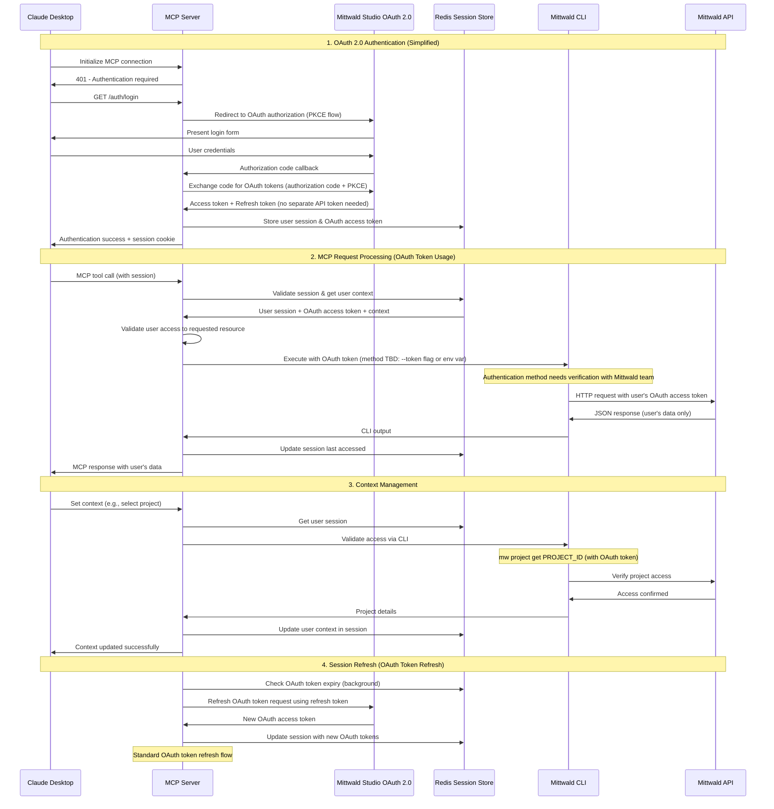

# Mittwald OAuth MCP Server: Simplified Multitenant Proposal

## Executive Summary

Transform the current single-tenant Mittwald MCP server into a secure multitenant platform using OAuth authentication integrated with Mittwald's self-service OAuth client system. This revised proposal focuses on core functionality using Docker Compose deployment without complex scaling infrastructure.

**Key Research Findings:**
- ✅ Mittwald API supports self-service OAuth client creation
- ✅ OAuth access tokens function directly as API tokens (no separate token creation needed)
- ⚠️ OIDC is not currently supported - mStudio uses OAuth 2.0 with authorization code + PKCE flow only
- ⚠️ CLI --token flag availability needs verification with Mittwald team

---

## 1. High-Level Architecture

### Current vs. Target Architecture

```
CURRENT STATE (Single Tenant)
┌─────────────────┐    ┌──────────────────┐    ┌─────────────────┐
│   MCP Client    │◄──►│   MCP Server     │◄──►│  Mittwald API   │
│   (Claude)      │    │ (Single Token)   │    │ (MITTWALD_API_  │
└─────────────────┘    └──────────────────┘    │    TOKEN)       │
                                               └─────────────────┘

TARGET STATE (Multitenant OAuth)
┌─────────────────┐    ┌──────────────────┐    ┌─────────────────┐
│   MCP Client    │◄──►│   OAuth Layer    │◄──►│ Mittwald Studio │
│   (Claude)      │    │  Session Mgmt    │    │   OAuth 2.0     │
└─────────────────┘    └──────────────────┘    └─────────────────┘
                                │
                                ▼
                       ┌──────────────────┐    ┌─────────────────┐
                       │ Per-User Context │◄──►│  Redis Sessions │
                       │ CLI Wrapper      │    │  User Contexts  │
                       └──────────────────┘    └─────────────────┘
                                │
                                ▼
                       ┌──────────────────┐
                       │  Mittwald API    │
                       │ (Per-User Token) │
                       └──────────────────┘
```

### Key Architectural Components

1. **OAuth Authentication Layer**: Mittwald Studio OAuth 2.0 integration (authorization code + PKCE flow)
2. **Session Management**: Redis-based per-user sessions and context
3. **Context Isolation**: Per-user CLI context (project-id, server-id, etc.)
4. **Token Injection**: Per-user OAuth token injection (CLI integration method TBD - requires verification of --token flag support)
5. **MCP Protocol Handler**: Request routing with tenant isolation

---

## 2. Multitenant CLI Context Safety Plan

### Current Context Problem
- CLI context (project-id, server-id, org-id) stored in local files
- Single global `MITTWALD_API_TOKEN` environment variable
- No user isolation in multitenant environment
- Risk of cross-user context contamination

### Solution: Per-User Context Isolation

```typescript
// Current context storage (UNSAFE for multitenancy)
~/.config/mittwald/context.json
{
  "project-id": "global-project",
  "server-id": "global-server"
}

// New per-user session context (SAFE for multitenancy)
interface UserSession {
  sessionId: string;
  userId: string;
  mittwaldApiToken: string;  // User's personal API token
  currentContext: {
    projectId?: string;      // User-specific project
    serverId?: string;       // User-specific server
    orgId?: string;          // User-specific organization
  };
  // WHAT IS THIS FOR? Might cause cache problem
  accessibleProjects: string[];  // Projects user has access to
  lastAccessed: Date;
}
```

### Context Safety Implementation

1. **Session-Based Context Storage**
   - Store all context in Redis per session
   - No global context files used
   - Context isolated by user session

2. **CLI Command Injection (Using Existing `--token` Flag)**
   ```bash
   # Old approach (unsafe - global environment variable)
   MITTWALD_API_TOKEN=global_token mw project list
   
   # New approach (safe - per-user token injection)
   mw project list --token=user_specific_token --project-id=user_project
   ```

   **Key Feature**: The Mittwald CLI already supports the `--token` flag for all commands.

3. **Context Validation**
   - Validate user has access to specified resources
   - Audit all context changes

### How Users Get API Tokens

**Existing CLI Infrastructure**:
```bash
# Users can create API tokens via CLI
mw user api-token create --description "My MCP Token" --roles api_read api_write

# Or manage them in Mittwald Studio dashboard
```

**REVISED APPROACH: Direct OAuth Token Usage**

**Based on Research Findings from Mittwald Team (@martin-helmich):**
- OAuth 2.0 Access Tokens can be used directly as mStudio API tokens
- **No separate API token creation required** - eliminates need for `user.createApiToken` API calls
- Simplified authentication flow with fewer moving parts
- OAuth tokens work directly with Mittwald API endpoints
- Standard OAuth token lifecycle management (refresh tokens, expiration)

---

## 3. OAuth 2.0 Information Flow Diagram

### Complete End-to-End Flow



---

## 4. Required Software Component Changes

### 4.1 MCP Server Core Changes

**File: `src/server.ts`**
- Add OAuth middleware for request authentication
- Implement session validation before processing requests
- Add user context extraction from session

**File: `src/server/auth-store.ts`** (New)
- Implement OAuth 2.0 client integration (authorization code + PKCE flow)
- Handle authorization code exchange
- Manage OAuth token refresh logic

**File: `src/server/session-manager.ts`** (New)
- Redis session storage and retrieval
- Session timeout and cleanup
- User context management

### 4.2 CLI Wrapper Modifications

**File: `src/utils/cli-wrapper.ts`**
- **NEEDS VERIFICATION**: Modify to use CLI token injection (method TBD)
- Add per-user OAuth token injection (via --token flag or environment variable)
- Add context parameter injection (`--project-id`, `--server-id`, etc.)
- Implement user permission validation

**Proposed Changes (Pending CLI Team Verification)**:
```typescript
// OPTION 1: If --token flag is supported globally
export async function executeCliWithUserToken(
  command: string,
  args: string[],
  userSession: UserSession,
  options: CliExecuteOptions = {}
): Promise<CliExecuteResult> {
  // Inject user's OAuth token via --token flag (if supported)
  const tokenArgs = [...args, '--token', userSession.oauthAccessToken];
  
  // Inject context if available
  if (userSession.currentContext.projectId) {
    tokenArgs.push('--project-id', userSession.currentContext.projectId);
  }
  
  return executeCli(command, tokenArgs, {
    ...options,
    env: {
      ...options.env,
      MITTWALD_API_TOKEN: undefined, // Clear global token
      MITTWALD_NONINTERACTIVE: '1',
      CI: '1'
    }
  });
}

// OPTION 2: If environment variable is the only option
export async function executeCliWithUserToken(
  command: string,
  args: string[],
  userSession: UserSession,
  options: CliExecuteOptions = {}
): Promise<CliExecuteResult> {
  return executeCli(command, args, {
    ...options,
    env: {
      ...options.env,
      MITTWALD_API_TOKEN: userSession.oauthAccessToken, // Use OAuth token as API token
      MITTWALD_NONINTERACTIVE: '1',
      CI: '1'
    }
  });
}
```

**File: `src/handlers/tool-handlers.ts`**
- Extract user session from MCP request context
- Pass user session to CLI wrapper
- Add audit logging for all operations

### 4.3 New Authentication Components

**File: `src/auth/oauth-client.ts`** (New)
```typescript
class MittwaldOAuthClient {
  async exchangeCodeForTokens(code: string, codeVerifier: string): Promise<TokenSet>;
  async refreshTokens(refreshToken: string): Promise<TokenSet>;
  async validateToken(token: string): Promise<UserClaims>;
  // Note: No need for separate API token extraction - OAuth tokens work directly
}
```

**File: `src/auth/session-store.ts`** (New)
```typescript
class RedisSessionStore {
  async createSession(user: User, tokens: TokenSet): Promise<string>;
  async getSession(sessionId: string): Promise<UserSession | null>;
  async updateContext(sessionId: string, context: Context): Promise<void>;
  async destroySession(sessionId: string): Promise<void>;
}
```

### 4.4 Context Management Components

**File: `src/context/user-context.ts`** (New)
```typescript
class UserContextManager {
  async setUserContext(sessionId: string, context: Context): Promise<void>;
  async validateResourceAccess(userId: string, resourceId: string): Promise<boolean>;
  async getUserProjects(userId: string): Promise<Project[]>;
}
```

### 4.5 Docker Compose Configuration

**File: `docker-compose.yml`** (Modified)
```yaml
version: '3.8'
services:
  mcp-server:
    build: .
    ports:
      - "3000:3000"
    environment:
      - NODE_ENV=production
      - REDIS_URL=redis://redis:6379 
      - OAUTH_AUTHORIZATION_URL=https://studio.mittwald.de/oauth2/authorize
      - OAUTH_TOKEN_URL=https://studio.mittwald.de/oauth2/token
      - OAUTH_CLIENT_ID=${MITTWALD_OAUTH_CLIENT_ID}
      - OAUTH_CLIENT_SECRET=${MITTWALD_OAUTH_CLIENT_SECRET}
      - OAUTH_REDIRECT_URI=https://your-mcp-server.com/auth/callback
    depends_on:
      - redis

  redis:
    image: redis:7-alpine
    volumes:
      - redis-data:/data
    command: redis-server --maxmemory 256mb --maxmemory-policy allkeys-lru

volumes:
  redis-data:
```

### 4.6 Environment Configuration

**File: `.env.example`** (New)
```bash
# OAuth 2.0 Configuration
MITTWALD_OAUTH_CLIENT_ID=your_client_id
MITTWALD_OAUTH_CLIENT_SECRET=your_client_secret
OAUTH_AUTHORIZATION_URL=https://studio.mittwald.de/oauth2/authorize
OAUTH_TOKEN_URL=https://studio.mittwald.de/oauth2/token
OAUTH_REDIRECT_URI=https://your-mcp-server.com/auth/callback

# Redis Configuration
REDIS_URL=redis://localhost:6379

# Session Configuration
SESSION_SECRET=your_session_secret
SESSION_TTL=28800  # 8 hours
```

---

## 5. Mittwald Systems Access and Enablement Requirements

### 5.1 Critical OAuth 2.0 Requirements 

**Immediate Access Needed:**
1. **Mittwald Studio OAuth 2.0 Configuration**
   - ✅ **CONFIRMED**: Self-service OAuth client creation is supported
   - Client ID and Secret for MCP server application (via self-service registration)
   - Authorized redirect URIs configuration
   - Scope definitions for API access
   - ✅ **SIMPLIFIED**: OAuth access tokens work directly as API tokens (no separate token creation needed)

2. **OAuth Client Registration Process**
   - Use existing self-service OAuth client creation via contributor dashboard
   - **Client Configuration**: 
     ```json
     {
       "name": "MCP Server Integration",
       "client_id": "mcp-server-{unique-id}",
       "redirect_uris": ["https://your-mcp-server.com/auth/callback"],
       "scopes": ["api_read", "api_write"]
     }
     ```
   - **Authentication Flow**: Authorization code + PKCE (already supported)

3. **OAuth Flow Capabilities**
   - ✅ **CONFIRMED**: Authorization code flow with PKCE is supported
   - ✅ **CONFIRMED**: OAuth access tokens function directly as API tokens
   - Token refresh process using refresh tokens (standard OAuth flow)

### 5.2 API Integration Requirements

**Required Access:**
1. **Development API Environment**
   - Sandbox API endpoints for testing
   - Test user accounts with various permission levels
   - API rate limits and quotas documentation

2. **Production API Access**
   - OAuth-enabled API endpoints
   - User permission validation endpoints
   - Project/organization membership APIs

### 5.3 Technical Documentation Needed

**Essential Information for Implementation:**
1. **User Token Management**
   - How Mittwald Studio stores/issues user API tokens
   - Token scope and permission mapping
   - Token refresh and revocation procedures

2. **Resource Access Control**
   - Project membership validation APIs
   - Organization role-based permissions
   - Resource ownership verification methods

3. **Multi-tenant Data Isolation**
   - Current tenant isolation mechanisms in Mittwald API
   - Cross-tenant access prevention measures
   - Audit logging requirements

### 5.4 Infrastructure Support Requirements

**Deployment Support:**
1. **Development Environment**
   - Docker/container deployment guidance
   - Redis instance recommendations
   - SSL certificate requirements for OAuth callbacks

2. **Security Review**
   - Security team review of OAuth implementation
   - Penetration testing coordination
   - Compliance verification (GDPR, SOC2)

### 5.5 Ongoing Support Commitment

**Required from Mittwald Team:**
1. **Technical Point of Contact** 
   - OAuth/OIDC technical questions
   - API integration troubleshooting
   - Security review coordination

2. **Testing Support**
   - Access to test environments
   - Test user account creation
   - API behavior validation

3. **Documentation Review**
   - Technical accuracy verification
   - Security implementation validation
   - User experience feedback

### 5.6 Key Questions for Mittwald - ANSWERED

**Research Findings Based on Documentation and Team Input:**

1. **OAuth Capability Confirmation** ✅
   - ✅ **CONFIRMED**: Mittwald Studio supports OAuth 2.0 for self-service third-party applications
   - ❌ **NOT SUPPORTED**: OIDC is not currently supported - only OAuth 2.0
   - ✅ **CONFIRMED**: Authorization code flow with PKCE is supported

2. **API Token Integration Strategy** ✅ 
   - ✅ **SIMPLIFIED APPROACH**: OAuth 2.0 Access Tokens can be used directly as mStudio API tokens
   - ❌ **NO LONGER NEEDED**: Separate API token creation via `user.createApiToken` is unnecessary
   - ✅ **DIRECT USAGE**: OAuth access tokens work directly with Mittwald API endpoints
   - ✅ **STANDARD LIFECYCLE**: Standard OAuth token refresh using refresh tokens

3. **CLI Token Usage** ⚠️ **NEEDS VERIFICATION**
   - ⚠️ **UNCERTAIN**: Global `--token` flag support needs verification with Mittwald CLI team
   - ✅ **ALTERNATIVE CONFIRMED**: `MITTWALD_API_TOKEN` environment variable definitely works
   - ✅ **API EQUIVALENCE**: Both methods work identically at the API level (per @martin-helmich)
   - ⚠️ **SECURITY NOTE**: `--token` flag may expose tokens in shell history (not applicable in MCP context)

4. **Multi-tenancy Support** ✅
   - ✅ **RBAC MODEL**: mStudio API implements RBAC for all relevant endpoints (similar to GitHub's org/repository access model)
   - ❌ **NO STRICT ISOLATION**: No strict tenant isolation, but RBAC provides adequate security
   - ❌ **NO USER AUDIT LOGS**: No audit logging mechanisms accessible to end users

5. **Development Timeline** ✅
   - ✅ **FAST REGISTRATION**: Self-service OAuth application registration available (within a day)
   - ✅ **MINIMAL SECURITY REVIEW**: No major security hurdles expected (RBAC enforcement via API)
   - ⚠️ **PRODUCTION DEPLOYMENT**: Process needs discussion with Mittwald team

6. **Resource Allocation** ✅
   - ✅ **TEAM CONTACTS**: @martin-helmich and @freisenhauer recommended as primary contacts
   - ✅ **SUPPORT AVAILABLE**: General integration developer support via https://github.com/mittwald/contributor-support
   - ⚠️ **RESOURCE CONSTRAINTS**: @freisenhauer has limited availability - use support discussion board

### 5.7 Critical Outstanding Questions

**MUST RESOLVE BEFORE IMPLEMENTATION:**

1. **CLI Authentication Method** ⚠️
   - **QUESTION**: Does the Mittwald CLI support a global `--token` flag for all commands?
   - **IMPACT**: Determines authentication architecture (flag vs environment variable)
   - **ACTION**: Direct verification with Mittwald CLI team required

2. **OIDC References Cleanup** ❌
   - **FINDING**: mStudio does NOT support OIDC - only OAuth 2.0
   - **ACTION**: Remove all OIDC references from proposal and implementation plans
   - **STATUS**: ✅ Completed in this revision

3. **OAuth Token/API Token Compatibility** 🚨 **CRITICAL ASSUMPTION UNVERIFIED**
   - **ASSUMPTION**: OAuth access tokens can be used directly as API tokens
   - **SOURCE**: Informal comment from @martin-helmich: "IIRC, the OAuth 2 Access Token can already be used as an mStudio API token"
   - **PROBLEM**: "IIRC" suggests uncertainty - no definitive technical documentation found
   - **IMPACT**: If incorrect, entire simplified approach fails and complex token creation flow is required
   - **ACTION**: Direct technical verification required before implementation

### 5.8 Research References and Documentation Gaps

**TODO: VERIFY OAUTH/API TOKEN COMPATIBILITY**

#### **Documentation Found:**

1. **API Authentication Methods** (https://api.mittwald.de/v2/openapi.json):
   ```
   "You can authenticate by passing your API token in the X-Access-Token header or as a bearer token"
   "You can obtain [an API token] by logging into the mStudio and navigating to the 'API Tokens' section"
   ```

2. **OAuth 2.0 Support** (https://developer.mittwald.de/docs/v2/contribution/overview/concepts/authentication/):
   ```
   "OAuth2 is supported for mittwald's public API"
   "Access tokens can be obtained through OAuth2 flows: Authorization Code Grant and Authorization Code Grant with PKCE"
   ```

3. **Access Token Usage** (https://developer.mittwald.de/docs/v2/reference/user/user-authenticate-with-access-token-retrieval-key/):
   ```
   Example: curl -H "Authorization: Bearer $MITTWALD_API_TOKEN"
   "Public token to identify yourself against the public api"
   ```

#### **Critical Gap:**
- ❌ **NO DOCUMENTATION** explicitly states OAuth access tokens work as API tokens
- ❌ **NO EXAMPLES** show OAuth tokens used in `X-Access-Token` header
- ❌ **NO CONFIRMATION** of token type interchangeability

#### **Required Verification:**
1. **Technical Test**: Create OAuth client, obtain access token, test with API endpoints
2. **Team Confirmation**: Direct verification from Mittwald engineering team
3. **Documentation Request**: Official clarification on token compatibility

#### **Fallback Plan:**
If OAuth tokens ≠ API tokens, revert to original complex approach:
- OAuth flow for authentication
- Separate API token creation via `user.createApiToken`
- Token extraction and management logic 

---

## 6. Implementation Details

### 6.1 Simplified OAuth 2.0 Integration Flow

**REVISED: Direct OAuth Token Usage (No Separate API Token Creation)**

Based on research findings, the implementation is significantly simplified:

```typescript
// MCP Server OAuth Integration
class MittwaldOAuthIntegration {
  async handleOAuthCallback(code: string, codeVerifier: string): Promise<UserSession> {
    try {
      // 1. Exchange authorization code for OAuth tokens using PKCE
      const tokenResponse = await this.oauthClient.exchangeCodeForTokens(code, codeVerifier);
      
      // 2. OAuth access token IS the API token - no conversion needed
      const userSession: UserSession = {
        sessionId: generateSessionId(),
        oauthAccessToken: tokenResponse.access_token,  // Use directly as API token
        refreshToken: tokenResponse.refresh_token,
        expiresAt: new Date(Date.now() + tokenResponse.expires_in * 1000),
        currentContext: {},
        lastAccessed: new Date()
      };
      
      // 3. Validate token works with Mittwald API
      await this.validateOAuthToken(userSession.oauthAccessToken);
      
      return userSession;
      
    } catch (error) {
      throw new OAuthError('OAuth integration failed', error);
    }
  }
  
  private async validateOAuthToken(token: string): Promise<void> {
    try {
      // Test OAuth token directly against Mittwald API
      const result = await executeCliWithOAuthToken(
        'mw',
        ['user', 'get', 'me', '-o', 'json'],
        token
      );
      
      if (result.exitCode !== 0) {
        throw new Error('OAuth token validation failed');
      }
    } catch (error) {
      throw new Error(`OAuth token validation failed: ${error.message}`);
    }
  }
}
```

### 6.2 Simplified Token Lifecycle Management

**REVISED: Standard OAuth Token Management**

With OAuth tokens functioning directly as API tokens, lifecycle management is greatly simplified:

1. **Token Ownership**
   - OAuth tokens are managed by standard OAuth 2.0 flows
   - Users control access via OAuth consent/authorization
   - No hidden or auto-created tokens

2. **Token Management**
   ```typescript
   interface OAuthSession {
     sessionId: string;
     oauthAccessToken: string;    // Functions directly as API token
     refreshToken: string;        // For refreshing expired access tokens
     expiresAt: Date;            // Standard OAuth expiration
     lastUsed: Date;             // Track session usage
     scopes: string[];           // OAuth scopes granted
   }
   ```

3. **Token Refresh**
   - Standard OAuth refresh token flow
   - Automatic token refresh before expiration
   - No manual token rotation needed

4. **Token Cleanup**
   - OAuth token revocation handled by standard OAuth flows
   - When user revokes OAuth access, tokens become invalid
   - No orphaned token cleanup required

### 6.3 Simplified Error Handling Scenarios

**Critical Error Cases (Revised):**

1. **OAuth Flow Fails**
   ```typescript
   // Standard OAuth error handling
   if (oauthExchangeFails) {
     return {
       error: 'oauth_exchange_failed',
       error_description: 'Failed to exchange authorization code for tokens'
     };
   }
   ```

2. **OAuth Token Validation Fails**
   ```typescript
   // MCP should retry OAuth or show clear error
   if (tokenValidationFails) {
     return {
       error: 'INVALID_OAUTH_TOKEN',
       message: 'OAuth token is invalid or expired. Please re-authenticate.',
       retry_oauth: true
     };
   }
   ```

3. **Token Permissions Insufficient**
   ```typescript
   // Check if OAuth token has required scopes
   const requiredScopes = ['api_read', 'api_write'];
   if (!tokenHasScopes(oauthToken, requiredScopes)) {
     throw new Error('OAuth token lacks required API scopes');
   }
   ```

### 6.4 Security Considerations

**Revised Security Requirements:**

1. **OAuth Token Transmission Security**
   - OAuth tokens transmitted via secure HTTPS
   - Authorization code exchange protected by PKCE
   - No sensitive tokens in URL parameters or logs

2. **Token Storage Security**
   - OAuth tokens stored in Redis with encryption at rest
   - Session data encrypted using AES-256
   - Regular cleanup of expired sessions and tokens

3. **Audit Trail**
   ```typescript
   interface OAuthAuditEvent {
     eventType: 'oauth_login' | 'token_refresh' | 'token_validation' | 'session_expired';
     userId: string;
     sessionId: string;
     timestamp: Date;
     success: boolean;
     errorMessage?: string;
   }
   ```

### 6.5 Advantages of Revised Approach

1. **Simplified Architecture**
   - No complex token creation/extraction logic
   - Standard OAuth 2.0 flows throughout
   - Reduced implementation complexity

2. **Standard Token Lifecycle**
   - OAuth tokens managed by established patterns
   - Built-in expiration and refresh mechanisms
   - Industry-standard security practices

3. **Reduced Security Surface**
   - No custom token creation logic
   - No additional API endpoints for token management
   - Standard OAuth security model

4. **Better User Experience**
   - Single OAuth authorization flow
   - No confusion about different token types
   - Clear revocation/consent management

---

## 7. Implementation Timeline

### Phase 1: OAuth Foundation (Weeks 1-2) - SIMPLIFIED
- **Week 1**: Mittwald OAuth client registration and verification of OAuth token/API token compatibility
- **Week 2**: OAuth 2.0 client implementation with PKCE flow (no token extraction needed)

### Phase 2: CLI Integration (Weeks 3-4) - PENDING VERIFICATION
- **Week 3**: CLI authentication method verification and implementation (--token flag vs environment variable)
- **Week 4**: Context isolation and user permission validation using chosen CLI method

### Phase 3: Production Readiness (Weeks 5-6)
- **Week 5**: Redis session store, integration testing, and security validation
- **Week 6**: Docker Compose deployment, documentation, and production deployment

**Total Timeline: 6 weeks** (reduced from 8 weeks due to simplified OAuth approach)

---

## 7. Success Criteria

### Technical Metrics
- OAuth authentication flow completion rate > 95%
- Session management response time < 100ms
- Zero cross-tenant data access incidents
- 99% uptime with Docker Compose deployment

### Security Metrics
- Complete tenant isolation verification
- All CLI commands executed with correct user tokens
- Comprehensive audit trail for all operations
- Successful security review completion

### User Experience Metrics
- Seamless authentication from Claude Desktop
- Transparent context switching between projects
- No disruption to existing CLI workflows
- Positive feedback from beta users

---

## Conclusion

This revised proposal provides a focused approach to implementing OAuth 2.0 multitenancy for the Mittwald MCP server. Based on thorough research of Mittwald's API capabilities, the approach has been significantly simplified by leveraging direct OAuth token usage instead of complex token creation flows.

**Key Success Factors (Revised):**
1. ✅ **Mittwald OAuth 2.0 support** - CONFIRMED: Self-service OAuth client creation available
2. ✅ **Simplified token approach** - OAuth tokens function directly as API tokens (no separate creation needed)
3. ⚠️ **CLI integration method** - Requires verification of --token flag availability
4. ✅ **Per-user context isolation** - Core security mechanism via RBAC
5. ✅ **Redis session management** - Scalable session storage

**Key Advantages of Revised Approach:**
- ✅ **Simplified Architecture** - Standard OAuth 2.0 flows throughout
- ✅ **Reduced Implementation Complexity** - No custom token creation/extraction
- ✅ **Industry Standard Security** - Established OAuth security patterns
- ✅ **Self-Service Registration** - OAuth clients can be registered immediately
- ✅ **Standard Token Lifecycle** - Built-in OAuth expiration and refresh
- ⚠️ **CLI Integration** - Pending verification of optimal authentication method
