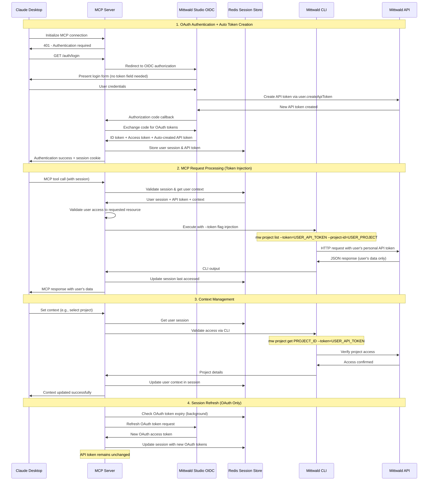

# Mittwald OAuth MCP Server: Simplified Multitenant Proposal

## Executive Summary

Transform the current single-tenant Mittwald MCP server into a secure multitenant platform using OAuth/OIDC authentication integrated with Mittwald Studio. This simplified proposal focuses on core functionality using Docker Compose deployment without complex scaling infrastructure.

---

## 1. High-Level Architecture

### Current vs. Target Architecture

```
CURRENT STATE (Single Tenant)
┌─────────────────┐    ┌──────────────────┐    ┌─────────────────┐
│   MCP Client    │◄──►│   MCP Server     │◄──►│  Mittwald API   │
│   (Claude)      │    │ (Single Token)   │    │ (MITTWALD_API_  │
└─────────────────┘    └──────────────────┘    │    TOKEN)       │
                                               └─────────────────┘

TARGET STATE (Multitenant OAuth)
┌─────────────────┐    ┌──────────────────┐    ┌─────────────────┐
│   MCP Client    │◄──►│   OAuth Layer    │◄──►│ Mittwald Studio │
│   (Claude)      │    │  Session Mgmt    │    │    OIDC         │
└─────────────────┘    └──────────────────┘    └─────────────────┘
                                │
                                ▼
                       ┌──────────────────┐    ┌─────────────────┐
                       │ Per-User Context │◄──►│  Redis Sessions │
                       │ CLI Wrapper      │    │  User Contexts  │
                       └──────────────────┘    └─────────────────┘
                                │
                                ▼
                       ┌──────────────────┐
                       │  Mittwald API    │
                       │ (Per-User Token) │
                       └──────────────────┘
```

### Key Architectural Components

1. **OAuth Authentication Layer**: Mittwald Studio OIDC integration
2. **Session Management**: Redis-based per-user sessions and context
3. **Context Isolation**: Per-user CLI context (project-id, server-id, etc.)
4. **Token Injection**: Per-user API token injection via existing CLI `--token` flag
5. **MCP Protocol Handler**: Request routing with tenant isolation

---

## 2. Multitenant CLI Context Safety Plan

### Current Context Problem
- CLI context (project-id, server-id, org-id) stored in local files
- Single global `MITTWALD_API_TOKEN` environment variable
- No user isolation in multitenant environment
- Risk of cross-user context contamination

### Solution: Per-User Context Isolation

```typescript
// Current context storage (UNSAFE for multitenancy)
~/.config/mittwald/context.json
{
  "project-id": "global-project",
  "server-id": "global-server"
}

// New per-user session context (SAFE for multitenancy)
interface UserSession {
  sessionId: string;
  userId: string;
  mittwaldApiToken: string;  // User's personal API token
  currentContext: {
    projectId?: string;      // User-specific project
    serverId?: string;       // User-specific server
    orgId?: string;          // User-specific organization
  };
  accessibleProjects: string[];  // Projects user has access to
  lastAccessed: Date;
}
```

### Context Safety Implementation

1. **Session-Based Context Storage**
   - Store all context in Redis per session
   - No global context files used
   - Context isolated by user session

2. **CLI Command Injection (Using Existing `--token` Flag)**
   ```bash
   # Old approach (unsafe - global environment variable)
   MITTWALD_API_TOKEN=global_token mw project list
   
   # New approach (safe - per-user token injection)
   mw project list --token=user_specific_token --project-id=user_project
   ```

   **Key Feature**: The Mittwald CLI already supports the `--token` flag for all commands.

3. **Context Validation**
   - Validate user has access to specified resources
   - Block access to unauthorized projects/servers
   - Audit all context changes

### How Users Get API Tokens

**Existing CLI Infrastructure**:
```bash
# Users can create API tokens via CLI
mw user api-token create --description "My MCP Token" --roles api_read api_write

# Or manage them in Mittwald Studio dashboard
```

**Selected Approach: Auto-Creation via Existing API**

**Studio Auto-Creates API Tokens**:
- Mittwald Studio automatically creates API tokens during OAuth using existing `user.createApiToken` API
- No user interaction required for token management
- Seamless authentication experience
- Tokens created with appropriate scopes (`api_read`, `api_write`)
- Automatic token lifecycle management

---

## 3. OAuth/OIDC Information Flow Diagram

### Complete End-to-End Flow



---

## 4. Required Software Component Changes

### 4.1 MCP Server Core Changes

**File: `src/server.ts`**
- Add OAuth middleware for request authentication
- Implement session validation before processing requests
- Add user context extraction from session

**File: `src/server/auth-store.ts`** (New)
- Implement OIDC client integration
- Handle authorization code exchange
- Manage token refresh logic

**File: `src/server/session-manager.ts`** (New)
- Redis session storage and retrieval
- Session timeout and cleanup
- User context management

### 4.2 CLI Wrapper Modifications

**File: `src/utils/cli-wrapper.ts`**
- Modify to use existing `--token` flag instead of `MITTWALD_API_TOKEN` environment variable
- Add per-user token injection via `--token` flag (leveraging existing CLI support)
- Add context parameter injection (`--project-id`, `--server-id`, etc.)
- Implement user permission validation

**Key Changes**:
```typescript
// NEW: Per-user token injection function
export async function executeCliWithUserToken(
  command: string,
  args: string[],
  userSession: UserSession,
  options: CliExecuteOptions = {}
): Promise<CliExecuteResult> {
  // Inject user's API token via existing --token flag
  const tokenArgs = [...args, '--token', userSession.mittwaldApiToken];
  
  // Inject context if available
  if (userSession.currentContext.projectId) {
    tokenArgs.push('--project-id', userSession.currentContext.projectId);
  }
  
  return executeCli(command, tokenArgs, {
    ...options,
    env: {
      ...options.env,
      // CRITICAL: Remove global token to prevent conflicts
      MITTWALD_API_TOKEN: undefined,
      MITTWALD_NONINTERACTIVE: '1',
      CI: '1'
    }
  });
}
```

**File: `src/handlers/tool-handlers.ts`**
- Extract user session from MCP request context
- Pass user session to CLI wrapper
- Add audit logging for all operations

### 4.3 New Authentication Components

**File: `src/auth/oidc-client.ts`** (New)
```typescript
class MittwaldOIDCClient {
  async exchangeCodeForTokens(code: string): Promise<TokenSet>;
  async refreshTokens(refreshToken: string): Promise<TokenSet>;
  async validateToken(token: string): Promise<UserClaims>;
  async extractApiTokenFromClaims(idToken: string): Promise<string>;
}
```

**File: `src/auth/session-store.ts`** (New)
```typescript
class RedisSessionStore {
  async createSession(user: User, tokens: TokenSet): Promise<string>;
  async getSession(sessionId: string): Promise<UserSession | null>;
  async updateContext(sessionId: string, context: Context): Promise<void>;
  async destroySession(sessionId: string): Promise<void>;
}
```

### 4.4 Context Management Components

**File: `src/context/user-context.ts`** (New)
```typescript
class UserContextManager {
  async setUserContext(sessionId: string, context: Context): Promise<void>;
  async validateResourceAccess(userId: string, resourceId: string): Promise<boolean>;
  async getUserProjects(userId: string): Promise<Project[]>;
}
```

### 4.5 Docker Compose Configuration

**File: `docker-compose.yml`** (Modified)
```yaml
version: '3.8'
services:
  mcp-server:
    build: .
    ports:
      - "3000:3000"
    environment:
      - NODE_ENV=production
      - REDIS_URL=redis://redis:6379
      - OIDC_ISSUER=https://studio.mittwald.de/auth/realms/mittwald
      - OIDC_CLIENT_ID=${MITTWALD_OIDC_CLIENT_ID}
      - OIDC_CLIENT_SECRET=${MITTWALD_OIDC_CLIENT_SECRET}
      - OIDC_REDIRECT_URI=https://your-mcp-server.com/auth/callback
    depends_on:
      - redis

  redis:
    image: redis:7-alpine
    volumes:
      - redis-data:/data
    command: redis-server --maxmemory 256mb --maxmemory-policy allkeys-lru

volumes:
  redis-data:
```

### 4.6 Environment Configuration

**File: `.env.example`** (New)
```bash
# OAuth Configuration
MITTWALD_OIDC_CLIENT_ID=your_client_id
MITTWALD_OIDC_CLIENT_SECRET=your_client_secret
OIDC_ISSUER=https://studio.mittwald.de/auth/realms/mittwald
OIDC_REDIRECT_URI=https://your-mcp-server.com/auth/callback

# Redis Configuration
REDIS_URL=redis://localhost:6379

# Session Configuration
SESSION_SECRET=your_session_secret
SESSION_TTL=28800  # 8 hours
```

---

## 5. Mittwald Systems Access and Enablement Requirements

### 5.1 Critical OAuth/OIDC Requirements 

**Immediate Access Needed:**
1. **Mittwald Studio OIDC Configuration**
   - Client ID and Secret for MCP server application
   - Authorized redirect URIs configuration
   - Scope definitions for API access
   - **CRITICAL**: Integration with `user.createApiToken` API during OAuth flow

2. **Studio Auto-Token Creation Implementation**
   - Studio must call `user.createApiToken` API during OAuth callback processing
   - **Token Configuration**: 
     ```json
     {
       "description": "MCP Server Access Token",
       "roles": ["api_read", "api_write"],
       "expiresAt": null // or appropriate expiration
     }
     ```
   - **Token Delivery**: Include created API token in OAuth response/claims
   - **Error Handling**: What happens if token creation fails during OAuth?

3. **OAuth Flow Documentation**
   - Supported OAuth 2.0 flows (authorization code, PKCE)
   - Token refresh process and timing
   - **CRITICAL**: Auto-token creation integration points and error scenarios

### 5.2 API Integration Requirements

**Required Access:**
1. **Development API Environment**
   - Sandbox API endpoints for testing
   - Test user accounts with various permission levels
   - API rate limits and quotas documentation

2. **Production API Access**
   - OAuth-enabled API endpoints
   - User permission validation endpoints
   - Project/organization membership APIs

### 5.3 Technical Documentation Needed

**Essential Information for Implementation:**
1. **User Token Management**
   - How Mittwald Studio stores/issues user API tokens
   - Token scope and permission mapping
   - Token refresh and revocation procedures

2. **Resource Access Control**
   - Project membership validation APIs
   - Organization role-based permissions
   - Resource ownership verification methods

3. **Multi-tenant Data Isolation**
   - Current tenant isolation mechanisms in Mittwald API
   - Cross-tenant access prevention measures
   - Audit logging requirements

### 5.4 Infrastructure Support Requirements

**Deployment Support:**
1. **Development Environment**
   - Docker/container deployment guidance
   - Redis instance recommendations
   - SSL certificate requirements for OAuth callbacks

2. **Security Review**
   - Security team review of OAuth implementation
   - Penetration testing coordination
   - Compliance verification (GDPR, SOC2)

### 5.5 Ongoing Support Commitment

**Required from Mittwald Team:**
1. **Technical Point of Contact** 
   - OAuth/OIDC technical questions
   - API integration troubleshooting
   - Security review coordination

2. **Testing Support**
   - Access to test environments
   - Test user account creation
   - API behavior validation

3. **Documentation Review**
   - Technical accuracy verification
   - Security implementation validation
   - User experience feedback

### 5.6 Key Questions for Mittwald

**Immediate Clarification Needed:**
1. **OAuth Capability Confirmation**
   - Does Mittwald Studio currently support OAuth 2.0/OIDC for third-party applications?
   - What OAuth flows are currently supported?
   - **CRITICAL**: Can users provide their API tokens during the OAuth flow in Studio?

2. **API Token Integration Strategy**
   - **✅ SELECTED**: Studio auto-creates API tokens for OAuth users via existing `user.createApiToken` API
   - **Required Implementation**: Studio calls `user.createApiToken` during OAuth callback
   - **Token Parameters**: Description: "MCP Server Access", Roles: ["api_read", "api_write"]
   - **Token Lifecycle**: How are auto-created tokens managed, renewed, or revoked?

3. **CLI Token Flag Validation**
   - **CONFIRMED**: All CLI commands support the `--token` flag (verified in CLI code)
   - Are there any security restrictions on using `--token` flag vs `MITTWALD_API_TOKEN` env var?
   - Any rate limiting or usage differences between the two approaches?

4. **Multi-tenancy Support**
   - How does the current Mittwald API handle multi-tenant scenarios?
   - What built-in tenant isolation exists?
   - Are there existing audit logging mechanisms?

5. **Development Timeline**
   - What's the realistic timeline for OAuth application registration?
   - How long does security review typically take?
   - What's the process for production deployment approval?

6. **Resource Allocation**
   - Which Mittwald team members will be assigned to support this project?
   - What level of ongoing support can be expected post-deployment?
   - Are there any internal resource constraints we should be aware of?

---

## 6. Implementation Details

### 6.1 Studio Auto-Token Creation Flow

**Technical Implementation Required by Mittwald:**

```javascript
// During OAuth callback processing in Mittwald Studio
async function handleOAuthCallback(user, clientId) {
  try {
    // 1. Validate OAuth authorization
    const oauthTokens = await createOAuthTokens(user, clientId);
    
    // 2. Auto-create API token for MCP access
    const apiTokenRequest = {
      description: `MCP Server Access - ${new Date().toISOString()}`,
      roles: ["api_read", "api_write"],
      expiresAt: null // Long-lived token or set appropriate expiration
    };
    
    const apiToken = await userApiService.createToken(user.id, apiTokenRequest);
    
    // 3. Include API token in OAuth response
    const idTokenClaims = {
      ...standardClaims,
      mittwald_api_token: apiToken.token,
      mcp_token_id: apiToken.id,
      mcp_token_created: apiToken.createdAt
    };
    
    return {
      access_token: oauthTokens.accessToken,
      id_token: createJWT(idTokenClaims),
      refresh_token: oauthTokens.refreshToken
    };
    
  } catch (error) {
    // Handle token creation failure
    throw new OAuthError('Failed to create MCP access token', error);
  }
}
```

### 6.2 MCP Server Token Extraction

**Implementation in MCP Server:**

```typescript
// src/auth/token-extractor.ts
class ApiTokenExtractor {
  async extractFromOAuthCallback(idToken: string): Promise<string> {
    // 1. Validate and decode JWT
    const claims = await this.validateJWT(idToken);
    
    // 2. Extract API token from claims
    if (!claims.mittwald_api_token) {
      throw new Error('No API token found in OAuth response');
    }
    
    // 3. Validate token works with Mittwald API
    await this.validateApiToken(claims.mittwald_api_token);
    
    return claims.mittwald_api_token;
  }
  
  private async validateApiToken(token: string): Promise<void> {
    // Test token by making a simple API call
    try {
      const result = await executeCliWithUserToken(
        'mw',
        ['user', 'get', 'me', '-o', 'json'],
        { mittwaldApiToken: token } as UserSession
      );
      
      if (result.exitCode !== 0) {
        throw new Error('Invalid API token received');
      }
    } catch (error) {
      throw new Error(`API token validation failed: ${error.message}`);
    }
  }
}
```

### 6.3 Token Lifecycle Management

**Considerations:**

1. **Token Ownership**
   - API tokens are created automatically by mStudio
   - Users may not be aware these tokens exist
   - Need clear documentation about auto-created tokens

2. **Token Management**
   ```typescript
   interface AutoCreatedTokenInfo {
     tokenId: string;          // Token ID from Mittwald API
     description: string;      // "MCP Server Access - 2025-01-30"
     createdAt: Date;         // When token was created
     lastUsed?: Date;         // Track usage
     mcpSessionCount: number; // How many MCP sessions use this token
   }
   ```

3. **Token Cleanup**
   - What happens when user revokes OAuth access?
   - Should auto-created API tokens be automatically deleted?
   - How to handle orphaned tokens?

4. **Token Rotation**
   - Should tokens be rotated periodically?
   - How to handle token rotation without breaking active MCP sessions?

### 6.4 Error Handling Scenarios

**Critical Error Cases:**

1. **Token Creation Fails During OAuth**
   ```typescript
   // Studio should handle gracefully
   if (apiTokenCreationFails) {
     return oauth_error({
       error: 'token_creation_failed',
       error_description: 'Unable to create MCP access token'
     });
   }
   ```

2. **Token Validation Fails in MCP**
   ```typescript
   // MCP should retry OAuth or show clear error
   if (tokenValidationFails) {
     return {
       error: 'INVALID_AUTO_TOKEN',
       message: 'Auto-created API token is invalid. Please re-authenticate.',
       retry_oauth: true
     };
   }
   ```

3. **Token Permissions Insufficient**
   ```typescript
   // Check if token has required roles
   const requiredRoles = ['api_read', 'api_write'];
   if (!tokenHasRoles(apiToken, requiredRoles)) {
     throw new Error('Auto-created token lacks required permissions');
   }
   ```

### 6.5 Security Considerations

**Security Requirements:**

1. **Token Transmission Security**
   - API tokens included in JWT claims (encrypted in transit)
   - JWT signed by Mittwald Studio private key
   - MCP server validates JWT signature before extracting token

2. **Token Storage Security**
   - API tokens stored in Redis with encryption at rest
   - Session data encrypted using AES-256
   - Regular cleanup of expired sessions and tokens

3. **Audit Trail**
   ```typescript
   interface TokenAuditEvent {
     eventType: 'auto_token_created' | 'token_extracted' | 'token_validated';
     userId: string;
     tokenId: string;
     sessionId: string;
     timestamp: Date;
     success: boolean;
     errorMessage?: string;
   }
   ```

### 6.6 Advantages

1. **Seamless User Experience**
   - No manual token management required
   - Single OAuth flow handles everything
   - Users don't need to understand API tokens

2. **Automatic Token Lifecycle**
   - Tokens created with appropriate permissions
   - Consistent token naming and metadata
   - Can implement automatic cleanup

3. **Reduced Security Risk**
   - No user handling of sensitive tokens
   - No risk of users providing wrong/invalid tokens
   - Controlled token creation process

4. **Better Integration**
   - Studio has full control over token creation
   - Can implement token rotation automatically
   - Better audit trail and monitoring

---

## 7. Implementation Timeline

### Phase 1: OAuth Foundation (Weeks 1-3)
- **Week 1**: Mittwald OAuth access setup and auto-token creation verification
- **Week 2**: OIDC client implementation with API token extraction from claims
- **Week 3**: Redis session store and user context management with auto-created tokens

### Phase 2: CLI Integration (Weeks 4-6)
- **Week 4**: CLI wrapper modifications to use `--token` flag instead of environment variables
- **Week 5**: Context isolation and user permission validation using existing CLI infrastructure
- **Week 6**: Integration testing and security validation

### Phase 3: Production Readiness (Weeks 7-8)
- **Week 7**: Docker Compose deployment setup and testing
- **Week 8**: Security review, documentation, and production deployment

**Total Timeline: 8 weeks**

---

## 7. Success Criteria

### Technical Metrics
- OAuth authentication flow completion rate > 95%
- Session management response time < 100ms
- Zero cross-tenant data access incidents
- 99% uptime with Docker Compose deployment

### Security Metrics
- Complete tenant isolation verification
- All CLI commands executed with correct user tokens
- Comprehensive audit trail for all operations
- Successful security review completion

### User Experience Metrics
- Seamless authentication from Claude Desktop
- Transparent context switching between projects
- No disruption to existing CLI workflows
- Positive feedback from beta users

---

## Conclusion

This simplified proposal provides a focused approach to implementing OAuth/OIDC multitenancy for the Mittwald MCP server. By using Docker Compose and focusing on core functionality, we can deliver a secure, scalable solution without complex infrastructure overhead.

**Key Success Factors:**
1. **Mittwald OAuth/OIDC support** - Critical foundation requirement  
2. **Studio API token auto-creation** - Via existing `user.createApiToken` API during OAuth
3. **Leveraging existing CLI `--token` flag** - No new CLI infrastructure needed
4. **Per-user context isolation** - Core security mechanism
5. **Redis session management** - Scalable session storage

**Key Advantages of Approach:**
- **Seamless User Experience** - No manual token management required from users
- **Leverages existing CLI infrastructure** - All commands already support `--token` flag  
- **Uses existing API endpoints** - Studio calls existing `user.createApiToken` API
- **Automatic token lifecycle** - Studio controls token creation, naming, and cleanup
- **Enhanced security** - No user handling of sensitive tokens
- **Clear integration path** - Well-defined Studio implementation requirements
