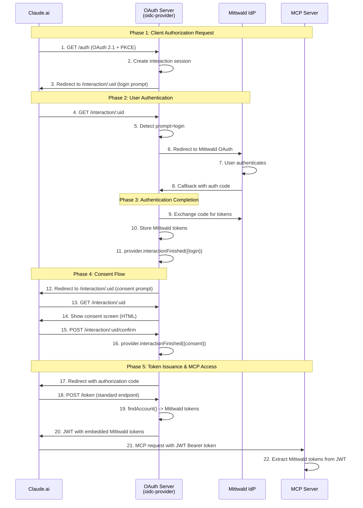

# Pure oidc-provider OAuth 2.1 Architecture

## 🎯 **Ultrathought Workflow: Claude.ai → MCP → Mittwald IdP**

### **Core Principle: Use oidc-provider's System Entirely**

**Eliminate:** Custom token endpoints, custom interaction stores, manual authorization codes, bridging logic
**Use:** oidc-provider's built-in OAuth 2.1 capabilities with minimal customization

---

## 🏗️ **Complete Architecture Flow**



---

## 📋 **Implementation Components**

### **1. User Account Store (New - Simple)**
```typescript
// Replace custom interaction store with simple user account mapping
interface UserAccount {
  accountId: string;
  mittwaldAccessToken: string;
  mittwaldRefreshToken: string;
  createdAt: number;
  expiresAt?: number;
}

class UserAccountStore {
  private accounts = new Map<string, UserAccount>();

  store(accountId: string, account: UserAccount): void
  get(accountId: string): UserAccount | null
}
```

### **2. findAccount Function (Enhanced)**
```typescript
// In provider.ts configuration
async findAccount(ctx, sub) {
  const account = userAccountStore.get(sub);
  return {
    accountId: sub,
    async claims(use, scope) {
      return {
        sub,
        // Embed Mittwald tokens as custom claims
        mittwald_access_token: account?.mittwaldAccessToken,
        mittwald_refresh_token: account?.mittwaldRefreshToken
      };
    }
  };
}
```

### **3. Simplified Interaction Handler**
```typescript
// Handle both login and consent prompts
router.get('/interaction/:uid', async (ctx) => {
  const details = await provider.interactionDetails(ctx.req, ctx.res);

  if (details.prompt?.name === 'login') {
    // Redirect to Mittwald OAuth for authentication
    return redirectToMittwald(ctx, details);
  }

  if (details.prompt?.name === 'consent') {
    // Show consent screen with requested scopes
    return showConsentScreen(ctx, details);
  }
});
```

### **4. Callback Handler (Streamlined)**
```typescript
// Store tokens and complete login
router.get('/mittwald/callback', async (ctx) => {
  const { code, state } = ctx.query;

  // Exchange Mittwald code for tokens
  const tokens = await exchangeMittwaldCode(code);

  // Store in user account
  const accountId = generateAccountId(tokens);
  userAccountStore.store(accountId, {
    accountId,
    mittwaldAccessToken: tokens.access_token,
    mittwaldRefreshToken: tokens.refresh_token,
    createdAt: Date.now()
  });

  // Complete oidc-provider login
  await provider.interactionFinished(ctx.req, ctx.res, {
    login: { accountId }
  });
});
```

---

## 🚀 **Benefits of Pure oidc-provider Approach**

### **Code Elimination (~450 lines removed):**
- ❌ **Custom token endpoint** (`/packages/oauth-server/src/handlers/token.ts`)
- ❌ **Custom interaction store** (`/packages/oauth-server/src/services/interaction-store.ts`)
- ❌ **Custom authorization code store** (`/packages/oauth-server/src/services/auth-code-store.ts`)
- ❌ **Complex bridging logic** (interaction mixing)

### **Standards Compliance:**
- ✅ **OpenID Certified™** oidc-provider handles all OAuth flows
- ✅ **Standard token endpoint** works with Claude.ai out of the box
- ✅ **Proper consent screens** with user transparency
- ✅ **Built-in PKCE validation** and security

### **Mittwald Integration:**
- ✅ **Static client support** (no changes needed at Mittwald)
- ✅ **Single callback URL** (existing whitelist works)
- ✅ **Scope compatibility** (all 41 Mittwald scopes supported)
- ✅ **Token embedding** (via findAccount custom claims)

---

## 🔧 **Implementation Changes Required**

### **Remove (Simplify):**
1. **Custom token routes** registration in `server.ts`
2. **Custom interaction store** entirely
3. **Manual authorization code** generation and storage
4. **Complex callback bridging** logic

### **Add (Minimal):**
1. **User account store** (simple Map with Mittwald tokens)
2. **Enhanced findAccount** function (embed Mittwald tokens)
3. **Prompt detection** in interaction handler (login vs consent)
4. **Standard consent screen** (HTML form with POST to confirm)

### **Keep (Working):**
1. **oidc-provider configuration** (scopes, client auth, etc.)
2. **Mittwald OAuth client** integration
3. **DCR support** for Claude.ai registration
4. **Scope validation middleware** for client compatibility

---

## 📊 **Complexity Comparison**

| Component | Current (Custom) | Pure oidc-provider | Reduction |
|-----------|------------------|-------------------|-----------|
| **Token Handling** | 200 lines | 0 lines | -200 |
| **Interaction Store** | 100 lines | 0 lines | -100 |
| **Auth Code Store** | 80 lines | 0 lines | -80 |
| **Bridging Logic** | 150 lines | 0 lines | -150 |
| **Configuration** | 50 lines | 50 lines | 0 |
| **findAccount** | 0 lines | 30 lines | +30 |
| **User Store** | 0 lines | 20 lines | +20 |
| **Total** | **580 lines** | **100 lines** | **-480 lines** |

**Result:** 83% code reduction with increased standards compliance.

---

## 🎯 **Expected Outcomes**

### **Claude.ai Compatibility:**
- ✅ **Standard OAuth 2.1 flow** (no custom bypasses)
- ✅ **Built-in token endpoint** (oidc-provider handles token exchange)
- ✅ **Proper consent screens** (OAuth security compliance)
- ✅ **JWT with Mittwald tokens** (embedded via findAccount)

### **Operational Benefits:**
- ✅ **No redirect loops** (single oidc-provider interaction system)
- ✅ **No context bridging** (standard oidc-provider flow throughout)
- ✅ **Better debugging** (oidc-provider's built-in logging)
- ✅ **Future compatibility** (works with any standard OAuth client)

### **Security Improvements:**
- ✅ **User consent transparency** (see exact permissions being granted)
- ✅ **Standards-based PKCE** (oidc-provider's proven implementation)
- ✅ **Proper client authentication** (supports both public and confidential)
- ✅ **Token security** (oidc-provider's JWT signing and validation)

---

This architecture eliminates the fundamental conflict between custom systems and oidc-provider standards, providing a clean, simple, and Claude.ai-compatible OAuth 2.1 implementation.