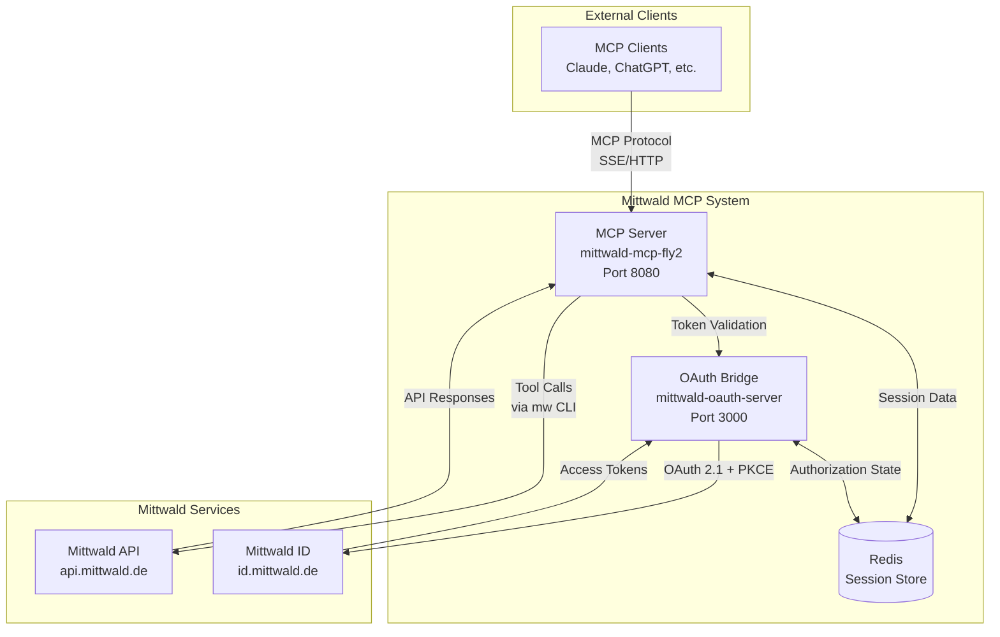
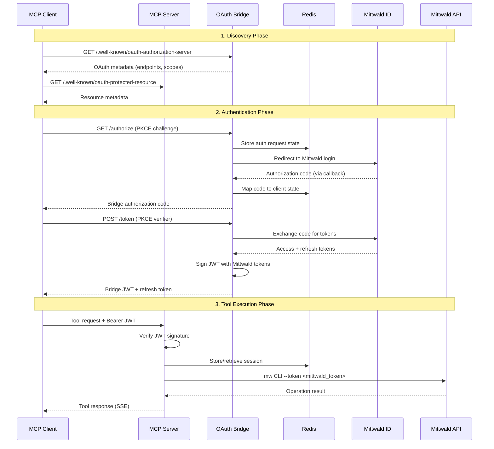
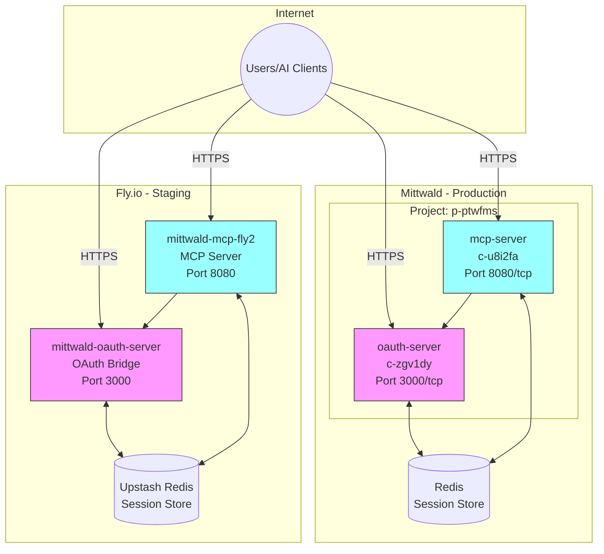

# Mittwald MCP System - Maintainers Handbook

**Version**: 1.1
**Last Updated**: 2025-12-17
**Target Audience**: Mittwald Operations & Development Teams

---

## Table of Contents

1. [System Overview](#system-overview)
2. [Architecture](#architecture)
   - [Component Architecture](#component-architecture)
   - [Data Flow](#data-flow)
   - [Deployment Topology](#deployment-topology)
3. [Repositories](#repositories)
   - [mittwald-mcp](#mittwald-mcp)
   - [mittwald-oauth](#mittwald-oauth)
   - [Repository Relationship](#repository-relationship)
4. [Deployment](#deployment)
   - [Fly.io Deployment](#flyio-deployment)
   - [Mittwald Deployment](#mittwald-deployment)
5. [Operations](#operations)
   - [Environment Variables](#environment-variables)
   - [Secrets Management](#secrets-management)
   - [Monitoring & Logging](#monitoring--logging)
6. [Troubleshooting](#troubleshooting)
7. [Test Scenarios](#test-scenarios)

---

## System Overview

The Mittwald MCP System enables AI assistants (Claude, ChatGPT, MCP Inspector, and other MCP-compliant clients) to interact with Mittwald's hosting infrastructure through the **Model Context Protocol (MCP)**. This protocol allows AI models to execute structured operations on behalf of authenticated users.

### What It Does

- **Exposes Mittwald API operations as AI-callable tools**: Projects, apps, containers, databases, domains, mail, and more
- **Handles OAuth 2.1 authentication**: Integrates with Mittwald ID using Authorization Code + PKCE flow
- **Provides secure, auditable access**: Every CLI operation authenticates with user-specific tokens
- **Supports dynamic client registration (DCR)**: AI platforms can register programmatically

### Key Capabilities

The MCP server exposes **173 tools** across 16 categories:

| Category | Tool Count | Examples |
|----------|------------|----------|
| Project | 10 | `project_list`, `project_create`, `project_delete` |
| App | 24 | `app_install`, `app_list`, `app_dependency_update` |
| Container | 17 | `container_run`, `container_logs`, `container_exec` |
| Database | 18 | `database_mysql_create`, `database_redis_create` |
| Domain | 12 | `domain_list`, `domain_dns_record_create` |
| Mail | 15 | `mail_address_create`, `mail_deliverybox_list` |
| SSH/SFTP | 8 | `ssh_user_create`, `sftp_user_list` |
| Cronjob | 5 | `cronjob_create`, `cronjob_execute` |
| Backup | 6 | `backup_create`, `backup_download` |
| User | 8 | `user_list`, `user_api_token_create` |
| Organization | 6 | `org_list`, `org_member_invite` |
| Conversation | 5 | `conversation_list`, `conversation_message_create` |
| Server | 3 | `server_list`, `server_get` |
| System | 6 | `system_version`, `system_software_list` |

### Users

- **AI Assistants**: Claude, ChatGPT, and other MCP clients consume the protocol
- **Mittwald Customers**: Use AI-powered tools to manage their hosting
- **Operations Teams**: Monitor system health, manage deployments, and troubleshoot

---

## Architecture

### Component Architecture

The system consists of several interconnected components:



**Component Responsibilities**:

| Component | Responsibility |
|-----------|----------------|
| **MCP Server** | Handles MCP protocol, validates JWTs, executes CLI commands, manages sessions |
| **OAuth Bridge** | Implements OAuth 2.1 proxy, dynamic client registration, JWT signing |
| **Redis** | Stores sessions, authorization state, rate limiting data |
| **Mittwald API** | Backend hosting operations (via `mw` CLI) |
| **Mittwald ID** | Identity provider, user consent, token issuance |

### Data Flow

The authentication and tool execution flow:



### Deployment Topology

The system deploys to two environments:



**Environment Details**:

| Environment | App | URL | Purpose |
|-------------|-----|-----|---------|
| Fly.io | mittwald-oauth-server | https://mittwald-oauth-server.fly.dev | Staging OAuth |
| Fly.io | mittwald-mcp-fly2 | https://mittwald-mcp-fly2.fly.dev | Staging MCP |
| Mittwald | oauth-server (c-zgv1dy) | Project domain :3000 | Production OAuth |
| Mittwald | mcp-server (c-u8i2fa) | Project domain :8080 | Production MCP |

---

## Repositories

### mittwald-mcp

**Purpose**: Main MCP server implementation with OAuth bridge package.

**Repository**: https://github.com/robertDouglass/mittwald-mcp

#### Directory Structure

```
mittwald-mcp/
├── src/                      # Core MCP server source
│   ├── auth/                # Authentication utilities
│   ├── config/              # Configuration loading
│   ├── constants/           # Server constants
│   ├── handlers/            # MCP tool handlers (173 tools)
│   ├── middleware/          # Express/session middleware
│   ├── resources/           # MCP resource handlers
│   ├── routes/              # HTTP routes
│   ├── server/              # Server setup, session manager
│   ├── services/            # Business logic services
│   ├── tools/               # Tool definitions and registry
│   ├── types/               # TypeScript type definitions
│   └── utils/               # Utility functions
├── packages/
│   ├── oauth-bridge/        # OAuth bridge Koa application
│   │   ├── src/
│   │   │   ├── routes/     # /authorize, /token, /register
│   │   │   ├── services/   # JWT signing, Mittwald client
│   │   │   └── state/      # Authorization state store
│   │   └── Dockerfile
│   └── mcp-server/          # MCP server package config
│       ├── fly.toml        # Fly.io deployment config
│       └── Dockerfile
├── tests/                    # Test suites
│   ├── unit/               # Unit tests (vitest)
│   ├── integration/        # Integration tests
│   ├── e2e/                # End-to-end tests
│   ├── security/           # Security regression tests
│   └── smoke/              # Deployment smoke tests
├── config/                   # Configuration files
│   ├── mittwald-scopes.json    # OAuth scope definitions
│   └── mw-cli-exclusions.json  # CLI coverage exclusions
├── docs/                     # Documentation
└── .github/workflows/        # CI/CD workflows
```

#### Key Files

| File | Purpose |
|------|---------|
| `src/server/mcp.ts` | MCP protocol handler, session lifecycle |
| `src/server/session-manager.ts` | Redis session persistence |
| `src/middleware/session-auth.ts` | Request authentication |
| `src/utils/session-aware-cli.ts` | CLI execution with session context injection |
| `src/utils/context-flag-support.ts` | Generated map of tool → supported context flags |
| `src/tools/cli-adapter.ts` | CLI tool invocation with error handling |
| `scripts/generate-context-flag-map.ts` | Generator for context flag support map |
| `packages/oauth-bridge/src/server.ts` | OAuth bridge entry point |
| `packages/oauth-bridge/src/routes/token.ts` | Token exchange logic |

#### Key Commands

```bash
# Install dependencies
npm install

# Build TypeScript
npm run build

# Run tests
npm test                  # Full suite
npm run test:unit        # Unit tests only
npm run test:integration # Integration tests

# Development
npm run dev              # Start MCP server (dev mode)
cd packages/oauth-bridge && npm run dev  # Start OAuth bridge

# Linting & Types
npm run lint
npm run typecheck

# Coverage
npm run coverage:generate  # Regenerate CLI coverage report

# Context Flag Map (regenerate after adding new CLI tools)
npm run generate:context-flags  # Updates src/utils/context-flag-support.ts
```

### mittwald-oauth

**Purpose**: Standalone OAuth 2.1 server with Dynamic Client Registration (legacy/companion).

**Repository**: https://github.com/robertDouglass/mittwald-oauth

> **Note**: The OAuth bridge in `packages/oauth-bridge/` is the primary OAuth implementation. The standalone `mittwald-oauth` repo may be used for specific deployment scenarios or legacy compatibility.

#### Directory Structure

```
mittwald-oauth/
├── src/
│   ├── lib/                 # Core OAuth logic
│   │   ├── dcr/            # Dynamic Client Registration
│   │   ├── oauth21/        # OAuth 2.1 implementation
│   │   └── mcp/            # MCP auth flow helpers
│   ├── routes/             # Express routes
│   ├── models/             # Data models
│   └── db/                 # Database migrations (Knex)
├── tests/                   # Jest + Playwright tests
└── specs/                   # Feature specifications
```

#### Key Commands

```bash
# Database
npm run db:migrate        # Run migrations
npm run db:seed          # Seed test data

# Development
npm run dev              # Start dev server

# Testing
npm test                 # Run Jest tests
npm run test:playwright  # Run E2E tests
```

### Repository Relationship

#### Why Two Approaches?

The system evolved to have an **integrated OAuth bridge** within `mittwald-mcp`:

| Aspect | packages/oauth-bridge | mittwald-oauth (standalone) |
|--------|----------------------|----------------------------|
| **Location** | Inside mittwald-mcp monorepo | Separate repository |
| **Framework** | Koa | Express |
| **State Store** | Redis | PostgreSQL + Redis |
| **Deployment** | Same CI/CD as MCP | Independent CI/CD |
| **Use Case** | Primary production use | Legacy/specific scenarios |

#### Communication Pattern

```
┌─────────────────────────────────────────────────────────────┐
│                    mittwald-mcp Repository                   │
├─────────────────────────────────────────────────────────────┤
│                                                              │
│  ┌──────────────────┐         ┌────────────────────────┐   │
│  │   MCP Server     │ ──────▶ │   OAuth Bridge         │   │
│  │   (src/)         │   JWT   │ (packages/oauth-bridge)│   │
│  │                  │ verify  │                        │   │
│  │  - Tool handlers │         │  - /authorize          │   │
│  │  - Session mgmt  │         │  - /token              │   │
│  │  - CLI execution │         │  - /register           │   │
│  └──────────────────┘         └────────────────────────┘   │
│           │                              │                  │
│           │ Redis                        │ Redis            │
│           ▼                              ▼                  │
│  ┌──────────────────────────────────────────────────────┐  │
│  │                   Shared Redis                        │  │
│  │   - Sessions: session:<id>                           │  │
│  │   - Auth state: auth:<state>                         │  │
│  │   - Rate limits: rate:<ip>                           │  │
│  └──────────────────────────────────────────────────────┘  │
│                                                              │
└─────────────────────────────────────────────────────────────┘
```

#### When to Modify Each

| Change Type | Location |
|-------------|----------|
| Add/modify MCP tool | `src/handlers/` in mittwald-mcp |
| Change OAuth flow | `packages/oauth-bridge/src/routes/` |
| Update API calls | `src/handlers/` or `src/services/` |
| Fix token handling | `packages/oauth-bridge/src/services/` |
| Add new middleware | `src/middleware/` in mittwald-mcp |
| Update session schema | `src/server/session-manager.ts` |
| Modify DCR behavior | `packages/oauth-bridge/src/routes/register.ts` |

---

## Deployment

### Fly.io Deployment

#### Prerequisites

```bash
# Install flyctl
brew install flyctl

# Authenticate
flyctl auth login

# Verify access
flyctl apps list
```

#### Deploy OAuth Bridge

```bash
cd mittwald-mcp

# Deploy oauth-bridge
flyctl deploy \
  --app mittwald-oauth-server \
  --config packages/oauth-bridge/fly.toml \
  --dockerfile packages/oauth-bridge/Dockerfile \
  --remote-only

# Verify health
curl https://mittwald-oauth-server.fly.dev/health
```

#### Deploy MCP Server

```bash
# Deploy mcp-server
flyctl deploy \
  --app mittwald-mcp-fly2 \
  --config packages/mcp-server/fly.toml \
  --dockerfile packages/mcp-server/Dockerfile \
  --remote-only

# Verify health
curl https://mittwald-mcp-fly2.fly.dev/health
```

#### View Logs

```bash
# OAuth bridge logs
flyctl logs -a mittwald-oauth-server -n 50

# MCP server logs
flyctl logs -a mittwald-mcp-fly2 -n 50
```

#### Rollback

```bash
# List releases
flyctl releases --app mittwald-oauth-server

# Rollback to specific release
flyctl deploy --app mittwald-oauth-server \
  --image registry.fly.io/mittwald-oauth-server:deployment-XXXXX
```

### Mittwald Deployment

#### Prerequisites

```bash
# Install mw CLI
npm install -g @mittwald/cli

# Authenticate
mw login

# Set project context
mw context set --project-id p-ptwfms

# List containers
mw container list
```

#### Update Container Image

```bash
# Update oauth-server
mw container update c-zgv1dy \
  --image mittwald/mcp-server-oauth:0.1.4 \
  --recreate

# Update mcp-server
mw container update c-u8i2fa \
  --image mittwald/mcp-server-http:0.1.4 \
  --recreate
```

#### Verify Deployment

```bash
# Check container status
mw container list --project-id p-ptwfms

# View logs (run from container SSH or use port-forward)
mw container logs c-u8i2fa
```

#### Rollback

```bash
# Rollback to previous image version
mw container update c-zgv1dy \
  --image mittwald/mcp-server-oauth:0.1.3 \
  --recreate

mw container update c-u8i2fa \
  --image mittwald/mcp-server-http:0.1.3 \
  --recreate
```

---

## Operations

### Environment Variables

#### MCP Server

| Variable | Required | Description |
|----------|----------|-------------|
| `PORT` | Yes | HTTP listen port (default: 8080) |
| `NODE_ENV` | Yes | Environment: `production`, `development` |
| `REDIS_URL` | Yes | Redis connection string |
| `OAUTH_BRIDGE_JWT_SECRET` | Yes | Shared secret with OAuth bridge |
| `OAUTH_BRIDGE_ISSUER` | Yes | Expected JWT issuer |
| `MCP_PUBLIC_BASE` | Yes | Public URL (e.g., `https://mittwald-mcp-fly2.fly.dev`) |
| `ENABLE_HTTPS` | No | `true` for TLS termination in-container |
| `ENABLE_DIRECT_BEARER_TOKENS` | No | Allow direct Mittwald token auth |

#### OAuth Bridge

| Variable | Required | Description |
|----------|----------|-------------|
| `PORT` | Yes | HTTP listen port (default: 3000) |
| `BRIDGE_BASE_URL` | Yes | Public URL |
| `BRIDGE_ISSUER` | Yes | JWT issuer string |
| `BRIDGE_JWT_SECRET` | Yes | JWT signing key (share with MCP) |
| `BRIDGE_REDIS_URL` | Yes | Redis connection string |
| `MITTWALD_AUTHORIZATION_URL` | Yes | Mittwald ID auth endpoint |
| `MITTWALD_TOKEN_URL` | Yes | Mittwald ID token endpoint |
| `MITTWALD_CLIENT_ID` | Yes | Mittwald OAuth client ID |
| `ENABLE_REGISTRATION` | No | Enable DCR (default: true) |

### Secrets Management

**Fly.io**:
```bash
# Set secrets
flyctl secrets set OAUTH_BRIDGE_JWT_SECRET=xxx -a mittwald-mcp-fly2

# List secrets (names only)
flyctl secrets list -a mittwald-mcp-fly2
```

**Mittwald**:
```bash
# Set environment variable on container
mw container update c-u8i2fa \
  -e OAUTH_BRIDGE_JWT_SECRET=xxx
```

### Monitoring & Logging

#### Health Endpoints

| Endpoint | Expected Response |
|----------|-------------------|
| `GET /health` | `200 OK` with JSON status |
| `GET /version` | `200 OK` with version info |
| `GET /.well-known/oauth-authorization-server` | OAuth metadata |
| `GET /.well-known/oauth-protected-resource` | Resource metadata |

#### Log Access

**Fly.io**:
```bash
flyctl logs -a mittwald-mcp-fly2 -n 100
```

**Mittwald**:
```bash
mw container logs c-u8i2fa
```

#### Key Log Patterns

| Pattern | Meaning |
|---------|---------|
| `JWT verification failed` | Invalid or expired token |
| `Session not found` | Missing Redis session |
| `CLI execution failed` | Mittwald API error |
| `Rate limit exceeded` | Too many requests |

---

## Troubleshooting

### Critical Issue: MCP Tool Timeouts (SIGTERM)

**Symptom**: All MCP tool calls timeout with `Command killed with signal SIGTERM`

**Root Cause**: Node.js process started without `--max-old-space-size` flag, resulting in insufficient heap memory (~42MB instead of 768MB).

**Diagnosis Steps**:

1. **Check for memory pressure in logs**:
   ```bash
   flyctl logs -a mittwald-mcp-fly2 --no-tail | tail -100 | grep "CRITICAL memory pressure"
   ```

   Look for:
   ```
   [ERROR] ⚠️  CRITICAL memory pressure detected {
     heapPercent: '90.6',
     heapUsedMB: '38.7',
     heapTotalMB: '42.8'  ← Should be ~768MB!
   }
   ```

2. **Verify Node.js is running with memory flag**:
   ```bash
   flyctl ssh console -a mittwald-mcp-fly2 -C "ps aux | grep 'node.*max-old-space'"
   ```

   Expected: `node --max-old-space-size=768 build/index.js`
   Problem: `node build/index.js` (missing flag)

3. **Check VM memory**:
   ```bash
   flyctl ssh console -a mittwald-mcp-fly2 -C "free -m"
   ```

   Should show ~459MB total with 200+ MB available

**Resolution**:

Ensure `Dockerfile` line 24 includes the memory flag:

```dockerfile
# CORRECT:
CMD ["node", "--max-old-space-size=768", "build/index.js"]

# WRONG:
CMD ["node", "build/index.js"]
```

**Verification After Fix**:

1. Deploy and check process:
   ```bash
   flyctl ssh console -a mittwald-mcp-fly2 -C "ps aux | grep node"
   # Should show: --max-old-space-size=768
   ```

2. Verify no memory pressure:
   ```bash
   flyctl logs -a mittwald-mcp-fly2 --no-tail | tail -50 | grep "CRITICAL memory"
   # Should return empty
   ```

3. Test MCP tool call (should complete without SIGTERM)

**Reference**: This issue was discovered and resolved via WP34 backups domain evaluation on 2025-12-17. Complete diagnosis: `evals/results/2025-12-17T21-25-15/root-cause-diagnosis.md`

---

### Common Issues

| Symptom | Cause | Resolution |
|---------|-------|------------|
| `401 Unauthorized` | Invalid/expired JWT | Re-authenticate via OAuth flow |
| `502 Bad Gateway` | App not started | Check logs, verify `PORT` config |
| `503 Service Unavailable` | Health check failing | Check Redis connection, review startup logs |
| `Redis connection refused` | Wrong `REDIS_URL` | Verify Redis credentials and network |
| `JWT issuer mismatch` | Config mismatch | Ensure `BRIDGE_ISSUER` matches across services |
| OAuth callback error | Redirect URI mismatch | Verify URI in Mittwald ID config |
| CLI flag not recognized | Context flag injection | Tool doesn't support `--project-id`. Run `npm run generate:context-flags` after adding tools |

### Diagnostic Commands

```bash
# Check Fly.io app status
flyctl status -a mittwald-mcp-fly2

# Check machine health
flyctl status -a mittwald-mcp-fly2 --json | jq '.Machines[].checks'

# Test OAuth metadata
curl https://mittwald-oauth-server.fly.dev/.well-known/oauth-authorization-server | jq

# Test DCR endpoint
curl -X POST https://mittwald-oauth-server.fly.dev/register \
  -H "Content-Type: application/json" \
  -d '{"client_name":"test","redirect_uris":["http://localhost/callback"]}'

# Check Mittwald container status
mw container list --project-id p-ptwfms
```

---

## Test Scenarios

### OAuth Flow Test

1. **Register a client**:
```bash
curl -X POST https://mittwald-oauth-server.fly.dev/register \
  -H "Content-Type: application/json" \
  -d '{
    "client_name": "Test Client",
    "redirect_uris": ["https://example.com/callback"],
    "token_endpoint_auth_method": "none",
    "grant_types": ["authorization_code", "refresh_token"],
    "response_types": ["code"]
  }'
# Expect: 201 Created with client_id
```

2. **Check OAuth metadata**:
```bash
curl https://mittwald-oauth-server.fly.dev/.well-known/oauth-authorization-server | jq
# Expect: JSON with authorization_endpoint, token_endpoint, etc.
```

### Health Check Test

```bash
# OAuth bridge
curl -s https://mittwald-oauth-server.fly.dev/health | jq
# Expect: {"status":"healthy",...}

# MCP server
curl -s https://mittwald-mcp-fly2.fly.dev/health | jq
# Expect: {"status":"healthy",...}
```

### MCP Protocol Test

```bash
# Test with MCP Inspector
npx @anthropic/mcp-inspector https://mittwald-mcp-fly2.fly.dev

# Or use curl for basic check
curl -i https://mittwald-mcp-fly2.fly.dev/mcp
# Expect: 401 with WWW-Authenticate header pointing to OAuth
```

---

## Appendix

### CLI Version Information

- **@mittwald/cli**: 1.12.0 (Dockerfile pinned)
- **Node.js**: 20.12.2 (Alpine)
- **MCP SDK**: @modelcontextprotocol/sdk ^1.23.0

### Related Documentation

- [ARCHITECTURE.md](./ARCHITECTURE.md) - Technical architecture details
- [DEPLOY.md](./DEPLOY.md) - Self-hosted deployment guide
- [cli-gap-analysis-1.12.md](./cli-gap-analysis-1.12.md) - CLI feature analysis
- [CREDENTIAL-SECURITY.md](./CREDENTIAL-SECURITY.md) - Security standards

### Contact

For issues or questions:
- GitHub Issues: https://github.com/robertDouglass/mittwald-mcp/issues
