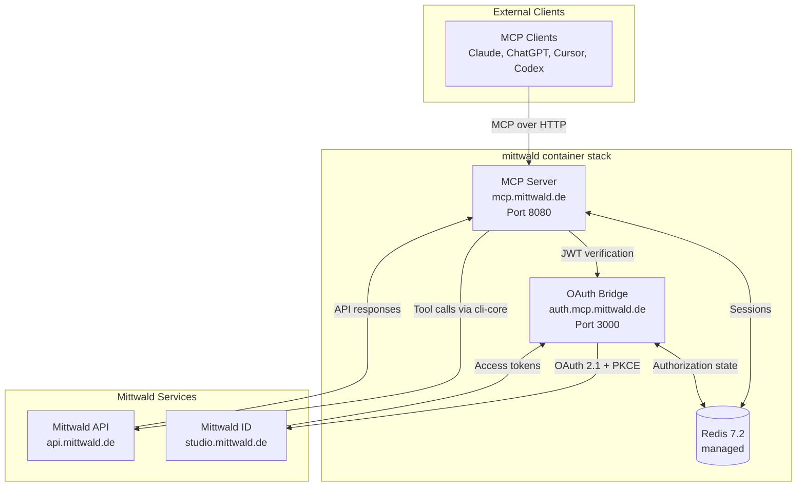
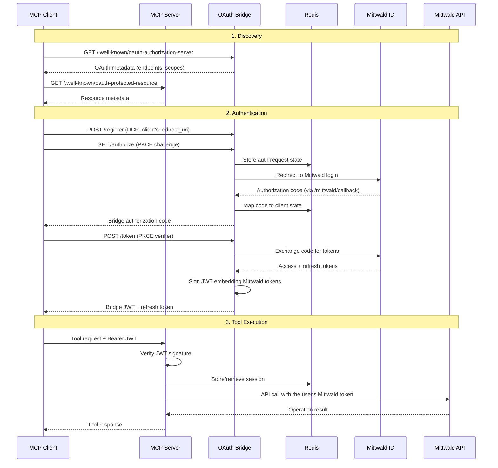

# Maintainers Handbook

**Audience**: Mittwald operations & development teams.

For architecture, read `ARCHITECTURE.md`. For deployment mechanics, read `DEPLOY.md`. For
development rules (tool annotations, execution model, scopes, DCR), read `CLAUDE.md`. This page
covers running the deployed system.

## System Overview

The Mittwald MCP server lets MCP clients (Claude, ChatGPT, Cursor, Codex CLI, MCP Inspector)
operate Mittwald hosting infrastructure on behalf of an authenticated user. It exposes **116 tools**
across 16 domains — apps, backups, certificates, containers, cronjobs, databases, domains, mail,
organizations, projects, registries, servers, SSH, stacks, users and volumes. The authoritative
list is the tool registry; the generated Tool Reference site mirrors it.

## Component Architecture


```mermaid
graph TB
    subgraph "External Clients"
        MC[MCP Clients<br/>Claude, ChatGPT, Cursor, Codex]
    end

    subgraph "mittwald container stack"
        MCP[MCP Server<br/>mcp.mittwald.de<br/>Port 8080]
        OAuth[OAuth Bridge<br/>auth.mcp.mittwald.de<br/>Port 3000]
        Redis[(Redis 7.2<br/>managed)]
    end

    subgraph "Mittwald Services"
        API[Mittwald API<br/>api.mittwald.de]
        ID[Mittwald ID<br/>studio.mittwald.de]
    end

    MC -->|MCP over HTTP| MCP
    MCP -->|Tool calls via cli-core| API
    MCP <-->|Sessions| Redis
    MCP -->|JWT verification| OAuth
    OAuth -->|OAuth 2.1 + PKCE| ID
    OAuth <-->|Authorization state| Redis
    ID -->|Access tokens| OAuth
    API -->|API responses| MCP
```

| Component | Responsibility |
|-----------|----------------|
| **MCP Server** (`src/`) | MCP protocol, JWT validation, session management, tool execution |
| **OAuth Bridge** (`packages/oauth-bridge/`) | OAuth 2.1 proxy, dynamic client registration, JWT signing |
| **`@mittwald-mcp/cli-core`** | Mittwald CLI business logic as a library, so tools run in-process |
| **Redis** | Sessions, authorization state, registration tokens |

## Data Flow


```mermaid
sequenceDiagram
    participant Client as MCP Client
    participant MCP as MCP Server
    participant OAuth as OAuth Bridge
    participant Redis as Redis
    participant ID as Mittwald ID
    participant API as Mittwald API

    Note over Client,API: 1. Discovery
    Client->>OAuth: GET /.well-known/oauth-authorization-server
    OAuth-->>Client: OAuth metadata (endpoints, scopes)
    Client->>MCP: GET /.well-known/oauth-protected-resource
    MCP-->>Client: Resource metadata

    Note over Client,API: 2. Authentication
    Client->>OAuth: POST /register (DCR, client's redirect_uri)
    Client->>OAuth: GET /authorize (PKCE challenge)
    OAuth->>Redis: Store auth request state
    OAuth->>ID: Redirect to Mittwald login
    ID-->>OAuth: Authorization code (via /mittwald/callback)
    OAuth->>Redis: Map code to client state
    OAuth-->>Client: Bridge authorization code
    Client->>OAuth: POST /token (PKCE verifier)
    OAuth->>ID: Exchange code for tokens
    ID-->>OAuth: Access + refresh tokens
    OAuth->>OAuth: Sign JWT embedding Mittwald tokens
    OAuth-->>Client: Bridge JWT + refresh token

    Note over Client,API: 3. Tool Execution
    Client->>MCP: Tool request + Bearer JWT
    MCP->>MCP: Verify JWT signature
    MCP->>Redis: Store/retrieve session
    MCP->>API: API call with the user's Mittwald token
    API-->>MCP: Operation result
    MCP-->>Client: Tool response
```

## Deployment

Production is a mittwald container stack described by `deploy/main.tf` and applied by
`.github/workflows/build-and-publish.yml` on `v*` tags. Do not deploy by hand — see `DEPLOY.md`.

| Environment | Service | URL |
|-------------|---------|-----|
| Production | OAuth bridge | https://auth.mcp.mittwald.de |
| Production | MCP server | https://mcp.mittwald.de |

Keep **one replica of each container**: the MCP transport holds per-session state in memory.

## Key Files

| File | Purpose |
|------|---------|
| `src/server/mcp.ts` | MCP protocol handler, session lifecycle |
| `src/server/oauth-middleware.ts` | Bridge JWT verification, direct bearer tokens |
| `src/server/direct-token-validator.ts` | Validates direct Mittwald API tokens via `/users/self` |
| `src/server/session-manager.ts` | Redis session persistence |
| `src/middleware/session-auth.ts` | Request authentication |
| `src/utils/tool-scanner.ts` | Tool discovery + the exclusion map |
| `src/utils/session-aware-cli.ts` | Context injection for tools that accept it |
| `src/utils/context-flag-support.ts` | Generated map of tool → supported context parameters |
| `scripts/generate-context-flag-map.ts` | Regenerates the above |
| `packages/oauth-bridge/src/routes/token.ts` | Token exchange |
| `packages/oauth-bridge/src/routes/register.ts` | Dynamic client registration |
| `deploy/main.tf` | Everything the production stack consists of |

## Common Commands

```bash
npm ci
npm run build:all              # workspace packages, then the server
npm run lint
npm run type-check
npm run test                   # full vitest suite
npm run test:unit
npm run test:integration
npm run coverage:generate      # regenerate CLI coverage artifacts
npm run generate:context-flags # after adding or changing tool schemas
npm run docs:guardrails        # after touching either docs site
```

## Environment Variables

`deploy/main.tf` is the authoritative record of what production sets. `.env.example` and
`packages/oauth-bridge/.env.example` document every supported variable. The essentials:

### MCP Server

| Variable | Required | Description |
|----------|----------|-------------|
| `PORT` | Yes | HTTP listen port (8080 in production) |
| `NODE_ENV` | Yes | `production` or `development` |
| `REDIS_URL` | Yes | Redis connection string |
| `OAUTH_BRIDGE_JWT_SECRET` | Yes | Must equal the bridge's `BRIDGE_JWT_SECRET` |
| `OAUTH_BRIDGE_ISSUER` | Yes | Expected JWT issuer |
| `MCP_PUBLIC_BASE` | Yes | Public URL, e.g. `https://mcp.mittwald.de` |
| `CORS_ORIGIN` | Yes in production | Wildcards are rejected at startup |
| `ENABLE_HTTPS` | No | `false` when TLS terminates upstream (production does) |
| `ENABLE_DIRECT_BEARER_TOKENS` | No | Allow direct Mittwald API token auth |
| `METRICS_USER` / `METRICS_PASS` | No | Basic auth for `/metrics` |

### OAuth Bridge

| Variable | Required | Description |
|----------|----------|-------------|
| `PORT` | Yes | HTTP listen port (3000 in production) |
| `BRIDGE_BASE_URL`, `BRIDGE_ISSUER` | Yes | Public URL and issuer claim |
| `BRIDGE_JWT_SECRET` | Yes | JWT signing key; shared with the MCP server |
| `BRIDGE_STATE_STORE` | Yes | `redis` in production, `memory` locally |
| `BRIDGE_REDIS_URL` | Yes when using Redis | Connection string |
| `MITTWALD_AUTHORIZATION_URL`, `MITTWALD_TOKEN_URL` | Yes | Mittwald ID endpoints |
| `MITTWALD_CLIENT_ID` | Yes | Public PKCE client — there is no client secret |
| `BRIDGE_REDIRECT_URIS` | No | Allowed MCP client redirect URIs |

**JWT secret synchronization**: Terraform derives both `BRIDGE_JWT_SECRET` and
`OAUTH_BRIDGE_JWT_SECRET` from one `random_string.jwt_secret`. If they ever diverge, JWT
verification fails and every request falls back to validating the token against Mittwald, which is
slow enough to have caused OOM kills. Change the secret in Terraform, never on a container.

## Monitoring

| Endpoint | Expected |
|----------|----------|
| `GET /health` | `200` with `{"status":"healthy", "checks":{"redis":"up"}}` |
| `GET /version` | `200` with version info |
| `GET /metrics` | Prometheus exposition (Basic auth in production) |
| `GET /.well-known/oauth-authorization-server` | Bridge OAuth metadata |
| `GET /.well-known/oauth-protected-resource` | MCP resource metadata |

Metric names are listed in `README.md`. `mcp_memory_pressure_percent` and `mcp_cli_queue_depth` are
the two worth alerting on. `grafana/` contains a dashboard and Prometheus alert rules.

Container logs:

```bash
mw container list --project-id <project-id>
mw container logs <container-id>
```

| Log pattern | Meaning |
|-------------|---------|
| `JWT verification failed` | Invalid or expired token |
| `Session not found` | Missing Redis session |
| `CRITICAL memory pressure` | Heap near its limit — see below |

## Troubleshooting

### Tool calls time out with SIGTERM

Almost always heap exhaustion. The Dockerfile's `CMD` runs
`node --max-old-space-size=768 build/index.js`, but a container definition that overrides both
`entrypoint` and `command` replaces that CMD and drops the flag, leaving Node at its small default
heap. Confirm with:

```bash
mw container logs <container-id> | grep "CRITICAL memory pressure"
```

Look for `heapTotalMB` far below 768. The fix is to include `--max-old-space-size=768` in the
container's `entrypoint`/`command` in `deploy/main.tf`.

### Common issues

| Symptom | Cause | Resolution |
|---------|-------|------------|
| `401 Unauthorized` | Invalid or expired JWT | Re-authenticate via the OAuth flow |
| `redirect_uri is not registered` | Client skipped DCR | Client must `POST /register` before `/authorize` |
| `502 Bad Gateway` | App not started | Check logs and `PORT` |
| `503 Service Unavailable` | Health check failing | Check the Redis connection and startup logs |
| `JWT issuer mismatch` | Config drift | Ensure `BRIDGE_ISSUER` matches across services |
| Tool rejects a context parameter | Stale flag map | Run `npm run generate:context-flags` |

### Diagnostic Commands

```bash
curl -s https://mcp.mittwald.de/health | jq
curl -s https://auth.mcp.mittwald.de/health | jq
curl -s https://auth.mcp.mittwald.de/.well-known/oauth-authorization-server | jq
curl -s https://mcp.mittwald.de/.well-known/oauth-protected-resource | jq

# MCP endpoint must challenge unauthenticated requests
curl -i https://mcp.mittwald.de/mcp   # expect 401 + WWW-Authenticate

# Dynamic client registration
curl -X POST https://auth.mcp.mittwald.de/register \
  -H "Content-Type: application/json" \
  -d '{"client_name":"test","redirect_uris":["http://localhost/callback"]}'
```

A full end-to-end OAuth walkthrough lives in `docs/oauth2c-end-to-end.md`.

## Versions

- `@mittwald/cli`: 1.12.0 (pinned in the Dockerfile and `package.json`)
- Node.js: 24.11.0 (see `.nvmrc` / `.node-version`; `engines` requires >= 24.11.0)
- MCP SDK: `@modelcontextprotocol/sdk` ^1.27.1
