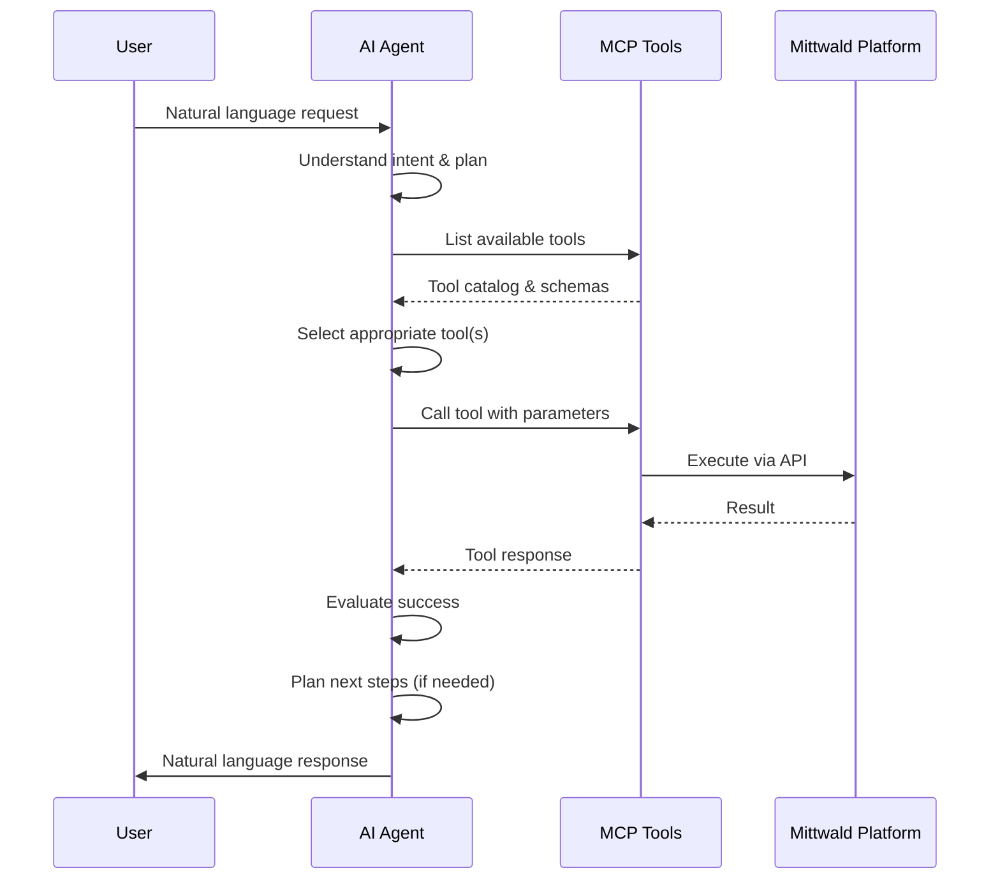

# What is Agentic Coding?

**Agentic coding** is a paradigm where AI assistants act as autonomous **agents** that use tools to solve complex development tasks, rather than just generating code or API documentation.

The key distinction: **Agents take action** rather than just provide suggestions.

---

## The Paradigm Shift

### Traditional AI Assistants (Co-Pilots)

Traditional AI coding assistants work as **co-pilots**:

```
You: "How do I create a database in Mittwald?"
AI: "Here's the API call:
     curl -X POST https://api.mittwald.de/v2/databases \\
     -H 'Authorization: Bearer token' \\
     -d '{\"name\": \"my-db\", ...}'"
You: [Copy and paste the command, run it in terminal]
```

**Your role**: You execute the AI's suggestions

**AI's role**: Advisor, code generator, documentation interpreter

**Time spent**:
- Reading documentation
- Constructing commands
- Waiting for execution
- Parsing results
- Manual error handling

### Agentic AI (Autonomous Agents)

Agentic assistants work as **autonomous agents**:

```
You: "Create a MySQL database called 'production' with 1GB storage"
AI: [Determines required action: database/create]
AI: [Authenticates with your OAuth token]
AI: [Calls database/create with parameters]
AI: "Created MySQL database 'production'.
     ID: db-xyz789
     Connection string: mysql://production.db.mittwald.de:3306"
```

**Your role**: You describe what you want

**AI's role**: Autonomous executor (figures out *how*, handles *what*)

**Time spent**: Just describing intent and reviewing results

---

## How Agentic Coding Works with MCP

### The Agent Loop



### Step-by-Step Example: Deploy a Web App

**You ask**:
```
"Set up a production environment: new project, TYPO3 CMS,
MySQL database, automated daily backups, SSL certificate"
```

**Agent executes** (automatically):

1. **Understand intent**: Recognizes multi-step task requiring several tools
2. **Create project**: Calls `project/create` → gets project ID
3. **Install TYPO3**: Calls `app/install` with project ID → gets installation details
4. **Create database**: Calls `database/create` with parameters → gets connection string
5. **Configure backup**: Calls `backup/create` with project ID → enables daily snapshots
6. **Issue certificate**: Calls `certificate/create` for domain → gets certificate ID
7. **Report**: Summarizes all actions and provides next steps

**You receive**:
```
"Environment ready!
- Project: my-project (ID: proj-abc123)
- TYPO3: Installed and configured
- Database: production-db (MySQL, 1GB)
- Backups: Daily snapshots enabled
- SSL: Certificate issued for yourdomain.com

Next steps: Configure DNS records and set admin password"
```

**Time**: Minutes instead of hours

---

## Agents vs. Assistants: Key Differences

| Aspect | Traditional Assistant | Agentic Agent |
|--------|----------------------|---------------|
| **Primary Role** | Advisor, suggester | Executor, problem-solver |
| **Interaction** | Question & answer | Task completion |
| **Tool Use** | Explains how to use tools | Uses tools autonomously |
| **Error Handling** | Requires manual retry | Handles and retries automatically |
| **Multi-step Tasks** | Requires user coordination | Plans and executes automatically |
| **Decision Making** | Suggests options | Chooses best path forward |
| **User Involvement** | High (execution) | Low (oversight) |
| **Time Efficiency** | Slower (manual steps) | Faster (automated) |

---

## Agentic Capabilities with MCP

### Tool Discovery

Agents can **dynamically discover** what tools are available:

```
Agent: "What tools does Mittwald MCP expose?"
[Calls list_tools()...]
Response: "115 tools across 14 domains available"
Agent: [Evaluates which tools apply to user request]
```

This enables:
- **Flexibility**: New tools automatically available without code changes
- **Adaptation**: Agent learns platform capabilities at runtime
- **Scalability**: System grows without agent modifications

### Multi-Step Planning

Agents can **plan complex workflows**:

```
User: "Migrate my WordPress site to Mittwald and set up a staging environment"

Agent [thinking]:
1. Create project (container for resources)
2. Set up production domain
3. Migrate WordPress data
4. Install SSL for production
5. Create staging project
6. Clone data to staging
7. Set up staging domain
8. Configure DNS

Agent [acting]: Executes steps 1-8, handling errors and retries
```

### Conditional Logic

Agents can **adapt based on results**:

```
Agent: "Creating database..."
[Database creation succeeds]
Agent: "Configuring backups..."

vs.

Agent: "Creating database..."
[Database creation fails - quota exceeded]
Agent: "Your database quota is full. Would you like me to
        delete old backups to free space? Or upgrade your plan?"
```

### Error Recovery

Agents can **handle failures gracefully**:

```
Agent: "Creating app..."
[App installation fails - incompatible with server OS]
Agent: [Automatically retries with different server configuration]
Agent: "App created successfully on compatible server"
```

---

## Real-World Example: Freelancer Workflow

### Without Agentic Coding

**Task**: Deploy a client's new website

**Manual steps** (~2 hours):
1. Log into MStudio control panel
2. Create new project
3. Read LAMP stack documentation
4. Find and install WordPress via MStudio
5. Create MySQL database manually
6. Configure WordPress database connection
7. Set up domain DNS records
8. Test domain resolution
9. Install SSL certificate manually
10. Configure SSL in WordPress
11. Set up automated backup schedule
12. Document setup for client

**Mistakes**: Wrong PHP version, forgotten DNS TTL, backup misconfiguration

**Result**: Full afternoon spent on setup, potential issues

### With Agentic Coding

**Task**: Deploy a client's new website

**Agentic request** (~15 minutes):
```
"Create a production-ready WordPress environment with:
- New project called 'client-name'
- LAMP stack (PHP 8.2, MySQL 8.0)
- WordPress installed and configured
- Daily backups to 7-day retention
- SSL certificate for [domain]
- Email forwarding for info@[domain]"
```

**Agent handles**: All setup, configuration, testing, documentation

**Result**: Environment ready in 15 minutes, zero manual errors, agent-generated documentation

**Impact**: 8x faster, zero errors, more client projects per week

---

## Practical Advantages

### Time Savings

**Common Mittwald tasks** - Time comparison:

| Task | Manual | Agentic | Savings |
|------|--------|---------|---------|
| Create project + database | 15 min | 2 min | 87% |
| Deploy TYPO3 with backup | 45 min | 5 min | 89% |
| Migrate site to new server | 60 min | 10 min | 83% |
| Set up staging environment | 30 min | 4 min | 87% |

### Quality Improvements

**Consistency**: Agents follow same procedure every time (no human variation)

**Completeness**: Agents don't forget steps or miss edge cases

**Documentation**: Agents can auto-generate setup documentation

**Rollback**: Agents can undo changes if needed

### Cost Reduction

**For agencies** (case study CS-002):
- **Before**: 1 junior dev handling infrastructure = 40% project overhead
- **After**: Junior dev + agentic AI = 10% project overhead
- **Result**: 30% more projects, same team size

---

## Limitations and Safeguards

### What Agents Should NOT Do Automatically

Agents have **guardrails** to prevent dangerous operations:

- **Destructive without confirmation**: Deleting projects, databases
- **Cost-impacting**: Upgrading server specs, increasing storage
- **Security changes**: Modifying access controls, rotating credentials
- **Data operations**: Migrations, backups restoration (requires approval)

**Design principle**: "Reversible actions are fast, destructive actions need approval"

### Human Oversight Still Important

Agentic systems work best with **human oversight**:

- Review agent's planned actions before execution
- Approve multi-step workflows
- Monitor critical operations
- Handle novel situations (agent asks for help)

**It's not about replacing humans; it's about amplifying human capability.**

---

## When to Use Agentic Coding

### Great for Agentic Coding

- **Exploratory work**: "What if I..." scenarios
- **Routine tasks**: Setup, configuration, migration
- **Multi-step workflows**: Complex operations broken into steps
- **Infrastructure automation**: Server provisioning, deployment
- **Knowledge work**: Researching and synthesizing information

### When to Use Traditional APIs/Manual Approaches

- **Highly specialized workflows**: One-off custom logic
- **Code generation**: When you need the actual code (not just execution)
- **Learning**: Understanding *how* systems work
- **Audit trails**: When you need to control every step for compliance

---

## The Future of Agentic Coding

### Emerging Capabilities

**Vision**:
- Agents working collaboratively on complex projects
- 24/7 autonomous infrastructure management
- Predictive optimization (agents proactively optimize costs, performance)
- Multi-agent teams (infrastructure agent + testing agent + documentation agent)

### Required Developments

- **Improved safety**: Better guardrails and approval workflows
- **Better transparency**: Agents explain their reasoning
- **Interoperability**: Agents from different vendors working together
- **Standards**: Industry-wide standards for agentic systems

---

## Common Misconceptions

### "Agentic AI will replace software developers"

**Reality**: Agentic AI **augments** developers, not replaces them.

- **Infrastructure setup**: 95% faster with agents
- **Architecture design**: Still requires human judgment
- **Complex features**: Still require human creativity
- **Testing strategy**: Still requires human expertise

Developers become more productive, not obsolete.

### "Agents can do anything AI assistants can do"

**Reality**: Agents are specifically designed for **tool use**.

**Agents excel at**:
- Using tools to accomplish tasks
- Multi-step workflows
- Hands-on operations

**Agents struggle with**:
- Creative code generation
- Architectural design
- Learning new domains
- Understanding context beyond tools

### "Agentic coding means less control"

**Reality**: Agentic systems provide **more control** through:

- **Approval workflows**: Review before execution
- **Audit trails**: Every action logged
- **Guardrails**: Dangerous operations blocked
- **Transparency**: Agents explain their decisions
- **Rollback**: Undo changes if needed

---

## Getting Started with Agentic Coding

1. **Set up OAuth** with your preferred tool ([Getting Started](/getting-started/))
2. **Explore MCP tools** in the [Reference](/reference/)
3. **Try simple tasks** first ("Create a project")
4. **Graduate to complex tasks** ("Set up a complete environment")
5. **Build workflows** for your routine operations

Start small. As you gain confidence, tackle more complex workflows.

---

## Further Learning

**Understand the protocol?**
→ [What is MCP?](/explainers/what-is-mcp/) - Deep dive into the protocol

**Want to see agentic workflows in practice?**
→ [Case Studies](/case-studies/) - Real developers using agentic coding

**Ready to start?**
→ [Getting Started](/getting-started/) - Set up your tool

---

*Agentic coding represents a fundamental shift in how developers interact with infrastructure. From executing steps to describing outcomes.*
