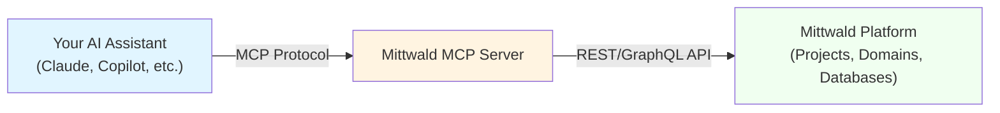

# What is MCP?

**MCP (Model Context Protocol)** is an open protocol that enables AI assistants (like Claude, ChatGPT, or Copilot) to interact with external tools, data sources, and services through a standardized interface.

Think of it as **USB for AI** — just as USB provides a universal way for devices to connect to computers, MCP provides a universal way for AI assistants to connect to your development tools and services.

---

## Why MCP Matters

### The Problem MCP Solves

Before MCP, integrating services with AI assistants was fragmented:

- **Claude needed** a Mittwald integration (custom implementation)
- **ChatGPT needed** a separate Mittwald integration (different implementation)
- **Copilot needed** yet another integration (yet another implementation)

Each integration used different APIs, authentication methods, and behaviors. This created:
- **Duplication**: Same work done multiple times
- **Fragmentation**: Inconsistent experiences across tools
- **Maintenance burden**: Updates needed in multiple places

### The MCP Solution

With MCP, Mittwald builds **one MCP server** that works with **all MCP-compatible AI assistants**:

- **Claude** connects via MCP
- **ChatGPT** connects via MCP
- **Copilot** connects via MCP
- All use the same tools, same API, same authentication

This provides:
- **Universal compatibility**: One implementation, multiple clients
- **Consistent experience**: Same behavior everywhere
- **Single maintenance**: Updates once, affects all integrations

---

## How MCP Works

### Architecture



**Three components**:

1. **MCP Client** (your AI assistant)
   - Sends requests to the MCP server
   - Receives responses and tool definitions
   - Handles natural language interpretation

2. **MCP Server** (Mittwald)
   - Receives MCP requests from clients
   - Translates to Mittwald API calls
   - Manages authentication and authorization
   - Returns results in MCP format

3. **Resource Provider** (Mittwald platform)
   - Actual infrastructure (projects, domains, databases)
   - REST API for direct programmatic access
   - Authentication via OAuth 2.1

### The Protocol in Action

**Example: Creating a Project**

1. **You (natural language)**:
   ```
   "Create a new project called 'my-website'"
   ```

2. **AI Assistant (MCP client)**:
   - Understands intent: "Create a project"
   - Finds tool: `project/create`
   - Sends MCP request with parameters (name: "my-website")

3. **Mittwald MCP Server**:
   - Receives the MCP request
   - Authenticates using your OAuth token
   - Calls Mittwald API: `POST /v2/projects`
   - Receives success response
   - Returns result via MCP protocol

4. **AI Assistant**:
   - Receives response
   - Translates to natural language:
   ```
   "Created project 'my-website' with ID project-xyz789"
   ```

**All of this happens in seconds, transparently to you.**

---

## Core MCP Concepts

### Tools

**Tools** are discrete capabilities exposed by the MCP server.

Mittwald MCP provides **115 tools** organized into 14 domains:

| Domain | Count | Purpose |
|--------|-------|---------|
| **apps** | 8 | Application lifecycle (install, upgrade, uninstall) |
| **backups** | 8 | Backup creation and restoration |
| **containers** | 10 | Docker stack deployment |
| **databases** | 14 | MySQL and Redis management |
| **domains-mail** | 22 | Domain, DNS, email, virtualhost management |
| **identity** | 13 | User profiles, API tokens, SSH keys |
| **project-foundation** | 12 | Project and server management |
| **automation** | 9 | Workflow automation tools |
| **... (6 more)** | ... | ... |

Each tool has:
- **Name**: Unique identifier (e.g., `project/create`)
- **Parameters**: Inputs the tool accepts (e.g., project name, organization ID)
- **Return value**: Data the tool provides (e.g., project ID, status)

### Schemas

**Schemas** define the structure of tool parameters and return values.

Schemas serve several purposes:
- **AI compatibility**: Tools describe what parameters they need
- **Type safety**: Validation ensures correct data types
- **Discovery**: AI assistants can explore available tools and their parameters
- **Documentation**: Schemas serve as self-documenting specifications

Example schema for `project/create`:
```json
{
  "name": "project/create",
  "description": "Create a new project",
  "parameters": {
    "name": {"type": "string", "description": "Project name"},
    "organizationId": {"type": "string", "description": "Organization ID"}
  },
  "returns": {
    "id": {"type": "string"},
    "name": {"type": "string"},
    "status": {"type": "string"}
  }
}
```

### Resources (Optional in MCP)

Some MCP servers expose **resources** — queryable or subscribable data sources.

Example: A calendar server might expose calendar events as resources.

**Mittwald MCP focuses on tools** (actions) rather than resources (data streams). This is appropriate because Mittwald users primarily need to take actions (create, update, delete) rather than subscribe to data streams.

### Prompts (Optional in MCP)

Some MCP servers provide **prompt templates** for common tasks.

Example prompt template: "Set up a complete web hosting stack: project + TYPO3 + MySQL database + automated backups"

**Mittwald MCP currently prioritizes tools.** Prompt templates could be added in future versions for guided, multi-step workflows.

---

## How Mittwald Implements MCP

### Architecture Overview

**Mittwald MCP Server**: https://mittwald-mcp-fly2.fly.dev/mcp

**Implementation details**:
- **Transport**: HTTP with Server-Sent Events (SSE) for streaming
- **Authentication**: OAuth 2.1 with PKCE for secure authentication
- **Tools**: 115 tools across 14 functional domains
- **Platform**: Node.js + TypeScript running on Fly.io (globally distributed)

### Authentication

Mittwald MCP uses **OAuth 2.1** for authentication. Why OAuth?

- **Secure**: Your password never shared with MCP server
- **Scoped**: Tools only access resources you explicitly authorize
- **Standard**: Industry-standard protocol, well-understood
- **Revocable**: You can revoke access anytime

See [How OAuth Integration Works](/explainers/oauth-integration/) for detailed explanation.

### Tool Organization

Tools are grouped by **domain** — functional areas of the Mittwald platform:

**Infrastructure**:
- `project-foundation` (12 tools) - Projects, servers
- `containers` (10 tools) - Docker stacks
- `sftp` (5 tools) - SFTP server management

**Data Services**:
- `databases` (14 tools) - MySQL, Redis
- `backups` (8 tools) - Backup operations

**Web Services**:
- `apps` (8 tools) - Application management
- `domains-mail` (22 tools) - Domains, DNS, email
- `certificates` (6 tools) - SSL/TLS certificates

**User & Organization**:
- `identity` (13 tools) - Users, tokens, SSH keys
- `organization` (7 tools) - Organization management
- `access-users` (7 tools) - User access control

**Other**:
- `automation` (9 tools) - Automation workflows
- `context` (3 tools) - System context information
- `misc` (5 tools) - Miscellaneous utilities

Complete reference available in [Tool Reference](/reference/).

---

## Design Decisions

### Why MCP Instead of Just REST API?

**MCP advantages**:
- **AI-native**: Designed from the ground up for AI assistants
- **Standardized**: One protocol works across all MCP-compatible assistants
- **Discoverable**: Tools are automatically discoverable and self-describing
- **Type-safe**: Schemas provide built-in validation

**REST API advantages**:
- **Universal**: Works with any HTTP client (curl, browsers, etc.)
- **Mature**: Well-established patterns and best practices
- **Extensive tooling**: Postman, curl, programming language libraries
- **Human-usable**: Can test directly in browser

**Mittwald's approach**: Provide **both**
- MCP for AI-assisted workflows
- REST API for direct programmatic access, automation, CI/CD

Both access the same underlying Mittwald platform.

### Why 115 Granular Tools Instead of Fewer Broad Tools?

**Granular tools** (115 focused tools):
- **Precision**: AI can invoke the exact action needed
- **Safety**: Less risk of unintended side effects
- **Clear intent**: Each tool name clearly indicates its purpose

**Broad tools** (e.g., single "manage-project" tool):
- **Simplicity**: Fewer tool definitions
- **Risk**: Ambiguity ("manage" could mean create, delete, update, pause, etc.)
- **Complexity**: More parameters, complex logic inside tool
- **Safety concerns**: Larger blast radius if misused

**Design decision**: Mittwald chose granular tools for safety and clarity, even though this means more documentation.

---

## Common Misconceptions

### "MCP is just a wrapper around REST APIs"

**Reality**: While MCP servers often call REST APIs internally, MCP adds significant value:

- **AI-optimized**: Tools designed for AI interpretation, not human developers
- **Discovery**: Clients can dynamically list and explore tools
- **Standardization**: One protocol, multiple AI assistants, consistent behavior
- **Schema-driven**: Built-in validation and structured data formats

The REST API is the underlying implementation detail; MCP is the abstraction layer that makes it AI-friendly.

### "I need to understand the MCP protocol to use Mittwald MCP"

**Reality**: You interact through **natural language** in your AI assistant.

The protocol is completely transparent:

- **You say**: "List my projects"
- **Assistant handles**: MCP protocol, authentication, parsing results
- **You see**: Natural language response with your projects

You never directly interact with the protocol.

### "MCP is Anthropic-only"

**Reality**: MCP is an **open standard** developed by Anthropic.

Current support landscape:
- **Anthropic Claude**: Native MCP support (Claude Code, Claude Desktop)
- **OpenAI ChatGPT**: Community integrations, growing support
- **GitHub Copilot**: MCP integration in development
- **Others**: Growing ecosystem of MCP-compatible tools

MCP is platform-agnostic — any AI assistant can implement client support.

### "MCP replaces the Mittwald REST API"

**Reality**: MCP is **complementary**, not a replacement.

**Use MCP when**:
- Working with AI assistants (Claude, Copilot, etc.)
- Conversational workflows ("What would happen if...")
- Exploratory tasks (figuring things out interactively)
- Rapid development and iteration

**Use REST API when**:
- Building production applications
- Writing automated scripts/CI pipelines
- Scheduled/recurring workflows
- Predictable, repeatable operations

Both provide the same underlying functionality—MCP is optimized for AI, REST API for direct programmatic access.

---

## Practical Implications

### For Developers

**Traditional workflow**:
1. Consult documentation for API syntax
2. Construct API request (curl, Postman, code)
3. Execute request manually
4. Parse results and take next action

**With MCP**:
1. Describe what you want to accomplish
2. AI assistant determines which tool(s) to use
3. AI handles authentication, execution, parsing
4. Results presented in natural language
5. Continue conversation or ask follow-up questions

**Result**: 60-90% time savings for common infrastructure tasks (based on case study research from feature 015).

### For Mittwald

**Competitive advantages**:
- First major hosting provider with native MCP support
- Reduced friction for common workflows
- Enables AI-powered infrastructure automation
- Positions Mittwald as developer-friendly platform

**Investments required**:
- MCP server development and maintenance
- OAuth server infrastructure
- Comprehensive documentation
- Ongoing support and updates

**Strategic value**: MCP support differentiates Mittwald in a competitive market and improves developer experience.

---

## Further Learning

**Want to get started?**
→ [Getting Started with Mittwald MCP](/getting-started/) - Choose your tool and set up OAuth

**Want to see MCP in action?**
→ [Case Studies](/case-studies/) - Real-world examples of developers using Mittwald MCP

**Need technical details?**
→ [Tool Reference](/reference/) - Complete documentation for all 115 tools

**Want more conceptual understanding?**
→ [What is Agentic Coding?](/explainers/what-is-agentic-coding/) - How AI agents use tools autonomously

---

*This explainer focused on understanding "what" MCP is and "why" it matters. For "how to use" it, see the getting-started guides.*
