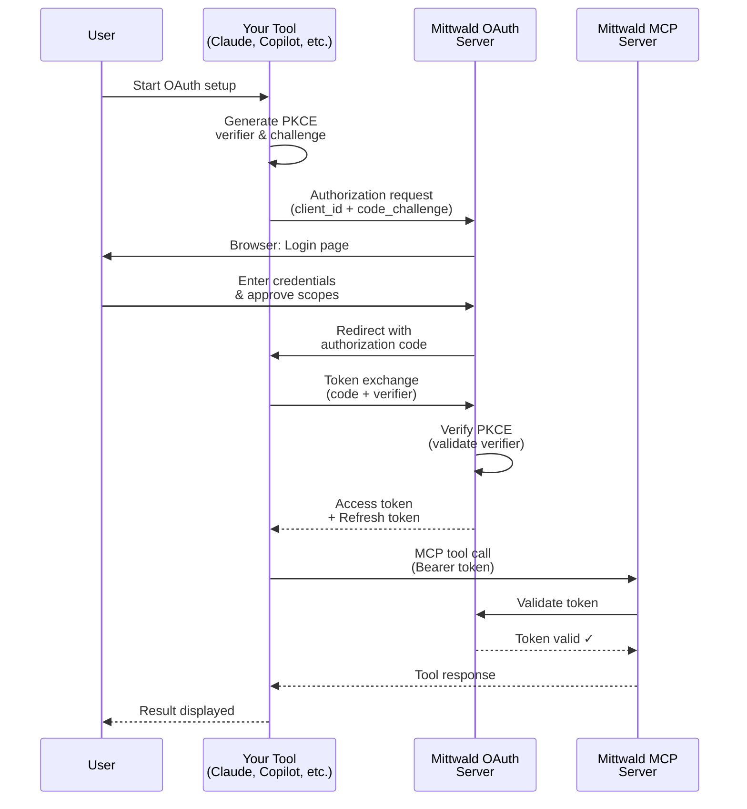

# Getting Started with Mittwald MCP

Welcome! This guide helps you set up OAuth authentication for Mittwald MCP with your preferred agentic coding tool.

**Why OAuth is required**: Mittwald MCP uses OAuth 2.1 to securely authenticate your access to Mittwald resources. Before you can use any MCP tools, you must complete OAuth setup for your chosen tool.

---

## Choose Your Tool

Mittwald MCP works with 4 popular agentic coding tools. Choose the one you use:

### Claude Code

**Best for**: Developers using Anthropic's Claude Code CLI

- **Type**: Command-line interface
- **OAuth Pattern**: Browser-based (standard web flow)
- **Setup Time**: ~10 minutes
- **Complexity**: ⭐⭐ (Simple - straightforward CLI commands)

→ **[Set up Claude Code](/getting-started/claude-code/)**

---

### GitHub Copilot

**Best for**: Developers using GitHub Copilot in VS Code, Visual Studio, JetBrains IDEs, or Xcode

- **Type**: IDE extension (multiple platforms)
- **OAuth Pattern**: IDE-based (Dynamic Client Registration)
- **Setup Time**: ~10 minutes
- **Complexity**: ⭐⭐ (Simple - IDE settings-based)

→ **[Set up GitHub Copilot](/getting-started/github-copilot/)**

---

### Cursor

**Best for**: Developers using Cursor IDE (VS Code fork with AI features)

- **Type**: IDE (desktop application)
- **OAuth Pattern**: IDE-based (configuration file or settings UI)
- **Setup Time**: ~10 minutes
- **Complexity**: ⭐⭐ (Simple - JSON configuration)

→ **[Set up Cursor](/getting-started/cursor/)**

---

### Codex CLI

**Best for**: Developers using OpenAI's Codex CLI for terminal-based AI workflows

- **Type**: Command-line interface
- **OAuth Pattern**: RFC 8252 loopback (native app pattern)
- **Setup Time**: ~10 minutes
- **Complexity**: ⭐⭐ (Simple - CLI commands, browser for auth)

→ **[Set up Codex CLI](/getting-started/codex-cli/)**

---

## Quick Comparison

| Feature | Claude Code | GitHub Copilot | Cursor | Codex CLI |
|---------|-------------|----------------|--------|-----------|
| **Type** | CLI | IDE Extension | IDE | CLI |
| **Platform** | macOS, Linux, Windows | VS Code, Visual Studio, JetBrains, Xcode | macOS, Linux, Windows | macOS, Linux, Windows |
| **Configuration** | CLI command | IDE settings | IDE settings or JSON file | CLI command |
| **Browser Required** | Yes (for auth) | Yes (for auth) | Yes (for auth) | Yes (for auth) |
| **PKCE** | Automatic | Automatic | Automatic | Automatic |
| **Port Configuration** | Dynamic | Managed by IDE | Configurable | Dynamic (RFC 8252) |

---

## What is OAuth and Why Do I Need It?

**OAuth 2.1** is a secure authorization protocol that allows Mittwald MCP to access your Mittwald resources on your behalf **without sharing your password**.

### How OAuth Works (Step-by-Step)

1. **You choose a tool** (Claude Code, Copilot, Cursor, or Codex CLI)
2. **The tool requests access** to Mittwald on your behalf
3. **You log in to Mittwald** through your browser (your password stays secure)
4. **You see what the tool can access** (transparency - you approve the scopes)
5. **Mittwald issues an access token** to your tool
6. **Your tool uses the token** to call MCP tools and access your Mittwald resources
7. **Your password is never shared** with the tool - only the access token

### Security Features

**PKCE** (Proof Key for Code Exchange)
- Prevents authorization code interception attacks
- Automatically handled by your tool (no action needed)
- Required by Mittwald OAuth for all clients

**Scoped Access**
- Tools only get permission for what they need
- You see and approve the scopes during login
- Common scopes: `user:read`, `project:read`, `app:read`

**Token Expiration**
- Access tokens expire after ~1 hour
- Your tool automatically refreshes before expiration
- Long sessions maintained via refresh tokens

**No Password Sharing**
- Your Mittwald password stays at Mittwald
- Tools receive only a temporary access token
- If token is compromised, impact is limited and token can be revoked

---

## Common OAuth Concepts Explained

### Redirect URI
The callback URL where Mittwald OAuth sends you after authentication. Each tool uses a different pattern:
- **CLI tools** (Claude Code, Codex CLI): `http://127.0.0.1/callback` (loopback)
- **IDE tools** (Copilot, Cursor): IDE-specific callback (handled automatically)

### Client ID
A unique identifier for your tool registration with Mittwald OAuth. You get this when registering your OAuth client.

### Authorization Code
A temporary code (valid ~10 minutes) exchanged for an access token during OAuth flow. You don't handle this manually - your tool does automatically.

### Access Token
Your credential for accessing Mittwald MCP tools. Your tool includes this in every request. Expires and is automatically refreshed.

### Refresh Token
A long-lived credential used to obtain new access tokens. Stored securely by your tool; enables you to stay authenticated for days without re-logging in.

### Scope
What your tool is allowed to do. Mittwald scopes follow `resource:action` format:
- `user:read` - Read user profile
- `project:read` - Read projects
- `app:read` - Read apps and domains
- `database:read` - Read databases

---

## After OAuth Setup

Once OAuth is configured for your chosen tool, you can:

- **Use all 115 MCP tools** to manage your Mittwald infrastructure via natural language
- **Follow real-world examples** in [case studies](/case-studies/) showing how developers use Mittwald MCP
- **Explore the complete reference** of all [tools](/reference/) with parameters and examples
- **Understand MCP concepts** with our [explainers](/explainers/what-is-mcp/)

---

## Troubleshooting

### "I'm not sure which tool to choose"

Each tool is best suited to different workflows:

- **Claude Code CLI**: Terminal lovers who want pure CLI workflows
- **GitHub Copilot**: Already using Copilot in your IDE
- **Cursor IDE**: Want an IDE specifically designed for AI-assisted coding
- **Codex CLI**: Prefer OpenAI's tools and terminal-based development

All have equally simple OAuth setup (~10 min each). You can always set up multiple tools if you want.

### "I got stuck during OAuth setup"

Each guide has a detailed **troubleshooting section** with solutions for:
- Port conflicts
- Browser not opening
- Redirect URI mismatches
- Token expiration issues
- And more

Visit your tool's guide (links above) and find your specific error.

### "I need more technical detail"

Check out:
- **[What is OAuth Integration?](/explainers/oauth-integration/)** - Deep dive into OAuth architecture
- **[What is MCP?](/explainers/what-is-mcp/)** - Understanding Model Context Protocol
- **Research documents** - Detailed technical specifications for each tool

---

## OAuth Flow Diagram

Here's what happens behind the scenes when you authenticate:

**Key insight**: PKCE (code verifier/challenge) ensures only your original tool can exchange the authorization code for a token - even if the code is intercepted, it's worthless without the verifier.

---

## Frequently Asked Questions

**Q: Is my Mittwald password sent to the tool?**

A: No. Your password is entered only at Mittwald's official OAuth server in your browser. The tool never sees it. You only share a temporary access token.

**Q: Can I revoke access later?**

A: Yes. Simply remove the MCP server configuration from your tool, and access is immediately revoked. The tool can no longer access Mittwald.

**Q: Do I need to set up OAuth for each tool?**

A: Only for the tool(s) you plan to use. You can set up multiple tools if you want (e.g., both Claude Code and Cursor).

**Q: How long does an access token last?**

A: About 1 hour. Your tool automatically refreshes before expiration, so you stay authenticated without needing to re-login frequently.

**Q: What if the token expires?**

A: Your tool uses the refresh token to get a new access token automatically. No action needed - it's seamless.

**Q: What scopes do I need?**

A: The default scopes in each guide cover most use cases: `user:read customer:read project:read app:read`. During OAuth, you'll see exactly what's being requested.

**Q: Can I use the same OAuth client on multiple computers?**

A: Yes, but the token storage is per-computer. On a new computer, you'll go through OAuth setup again (takes ~10 min). Each registration can have a different client_name (e.g., "Claude Code - Laptop" vs "Claude Code - Desktop").

**Q: What if I want to use multiple Mittwald accounts?**

A: Register separate OAuth clients for each account (give them different names). Manage separate configurations for each client in your tool.

---

## Ready to Get Started?

Choose your tool from the list above and follow the step-by-step guide. OAuth setup takes about 10 minutes, and then you'll have access to all 115 Mittwald MCP tools!

### Quick Links

- **[Claude Code Setup](/getting-started/claude-code/)** - For Claude Code CLI users
- **[GitHub Copilot Setup](/getting-started/github-copilot/)** - For Copilot IDE users
- **[Cursor Setup](/getting-started/cursor/)** - For Cursor IDE users
- **[Codex CLI Setup](/getting-started/codex-cli/)** - For Codex CLI users

---

## Need Help?

- **Specific error?** Check your tool's guide troubleshooting section
- **OAuth questions?** See [How OAuth Integration Works](/explainers/oauth-integration/)
- **MCP concepts?** Read [What is MCP?](/explainers/what-is-mcp/)
- **Mittwald support?** Email support@mittwald.de

*Happy coding! 🚀*
