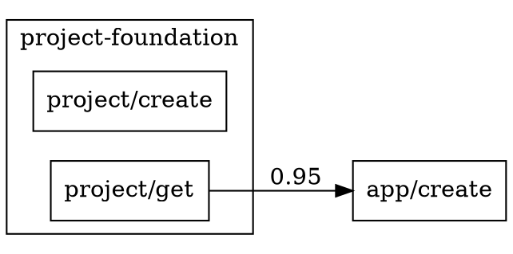

# Research: Session Log Analysis for LLM Efficiency

**Feature**: 006-session-log-analysis
**Date**: 2025-12-04

## Session Log Format

### Decision
Use the existing Claude Code JSONL format as documented in the 005-mcp-functional-test sessions.

### Rationale
The 595 session logs are already in a consistent JSONL format from Claude Code 2.0.58+. No format conversion needed.

### Format Structure

Each line is a JSON object with these common fields:
```typescript
{
  type: string;           // Event type
  timestamp: string;      // ISO 8601
  sessionId: string;      // UUID
  parentUuid?: string;    // Links to parent event
  message?: object;       // Varies by type
}
```

**Event types observed**:
- `queue-operation`: Session start/dequeue
- `user`: User message with content
- `assistant`: Assistant response with tool_use
- `tool_result`: Tool execution result

### Alternatives Considered
- Converting to SQLite for querying: Rejected (adds complexity, 13MB fits in memory)
- Custom binary format: Rejected (JSONL is human-readable, debuggable)

---

## Confusion Pattern Detection

### Decision
Implement 6 specific pattern detectors based on observed behaviors in sample sessions.

### Rationale
Analysis of session `0616a506-15b4-466f-9793-44ceebe2a82f.jsonl` revealed clear anti-patterns that can be programmatically detected.

### Pattern Catalog

| Pattern | Detection Signal | Example from Logs |
|---------|-----------------|-------------------|
| wrong-tool-selection | `name: "SlashCommand"` with MCP-like input | `/mcp__mittwald__...` used as slash command |
| retry-loop | 3+ consecutive `is_error: true` results | Error → Error → Error → Success |
| unnecessary-delegation | `name: "Task"` for single tool lookup | Task agent spawned to find tool info |
| stuck-indicator | >60s timestamp gap between events | Long pause while LLM "thinks" |
| capability-mismatch | Error contains "does not support" | WebSearch on Haiku model |
| exploration-waste | 3+ Glob/Grep/Read before target tool | Searching codebase instead of calling MCP |

### Alternatives Considered
- ML-based pattern detection: Rejected (overkill for known patterns, not interpretable)
- Regex on raw logs: Rejected (brittle, doesn't leverage structure)

---

## Dependency Graph Format

### Decision
Use JSON adjacency list for machine consumption, DOT format for visualization.

### Rationale
- JSON: Easy to consume in future sprints for MCP improvements
- DOT: Standard format, renders in Graphviz, VS Code extensions, online tools

### JSON Structure
```json
{
  "nodes": [
    { "id": "project/create", "domain": "project-foundation" }
  ],
  "edges": [
    { "from": "project/get", "to": "app/create", "confidence": 0.95, "evidence": 12 }
  ]
}
```

### DOT Structure


### Alternatives Considered
- Mermaid: Rejected (less tooling support than DOT)
- Neo4j: Rejected (overkill for static analysis)

---

## Domain Grouping Reuse

### Decision
Import domain mapping from `tests/functional/src/inventory/grouping.ts`.

### Rationale
The 005 test harness already defined the 10 functional domains with tool pattern matching. Reusing this ensures consistency.

### Integration
```typescript
import { mapToolToDomain, getDomainsInOrder } from '../inventory/grouping.js';

const domain = mapToolToDomain('mcp__mittwald__mittwald_app_create');
// Returns: 'apps'
```

### Alternatives Considered
- Duplicate domain definitions: Rejected (violates DRY)
- New domain structure: Rejected (no benefit, adds confusion)

---

## Output Location

### Decision
Write all artifacts to `tests/functional/analysis-output/`.

### Rationale
Keeps analysis output near the source logs and test harness. Makes it easy for future sprints to access.

### Directory Structure
```
tests/functional/analysis-output/
├── corpus-index.json
├── incidents.json
├── dependencies.json
├── dependencies.dot
├── summary.md
├── recommendations.json
├── recommendations.md
└── reports/
    └── {domain}.md (10 files)
```

### Alternatives Considered
- `kitty-specs/006-session-log-analysis/output/`: Rejected by user (too far from source)
- `/tmp/`: Rejected (not persistent)

---

## Performance Strategy

### Decision
Single-pass streaming with in-memory aggregation.

### Rationale
13MB corpus fits comfortably in memory. Streaming reads avoid loading all files at once.

### Implementation
```typescript
async function* parseDirectory(dir: string): AsyncGenerator<ParsedSession> {
  for (const file of await readdir(dir)) {
    yield parseSessionFile(join(dir, file));
  }
}

// Aggregate in memory
const index = new Map<string, SessionMeta>();
for await (const session of parseDirectory(inputDir)) {
  index.set(session.id, session);
}
```

### Alternatives Considered
- SQLite intermediate storage: Rejected (adds complexity for 13MB)
- Parallel file parsing: Rejected (I/O bound, not CPU bound)

---

## Testing Strategy

### Decision
Unit tests for detectors, integration test on sample corpus.

### Rationale
Detectors have clear input/output contracts. Integration test validates end-to-end pipeline.

### Test Files
```
tests/functional/src/analysis/__tests__/
├── parser.test.ts
├── detectors/
│   ├── wrong-tool.test.ts
│   └── ... (one per detector)
├── mapper.test.ts
└── integration.test.ts
```

### Sample Corpus
Use 10 representative sessions (one per domain) for integration tests:
- Known-good sessions (no confusion)
- Known-confusing sessions (expected patterns)

### Alternatives Considered
- Mock all file I/O: Rejected (integration tests need real files)
- Test on full 595: Rejected (too slow for CI)
