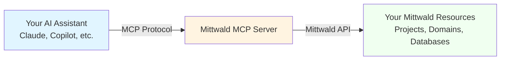
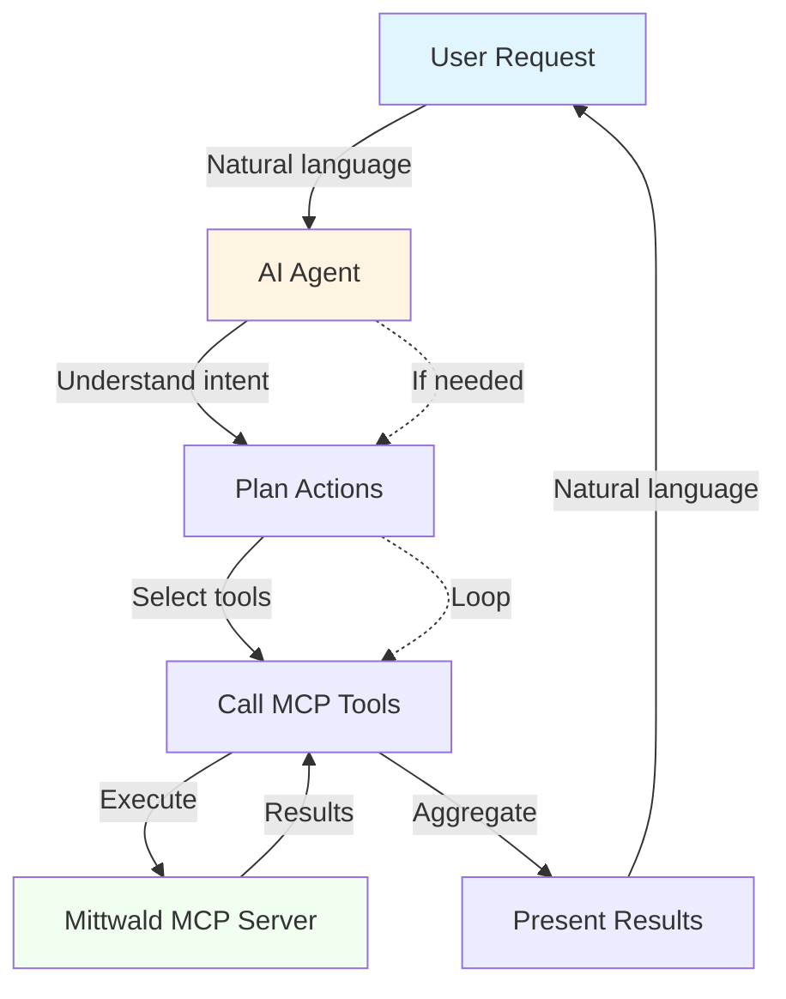
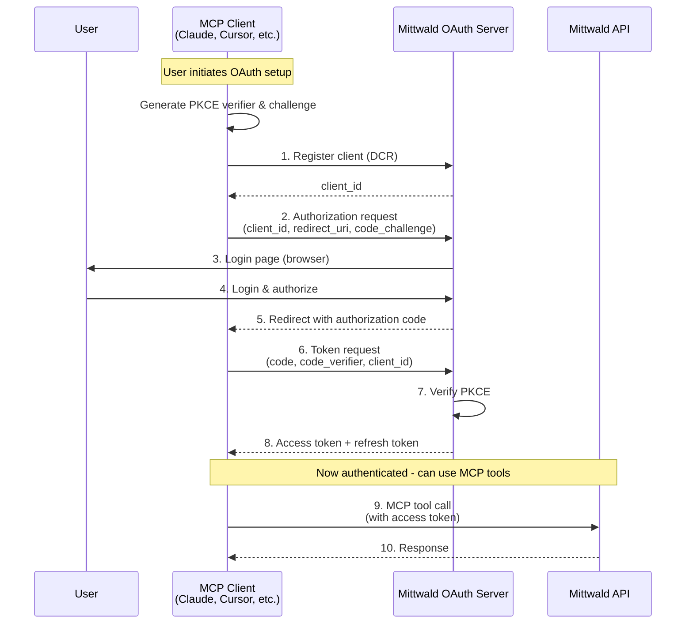

# Work Package Prompt: WP08 – Write Conceptual Explainers

## ⚠️ IMPORTANT: Review Feedback Status

**Read this first if you are implementing this task!**

- **Has review feedback?**: Check the `review_status` field above. If it says `has_feedback`, scroll to the **Review Feedback** section immediately.
- **You must address all feedback** before your work is complete.
- **Mark as acknowledged**: When you understand the feedback, update `review_status: acknowledged` in the frontmatter.

---

## Review Feedback

*[This section is empty initially. Reviewers will populate it if work is returned from review.]*

---

## Markdown Formatting

Wrap HTML/XML tags in backticks: `` `<div>` ``, `` `<script>` ``
Use language identifiers in code blocks: ````python`, ````bash`

---

## Objectives & Success Criteria

**Goal**: Write 3 understanding-oriented explanations (Divio "Explanation" type) covering MCP, agentic coding, and OAuth integration.

**Success Criteria**:
- ✅ "What is MCP?" explainer written with architecture diagrams
- ✅ "What is Agentic Coding?" explainer written with practical examples
- ✅ "How OAuth Integration Works" explainer written with flow diagrams
- ✅ All explainers follow Divio Explanation format (understanding-oriented)
- ✅ All explainers understandable by developers without prior MCP/OAuth knowledge
- ✅ Diagrams are clear, accessible, and helpful
- ✅ Each explainer includes common misconceptions section
- ✅ All explainers published and navigable

---

## Context & Constraints

**Prerequisites**: WP01 (Site 1 must exist to publish explainers)

**Related Documents**:
- Spec: `/Users/robert/Code/mittwald-mcp/kitty-specs/016-mittwald-mcp-documentation/spec.md` (User Scenario 3: Understanding MCP concepts)
- Plan: `/Users/robert/Code/mittwald-mcp/kitty-specs/016-mittwald-mcp-documentation/plan.md`
- Divio Explanation Template: `/Users/robert/Code/mittwald-mcp/.kittify/missions/documentation/templates/divio/explanation-template.md`

**Purpose of Explainers**:
- **Build understanding**: Help developers understand "why" before "how"
- **Provide context**: Connect MCP, OAuth, and agentic coding concepts
- **Clarify misconceptions**: Address common confusion points
- **Not instructional**: These are understanding-oriented, not step-by-step guides

**Divio Explanation Principles**:
- Understanding-oriented (clarify and illuminate)
- Discuss concepts, not tasks
- Provide context and background
- Explain "why" things are the way they are
- Discuss alternatives and trade-offs
- No imperative mood ("do this")

**Constraints**:
- Written for developers without assumed expertise
- Must use clear, accessible language
- Diagrams are encouraged (visual aids help understanding)
- Link to how-to guides and reference docs for practical application

---

## Subtasks & Detailed Guidance

### Subtask T014 – Write "What is MCP?" Explainer

**Purpose**: Explain the Model Context Protocol in clear, accessible terms so developers understand what it is, why it matters, and how Mittwald implements it.

**Target Audience**: Developers who have heard of MCP but don't understand how it works or why they should care.

**File**: `docs/setup-and-guides/src/content/docs/explainers/what-is-mcp.md`

**Content Structure** (following Divio Explanation format):

```markdown
---
title: What is MCP?
description: Understanding the Model Context Protocol and how it enables agentic coding
sidebar:
  order: 1
---

# What is MCP?

**MCP (Model Context Protocol)** is an open protocol that enables AI assistants (like Claude, ChatGPT, or Copilot) to interact with external tools, data sources, and services through a standardized interface.

Think of it as **USB for AI** - just as USB provides a universal way for devices to connect to computers, MCP provides a universal way for AI assistants to connect to your development tools and services.

## Why MCP Matters

### The Problem MCP Solves

Without MCP, every AI assistant needs custom integrations for every service:
- Claude needs a Mittwald integration
- ChatGPT needs a separate Mittwald integration
- Copilot needs yet another integration
- Each integration has different APIs, auth methods, and behaviors

**Result**: Fragmentation, duplicate work, inconsistent experiences.

### The MCP Solution

With MCP, Mittwald builds **one MCP server** that works with **all MCP-compatible AI assistants**:
- Claude connects via MCP
- ChatGPT connects via MCP
- Copilot connects via MCP
- All use the same tools, same API, same authentication

**Result**: Universal compatibility, consistent experience, single implementation.

## How MCP Works

### Architecture Overview



**Three components**:
1. **MCP Client** (your AI assistant): Sends requests, receives responses
2. **MCP Server** (Mittwald): Translates MCP requests to Mittwald API calls
3. **Resource Provider** (Mittwald platform): Your actual infrastructure

### The Protocol in Action

**Example - Creating a Project**:

1. **You (natural language)**:
   ```
   "Create a new project called 'my-website' in my organization"
   ```

2. **AI Assistant (MCP client)**:
   - Parses your intent
   - Identifies required MCP tool: `project/create`
   - Sends MCP request:
     ```json
     {
       "tool": "project/create",
       "parameters": {
         "name": "my-website",
         "organizationId": "org-abc123"
       }
     }
     ```

3. **Mittwald MCP Server**:
   - Receives MCP request
   - Authenticates using your OAuth token
   - Calls Mittwald API: `POST /v2/projects`
   - Returns result via MCP protocol

4. **AI Assistant**:
   - Receives MCP response
   - Translates to natural language:
     ```
     "Created project 'my-website' with ID project-xyz789"
     ```

**All of this happens in seconds, transparently.**

## Core MCP Concepts

### Tools

**MCP tools** are discrete capabilities exposed by the server.

Mittwald MCP provides **115 tools** across 14 domains:
- `app/create` - Create an application
- `database/list` - List databases
- `domain/register` - Register a domain
- ... (112 more)

Each tool has:
- **Name**: Unique identifier (e.g., `project/create`)
- **Parameters**: Inputs required (e.g., project name, organization ID)
- **Return value**: Data returned (e.g., project ID, status)

### Schemas

**Schemas** define the structure of parameters and return values.

Example schema for `project/create`:
```json
{
  "tool": "project/create",
  "parameters": {
    "name": {"type": "string", "required": true},
    "organizationId": {"type": "string", "required": true}
  },
  "returns": {
    "id": {"type": "string"},
    "name": {"type": "string"},
    "status": {"type": "string"}
  }
}
```

Schemas ensure:
- AI assistants know what parameters to send
- MCP servers know what data to expect
- Type safety and validation

### Resources (Optional in MCP)

Some MCP servers expose **resources** - data that can be queried or subscribed to.

Mittwald MCP currently focuses on **tools** (actions) rather than resources (data streams).

### Prompts (Optional in MCP)

Some MCP servers provide **prompt templates** for common tasks.

Example: "Create a TYPO3 project with MySQL database"

Mittwald MCP could expose prompts for common workflows (future enhancement).

## How Mittwald Implements MCP

### Mittwald MCP Server

**Location**: https://mittwald-mcp-fly2.fly.dev/mcp

**Architecture**:
- **Transport**: HTTP/SSE (Server-Sent Events) for streaming
- **Authentication**: OAuth 2.1 with PKCE
- **Tools**: 115 tools across 14 domains
- **Platform**: Node.js + TypeScript running on Fly.io

### Tool Organization

Tools are organized by **domain** (functional area):

| Domain | Tools | Purpose |
|--------|-------|---------|
| **apps** | 8 | Application lifecycle (install, upgrade, uninstall) |
| **backups** | 8 | Backup creation and restoration |
| **containers** | 10 | Docker stack deployment |
| **databases** | 14 | MySQL and Redis management |
| **domains-mail** | 22 | Domain, DNS, email, virtualhost management |
| **identity** | 13 | User profiles, API tokens, SSH keys |
| **project-foundation** | 12 | Project and server management |
| ... | ... | ... |

**Total**: 115 tools across 14 domains

See [Tool Reference](/reference/) for complete documentation.

### Authentication Flow

Mittwald MCP uses **OAuth 2.1** for authentication (see [How OAuth Integration Works](/explainers/oauth-integration/) for details).

**Why OAuth?**
- Secure: No password sharing
- Scoped: Tools only access what you authorize
- Standard: Industry-standard protocol
- Revocable: You can revoke access anytime

## Design Decisions

### Why MCP Instead of REST API?

**MCP advantages**:
- **AI-native**: Designed for AI assistants, not humans
- **Standardized**: One protocol works across all AI assistants
- **Discovery**: Tools are discoverable via protocol (list_tools)
- **Type safety**: Schemas provide validation

**REST API advantages**:
- **Universal**: Works with any HTTP client
- **Mature**: Well-understood patterns
- **Tooling**: Extensive tooling (Postman, curl, etc.)

**Mittwald's choice**: Provide **both**
- MCP for AI assistants
- REST API for direct programmatic access

### Why 115 Tools Instead of Fewer?

**Granular tools** provide:
- **Precision**: AI can invoke exact action needed
- **Safety**: Less risk of unintended actions
- **Discoverability**: Each capability is explicitly named

**Alternative**: Fewer, broader tools (e.g., single "manage project" tool)
- **Risk**: Ambiguity in intent ("manage" could mean create, delete, update)
- **Complexity**: More parameters, more complex tool logic

**Trade-off accepted**: More tools = more documentation, but better user experience.

## Common Misconceptions

### Misconception: "MCP is just a wrapper around REST APIs"

**Reality**: While MCP servers often call REST APIs internally, MCP provides value beyond simple wrapping:
- **AI-optimized schemas**: Tools are designed for AI interpretation, not human developers
- **Discovery**: Clients can list and explore tools dynamically
- **Standardization**: One protocol across all services and AI assistants
- **Type safety**: Built-in validation and error handling

### Misconception: "I need to learn the MCP protocol to use Mittwald MCP"

**Reality**: You interact via natural language through your AI assistant. The assistant handles all MCP protocol details.

**Example**: You say "list my projects", your assistant calls `project/list`, you see the results in natural language. You never see the MCP protocol.

### Misconception: "MCP is Anthropic-only"

**Reality**: MCP is an **open protocol** developed by Anthropic but available to any AI assistant or service.

Current MCP support:
- **Anthropic**: Claude Code, Claude Desktop (first-class)
- **OpenAI**: Experimental/community integrations
- **Others**: Growing ecosystem

### Misconception: "MCP replaces the Mittwald API"

**Reality**: MCP is a **complementary interface**, not a replacement.

**Use MCP when**:
- Working with AI assistants
- Exploratory workflows (conversational)
- Quick, one-off tasks

**Use REST API when**:
- Building applications
- Automated scripts/CI/CD
- Predictable, repeated workflows

Both access the same underlying Mittwald platform.

## Practical Implications

### For Developers Using AI Assistants

**Before MCP**:
- Copy-paste commands from documentation
- Manually construct API requests
- Switch between terminal and web browser (MStudio)

**With MCP**:
- Describe what you want in natural language
- AI handles API calls, authentication, error handling
- Stay in your development flow (no context switching)

**Time savings**: 60-90% for common tasks (per 015 case study research)

### For Mittwald

**Benefits**:
- Differentiation: First hosting provider with MCP support
- Developer experience: Reduced friction for common tasks
- Automation: Enables AI-powered workflows

**Costs**:
- MCP server maintenance
- Documentation and support
- OAuth server infrastructure

**Trade-off**: Investment in developer experience pays off in customer satisfaction and competitive positioning.

## Further Reading

- **Tutorial**: [Getting Started](/getting-started/) - Set up OAuth and start using MCP
- **How-To**: [Case Studies](/case-studies/) - See MCP in real-world scenarios
- **Reference**: [Tool Reference](/reference/) - Explore all 115 available tools
- **External**: [MCP Specification](https://modelcontextprotocol.io) (if exists) - Official protocol documentation

---

*This explainer focused on "what" and "why". For "how to use", see the getting-started guides.*
```

**Duration**: 4-5 hours to write and refine

**Files Created**:
- `docs/setup-and-guides/src/content/docs/explainers/what-is-mcp.md` (new)

**Notes**:
- Include Mermaid diagram showing MCP architecture
- Use analogies (USB for AI) to clarify concepts
- Address all misconceptions identified in research
- Link to getting-started for practical application

---

### Subtask T015 – Write "What is Agentic Coding?" Explainer

**Purpose**: Explain the concept of agentic coding and its relationship to AI assistants and MCP.

**Target Audience**: Developers familiar with AI assistants but unfamiliar with the "agentic" paradigm.

**File**: `docs/setup-and-guides/src/content/docs/explainers/what-is-agentic-coding.md`

**Content Structure**:

```markdown
---
title: What is Agentic Coding?
description: Understanding how AI agents use tools autonomously to solve development tasks
sidebar:
  order: 2
---

# What is Agentic Coding?

**Agentic coding** is a paradigm where AI assistants act as autonomous **agents** that use tools to solve complex development tasks, rather than just generating code suggestions.

## The Paradigm Shift

### Traditional AI Assistants (Co-Pilots)

Traditional AI coding assistants work as **co-pilots**:
- **You ask**: "How do I create a database in Mittwald?"
- **AI suggests**: Code snippet or API call
- **You execute**: Copy-paste and run the code yourself

**Role**: Advisor and code generator

**Example interaction**:
```
You: "Show me how to create a MySQL database"
AI: "Here's the API call:
     curl -X POST https://api.mittwald.de/v2/databases -d '...'"
You: [Copy, paste, run in terminal]
```

### Agentic AI (Autonomous Agents)

Agentic assistants work as **autonomous agents**:
- **You ask**: "Create a MySQL database called 'production' with 1GB storage"
- **AI acts**: Calls the MCP tool directly, handles authentication, creates the database
- **You receive**: Result notification

**Role**: Autonomous executor

**Example interaction**:
```
You: "Create a MySQL database called 'production' with 1GB storage"
AI: [Calls project/list to find projectId]
AI: [Calls database/create with parameters]
AI: "Created MySQL database 'production' with ID db-xyz789.
     Connection string: mysql://production.db.mittwald.de:3306"
```

**The AI took action without you writing or running code.**

## How Agentic Coding Works with MCP

### The Agent Loop



**Agent decision-making**:
1. **Understand**: Parse user intent
2. **Plan**: Determine which tools to use and in what order
3. **Execute**: Call MCP tools with correct parameters
4. **Verify**: Check results, retry if needed
5. **Report**: Summarize outcomes in natural language

**Example** (multi-step task):
```
You: "Set up a new WordPress site for client 'Acme Corp'"

AI Agent:
  Step 1: Calls project/create → creates project
  Step 2: Calls app/install → installs WordPress
  Step 3: Calls database/create → creates MySQL database
  Step 4: Calls domain/add → adds acme-corp.com domain
  Step 5: Calls virtualhost/create → points domain to WordPress

  Result: "WordPress site ready at https://acme-corp.com"
```

**You issued one request. The AI executed 5 different MCP tools autonomously.**

## MCP Enables Agentic Coding

Without MCP, AI assistants can only suggest code.

With MCP, AI assistants can **take action**:
- **Tools**: MCP provides standardized tool interface
- **Authentication**: OAuth enables secure access
- **Safety**: Scoped permissions limit what agents can do

**MCP is the bridge** between AI reasoning and real-world actions.

## When to Use Agentic Coding

**Agentic coding is best for**:
✅ Repetitive tasks (client onboarding, server setup)
✅ Multi-step workflows (deploy app + database + domain)
✅ Exploratory work (check status of all backups)
✅ One-off tasks (create temporary test environment)

**Manual coding is still better for**:
❌ Complex logic requiring deep understanding
❌ Mission-critical operations requiring human oversight
❌ Tasks that need custom business logic
❌ Debugging subtle issues

**Best practice**: Use agents for orchestration, humans for decision-making.

## Practical Examples with Mittwald MCP

### Example 1: Client Onboarding (Freelancer)

**Traditional approach** (manual):
1. Log into MStudio web portal
2. Click through UI to create project
3. Configure server settings
4. Set up SSH access
5. Create database
6. Configure domain
7. Install WordPress

**Time**: ~30-45 minutes

**Agentic approach**:
```
You: "Set up a new client project for 'Jane's Bakery' with WordPress,
     MySQL database, and jane-bakery.com domain"

AI: [Executes all steps via MCP tools]
    "Done! Project created with WordPress at https://jane-bakery.com"
```

**Time**: ~3-5 minutes

**Savings**: 85-90% time reduction

### Example 2: Database Performance Audit (E-commerce)

**Traditional approach**:
1. SSH into server
2. Run MySQL queries for slow query log
3. Check database size and growth
4. Review backup schedule
5. Manually compile report

**Time**: ~1-2 hours

**Agentic approach**:
```
You: "Audit all databases in my e-commerce project - check size,
     slow queries, backup status"

AI: [Calls database/list, database/get-stats, backup/list for each DB]
    "Found 3 databases:
     - 'shop_prod': 2.4GB, 12 slow queries, last backup 2 hours ago ✓
     - 'shop_staging': 800MB, 0 slow queries, last backup 24 hours ago ⚠
     - 'analytics': 5.1GB, 45 slow queries ⚠, last backup 1 hour ago ✓

     Recommendations: Enable slow query optimization for analytics DB"
```

**Time**: ~2-5 minutes

**Savings**: 95%+ time reduction

## Common Misconceptions

### Misconception: "Agents will replace developers"

**Reality**: Agents handle **orchestration and automation**, not complex problem-solving.

Developers still:
- Make architectural decisions
- Write custom business logic
- Debug complex issues
- Design user experiences
- Make judgment calls

Agents augment developers by eliminating tedious tasks.

### Misconception: "Agentic coding is risky - agents might break things"

**Reality**: Safety mechanisms limit risk:
- **OAuth scopes**: Agents only access authorized resources
- **Tool design**: Tools are granular (agent can't accidentally delete everything)
- **Confirmation**: Destructive operations can require confirmation
- **Audit logs**: All actions logged for accountability

**Best practice**: Use read-only tools for exploration, require confirmation for destructive operations.

### Misconception: "I need to learn MCP protocol to use agents"

**Reality**: You interact in **natural language**. The AI assistant handles all MCP protocol details.

You never write MCP requests manually - the agent constructs them based on your natural language intent.

## Agentic Coding vs. Other Paradigms

| Paradigm | Role | Example | User Involvement |
|----------|------|---------|------------------|
| **Manual coding** | You write all code | Write API integration | High |
| **Code completion** (Copilot) | AI suggests code | `database.create(` → AI completes | Medium |
| **Agentic coding** (MCP) | AI executes tasks | "Create a database" → AI does it | Low |

**All three have their place** in modern development. Agentic coding is **complementary**, not exclusive.

## Further Reading

- **How-To**: [Getting Started](/getting-started/) - Set up OAuth to start using agentic coding
- **Examples**: [Case Studies](/case-studies/) - See agentic coding in real-world scenarios
- **Reference**: [Tool Reference](/reference/) - Explore all 115 tools available to agents
- **Related**: [How OAuth Integration Works](/explainers/oauth-integration/) - Security model for agents

---

*This explainer covered "what" agentic coding is. For practical examples, see the case studies.*
```

**Duration**: 3-4 hours

**Files Created**:
- `docs/setup-and-guides/src/content/docs/explainers/what-is-agentic-coding.md` (new)

**Notes**:
- Use concrete examples from 015 case study research
- Time savings must be realistic (based on research findings)
- Diagram showing agent loop is helpful
- Address safety concerns proactively

---

### Subtask T016 – Write "How OAuth Integration Works" Explainer

**Purpose**: Explain how Mittwald OAuth integrates with MCP, covering OAuth 2.1 flow, Dynamic Client Registration, PKCE, and security considerations.

**Target Audience**: Developers who want to understand the security and authentication model for Mittwald MCP.

**File**: `docs/setup-and-guides/src/content/docs/explainers/oauth-integration.md`

**Content Structure**:

```markdown
---
title: How OAuth Integration Works
description: Understanding OAuth 2.1, PKCE, and Dynamic Client Registration for Mittwald MCP
sidebar:
  order: 3
---

# How OAuth Integration Works

Mittwald MCP uses **OAuth 2.1 with PKCE** and **Dynamic Client Registration (DCR)** to provide secure, flexible authentication for AI assistants.

This explainer covers:
- Why OAuth is used for MCP authentication
- How the OAuth flow works (with diagrams)
- What PKCE is and why it's required
- How Dynamic Client Registration enables any tool to connect
- Security considerations and best practices

## Background: Why OAuth for MCP?

### The Authentication Challenge

MCP clients (Claude Code, Cursor, etc.) need to access your Mittwald resources on your behalf. This requires authentication.

**Traditional approaches**:
- **API keys**: Simple but insecure (hard to scope, revoke, expire)
- **Username + password**: Never a good idea (credential sharing is risky)

**OAuth approach**:
- ✅ **Delegated authorization**: Client gets limited access without your password
- ✅ **Scoped permissions**: Client only accesses authorized resources
- ✅ **Revocable**: You can revoke access anytime
- ✅ **Standard protocol**: Industry best practice

**Mittwald's choice**: OAuth 2.1 (modern OAuth with security enhancements)

## OAuth 2.1 Flow for MCP

### The Complete Flow (Authorization Code + PKCE)



**Steps explained**:

1. **Register Client (DCR)**:
   - Client sends registration request to Mittwald OAuth
   - Includes: client name, redirect URIs, grant types
   - Receives: client_id (no secret needed for PKCE)

2. **Generate PKCE Verifier**:
   - Client generates random code verifier (43-128 characters)
   - Computes code challenge: `SHA256(verifier)`
   - Sends challenge to OAuth server (not the verifier)

3. **Request Authorization**:
   - Client opens browser to `https://mittwald-oauth-server.fly.dev/oauth/authorize`
   - Parameters: client_id, redirect_uri, scopes, code_challenge

4. **User Authorizes**:
   - User logs in with Mittwald credentials
   - User sees authorization screen: "Claude Code wants to access your projects"
   - User approves

5. **Receive Authorization Code**:
   - OAuth server redirects to client's redirect_uri
   - URL includes authorization code: `http://127.0.0.1:PORT/callback?code=abc123`

6. **Exchange Code for Token**:
   - Client sends token request with: code, code_verifier, client_id
   - OAuth server verifies: code matches, verifier matches challenge
   - If valid, returns access token + refresh token

7. **Use Access Token**:
   - Client includes access token in MCP requests
   - Token is sent to Mittwald API for authorization
   - Client can now use all authorized MCP tools

**This entire flow is handled automatically by your MCP client. You only see: "Log in" → "Authorized!"**

## Key OAuth Concepts

### Dynamic Client Registration (DCR)

**Problem**: Traditional OAuth requires pre-registering every client with redirect URIs.
- Mittwald would need to maintain a list of all possible clients
- New tools couldn't connect without Mittwald's approval

**Solution**: Dynamic Client Registration (RFC 7591)
- Clients register themselves programmatically
- No pre-configuration needed
- Any tool can connect (as long as it follows the protocol)

**How it works**:
```bash
# Client sends registration request
POST /oauth/register
{
  "client_name": "My Tool",
  "redirect_uris": ["http://127.0.0.1/callback"],
  "grant_types": ["authorization_code"]
}

# OAuth server responds
{
  "client_id": "abc123...",
  "registration_access_token": "xyz789..."
}
```

**Benefits**:
- Self-service: No manual approval needed
- Flexible: New tools work immediately
- Standard: RFC 7591 compliance

### PKCE (Proof Key for Code Exchange)

**Problem**: Authorization codes can be intercepted (especially for native apps).

**Solution**: PKCE adds cryptographic proof to prevent code interception.

**How it works**:

1. **Client generates verifier** (random string):
   ```
   verifier = "random_43_to_128_character_string"
   ```

2. **Client computes challenge** (SHA256 hash):
   ```
   challenge = SHA256(verifier) = "abc123..."
   ```

3. **Authorization request includes challenge**:
   ```
   GET /oauth/authorize?code_challenge=abc123...&code_challenge_method=S256
   ```

4. **Token request includes verifier**:
   ```
   POST /oauth/token
   {
     "code": "auth_code_here",
     "code_verifier": "random_43_to_128_character_string"
   }
   ```

5. **Server verifies**:
   ```
   SHA256(received_verifier) == stored_challenge?
   ```

**If attacker intercepts authorization code**:
- They don't have the code verifier (it never left the client)
- They can't exchange the code for a token
- Attack fails

**PKCE is required** for all clients connecting to Mittwald OAuth.

### Redirect URIs

**Purpose**: OAuth callback URL where the server sends the authorization code after user authorizes.

**Patterns** (tool-dependent):

1. **Native Apps (RFC 8252 Loopback)**:
   - URI: `http://127.0.0.1/callback` or `http://localhost/callback`
   - Port: Dynamic (client chooses available port)
   - Server: Temporary HTTP server started by client
   - **Used by**: Claude Code, Codex CLI

2. **Web Apps**:
   - URI: `https://your-app.com/oauth/callback`
   - Fixed URL
   - **Used by**: Web-based tools

3. **IDE Extensions**:
   - URI: Custom scheme (e.g., `vscode://auth/callback`) or localhost
   - Tool-specific
   - **Used by**: VS Code, Cursor (potentially)

**Mittwald OAuth supports**:
- RFC 8252 loopback with dynamic port matching
- HTTPS redirect URIs
- HTTP redirect URIs for loopback only (security exception per RFC 8252)

## Security Considerations

### What OAuth Protects Against

**✅ Password exposure**:
- Your Mittwald password never leaves Mittwald's servers
- Clients never see or store your password

**✅ Over-permissioning**:
- OAuth scopes limit what clients can access
- Example: read-only access, specific projects only

**✅ Code interception**:
- PKCE prevents authorization code interception attacks
- Even if code is stolen, attacker can't use it

**✅ Token theft**:
- Access tokens expire (typically 1-24 hours)
- Refresh tokens require re-authentication periodically

### What OAuth Doesn't Protect Against

**❌ Malicious clients**:
- If you authorize a malicious tool, it gets access
- **Mitigation**: Only authorize trusted tools

**❌ Compromised machines**:
- If your machine is compromised, tokens can be stolen
- **Mitigation**: Keep systems updated, use antivirus

**❌ Phishing**:
- Fake OAuth pages can trick users
- **Mitigation**: Verify OAuth server URL (mittwald-oauth-server.fly.dev)

### Best Practices

1. **Verify OAuth server URL** before logging in:
   - Correct: `mittwald-oauth-server.fly.dev`
   - Incorrect: `m1ttwald-oauth.com` (phishing)

2. **Review authorization scopes**:
   - Only authorize necessary permissions
   - Understand what each scope allows

3. **Revoke unused authorizations**:
   - Periodically review and revoke old authorizations
   - (Revocation UI may be added in future)

4. **Use tools from trusted sources**:
   - Official tools (Claude Code from Anthropic, Copilot from GitHub)
   - Verify tool publisher before authorizing

## Token Management

### Access Tokens

**Lifetime**: Short (1-24 hours typically)
**Usage**: Included in every MCP request
**Storage**: Client stores securely (OS keychain or encrypted file)

### Refresh Tokens

**Lifetime**: Longer (days to months)
**Usage**: Exchange for new access token when old one expires
**Security**: Refresh tokens are more sensitive (longer lifetime)

### Token Refresh Flow

When access token expires:
```
Client->>OAuth: POST /oauth/token (grant_type=refresh_token, refresh_token=xyz)
OAuth-->>Client: New access token + new refresh token
```

**This happens automatically** - your MCP client handles token refresh transparently.

## Design Decisions

### Why OAuth 2.1 Instead of OAuth 2.0?

**OAuth 2.1** is the modern version with security best practices built-in:
- PKCE required (not optional)
- No implicit grant (removed)
- Redirect URIs must be exact match (no wildcards)

Mittwald uses OAuth 2.1 for maximum security.

### Why Dynamic Client Registration?

**Alternative**: Pre-register every client manually
- **Problem**: Doesn't scale; delays new tool adoption

**DCR benefits**:
- Self-service client registration
- No manual approval needed
- Faster integration for new tools

**Trade-off accepted**: Slightly increased complexity for better flexibility.

### Why Separate OAuth Server?

**Mittwald OAuth server** is separate from the MCP server:
- **OAuth server**: handles authentication, token issuance
- **MCP server**: handles tool execution

**Why separate?**
- **Security**: OAuth is sensitive; isolated deployment
- **Reusability**: OAuth server can support multiple MCP servers
- **Maintenance**: Independent scaling and updates

## Practical Implications

### For Developers

**You need to**:
- Complete OAuth setup once per tool (10 minutes)
- Refresh tokens automatically (handled by tool)
- Re-authorize if scopes change

**You don't need to**:
- Manage tokens manually
- Understand OAuth protocol details
- Handle token refresh yourself

### For Tool Developers

**If building an MCP client**:
- Implement OAuth 2.1 with PKCE
- Use Dynamic Client Registration
- Handle token refresh
- Follow RFC 8252 for native apps

**Mittwald provides**:
- OAuth server with DCR support
- Well-documented endpoints
- RFC 8252 loopback support

## Further Reading

- **Tutorial**: [Getting Started](/getting-started/) - Set up OAuth for your tool
- **How-To**: Individual tool guides for OAuth setup
- **Reference**: [OAuth Server Docs](https://mittwald-oauth-server.fly.dev/.well-known/oauth-authorization-server) - Technical specs
- **External**: [RFC 7591 (DCR)](https://datatracker.ietf.org/doc/html/rfc7591) - DCR specification
- **External**: [RFC 8252 (Native Apps)](https://datatracker.ietf.org/doc/html/rfc8252) - OAuth for native apps

---

*This explainer focused on OAuth mechanics and security. For setup instructions, see the getting-started guides.*
```

**Duration**: 4-5 hours to write and refine

**Files Created**:
- `docs/setup-and-guides/src/content/docs/explainers/oauth-integration.md` (new)

**Notes**:
- Include Mermaid sequence diagram for OAuth flow
- Reference mittwald-oauth-server documentation
- Explain PKCE clearly (many developers don't understand it)
- Address security concerns proactively

---

## Test Strategy

**Content Validation**:

1. **Technical accuracy**:
   - Cross-reference with OAuth server docs: `/Users/robert/Code/mittwald-oauth/mittwald-oauth/docs/ARCHITECTURE.md`
   - Verify RFC 7591 and RFC 8252 references are correct
   - Check that PKCE explanation is accurate

2. **Clarity testing**:
   - Non-OAuth-specialist reads each explainer
   - Can they understand the concepts?
   - Are diagrams helpful?

3. **Diagram validation**:
   - Mermaid diagrams render correctly
   - Flow is accurate and matches actual implementation
   - Diagrams are accessible (alt text or accessible SVG)

**Build Testing**:

```bash
cd docs/setup-and-guides
npm run build
npm run dev

# Visit each explainer:
# - /explainers/what-is-mcp/
# - /explainers/what-is-agentic-coding/
# - /explainers/oauth-integration/

# Verify:
# - All pages load
# - Diagrams render
# - Links work
# - Navigation includes explainers section
```

**Accessibility Testing**:
- Heading hierarchy correct (H1 → H2 → H3)
- Diagrams have alt text or accessible rendering
- Code blocks have language tags
- Links have descriptive text

---

## Risks & Mitigations

**Risk 1: Technical concepts may be too complex for target audience**
- **Cause**: OAuth, PKCE, DCR are advanced topics
- **Mitigation**: Use analogies, diagrams, simple language
- **Testing**: Non-specialist review before publication

**Risk 2: Diagrams may not render correctly**
- **Cause**: Mermaid plugin may not be configured in Starlight
- **Mitigation**: Test rendering; use static images if Mermaid fails
- **Fallback**: Remove diagrams if they complicate setup

**Risk 3: Explainers may become outdated as OAuth server evolves**
- **Cause**: OAuth implementation changes
- **Mitigation**: Date explainers; link to authoritative source (OAuth server docs)
- **Maintenance**: Review quarterly or when OAuth server updates

**Risk 4: Explainers may duplicate getting-started guides**
- **Cause**: Explaining OAuth flow vs. documenting OAuth steps
- **Mitigation**: Focus on "why" and "how it works", not "do this"
- **Differentiation**: Explainers are understanding-oriented; guides are goal-oriented

---

## Review Guidance

**Key Acceptance Criteria**:

1. **All 3 explainers complete**:
   - What is MCP?
   - What is Agentic Coding?
   - How OAuth Integration Works

2. **Explainers follow Divio Explanation format**:
   - Understanding-oriented (not instructional)
   - Explain "why" things are the way they are
   - Provide context and background
   - Include diagrams where helpful
   - No imperative mood ("do this")

3. **Content is accurate**:
   - MCP description matches protocol specification
   - Agentic coding examples are realistic
   - OAuth flow matches actual implementation
   - PKCE explanation is technically correct

4. **Content is accessible**:
   - Written for non-specialists
   - Jargon defined or avoided
   - Diagrams clarify rather than confuse
   - Examples are concrete and relatable

5. **Cross-references work**:
   - Links to getting-started guides
   - Links to case studies
   - Links to tool reference
   - External links to RFCs and specifications

**Verification Commands**:

```bash
# Check files exist
ls docs/setup-and-guides/src/content/docs/explainers/

# Expected:
# - what-is-mcp.md
# - what-is-agentic-coding.md
# - oauth-integration.md

# Build and preview
cd docs/setup-and-guides
npm run build
npm run dev

# Visit each explainer and verify content
```

**Review Checklist**:
- [ ] "What is MCP?" explainer complete
- [ ] "What is Agentic Coding?" explainer complete
- [ ] "How OAuth Integration Works" explainer complete
- [ ] All explainers follow Divio Explanation format
- [ ] All explainers understandable by non-specialists
- [ ] Diagrams render correctly (Mermaid or images)
- [ ] Diagrams are accessible (alt text)
- [ ] Technical accuracy verified (OAuth flow, PKCE, DCR)
- [ ] Examples are concrete and realistic
- [ ] Common misconceptions addressed
- [ ] Links to other documentation work
- [ ] All explainers build and display correctly

---

## Implementation Command

To implement this work package:

```bash
spec-kitty implement WP08 --base WP01
```

*(Depends on WP01; Site 1 must exist. Can be implemented in parallel with WP05-WP07.)*

---

## Activity Log

> Entries MUST be in chronological order (oldest first, newest last).

*[Activity log will be populated during implementation and review]*
- 2026-01-23T10:58:46Z – claude-code – shell_pid=18119 – lane=doing – Started implementation via workflow command
